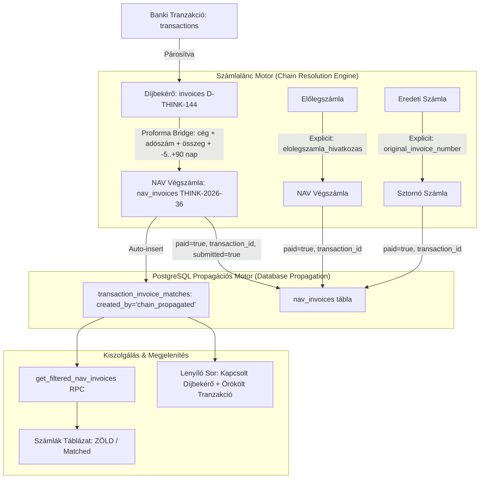

# A-173: Számlalánc Tranzakció-örökítés, Díjbekérő-Végszámla Automatikus Párosítás és PostgreSQL Propagáció

**Státusz:** ✅ Elfogadva  
**Dátum:** 2026-09-28  
**Utoljára frissítve:** 2026-09-29  
**Döntéshozó:** Antigravity Architect & User Approval  
**Kapcsolódó PRD:** [P-133: Számlalánc és Díjbekérő Tranzakció-örökítés és Zöld Státusz UX](../../product/decisions/P-133-invoice-chain-transaction-propagation-ux.md)  
**Kapcsolódó ADR-ek:**
- [A-016: PostgreSQL query stratégia & RPC katalógus](./A-016-postgresql-query-strategy.md)
- [A-054: Szigorított NAV ↔ Beküldött Számla Összerendelés (Strict Invoice Pairing)](./A-054-strict-nav-submitted-pairing.md)
- [A-059: Tranzakció Párosítási Mag & Moduláris UI Architektúra](./A-059-transaction-matching-core-and-modular-ui.md)
- [A-098: Készpénzes és Manuális Kifizetésű Számlák Egységes Párosítási Státusza és KPI Integritása](./A-098-cash-and-manual-payment-matching-status-consistency.md)
- [A-128: Szigorított Számlaszám Határ-illesztés és Többszörös Párosítási Jóváhagyási Kapu](./A-128-strict-invoice-number-boundary-matching-and-subsumption-guard.md)
- [A-147: Kétirányú Számlaláncolat (Invoice Chaining), Dinamikus Kapcsolt Bizonylat Feloldás](./A-147-bidirectional-invoice-chaining-and-preview-tabs.md)

**Érintett Komponensek és Fájlok:**
- [`supabase/migrations/20260928150000_invoice_chain_transaction_propagation.sql`](file:///c:/Users/adetw/.antigravity/visibill/visibill-709fffdf/supabase/migrations/20260928150000_invoice_chain_transaction_propagation.sql)
- [`supabase/migrations/20260929110000_fix_invoice_chain_propagation_partner_match.sql`](file:///c:/Users/adetw/.antigravity/visibill/visibill-709fffdf/supabase/migrations/20260929110000_fix_invoice_chain_propagation_partner_match.sql)
- [`supabase/migrations/20261008031500_sync_submitted_invoices_matching_and_triggers.sql`](file:///d:/ThinkAI/Visibill/eaisybill-prod/supabase/migrations/20261008031500_sync_submitted_invoices_matching_and_triggers.sql)
- [`src/features/invoices/utils/invoiceRelations.ts`](file:///c:/Users/adetw/.antigravity/visibill/visibill-709fffdf/src/features/invoices/utils/invoiceRelations.ts)
- [`src/features/invoices/components/table/NavInvoiceRow.tsx`](file:///c:/Users/adetw/.antigravity/visibill/visibill-709fffdf/src/features/invoices/components/table/NavInvoiceRow.tsx)
- [`src/features/invoices/components/table/SubmittedInvoiceRow.tsx`](file:///c:/Users/adetw/.antigravity/visibill/visibill-709fffdf/src/features/invoices/components/table/SubmittedInvoiceRow.tsx)
- [`src/hooks/useTransactionMatcher.ts`](file:///c:/Users/adetw/.antigravity/visibill/visibill-709fffdf/src/hooks/useTransactionMatcher.ts)
- [`src/features/invoices/__tests__/invoiceChainMatching.test.ts`](file:///c:/Users/adetw/.antigravity/visibill/visibill-709fffdf/src/features/invoices/__tests__/invoiceChainMatching.test.ts)

---

## 1. Kontextus & Problémafelvetés

A valós könyvelési és banki folyamatok során rendkívül gyakori, hogy a vevő nem közvetlenül a NAV-ba beérkező végszámla bizonylatszámára hivatkozva utal (pl. `THINK-2026-36`), hanem az azt megelőző **díjbekérő / proforma számla** számára (pl. `D-THINK-144`).

A rendszerben korábban komoly adatkonzisztencia és megjelenítési hiba állt fenn:
1. **Elszigetelt tranzakció-kapcsolat:** A banki tranzakció sikeresen összepárosításra került a beküldött díjbekérővel (`invoices` rekord: `fizetve = true`, `transaction_id = tx.id`).
2. **Pirosan maradó NAV számlák:** Amikor a végszámla beérkezett a NAV Online Számla rendszerből, sem a trigger réteg (`mark_nav_invoice_paid_on_transaction_match`, `match_nav_invoice_on_insert`), sem a szerveroldali RPC-k (`get_filtered_nav_invoices`) nem tudták feloldani a díjbekérő ↔ végszámla kapcsolatot. Ennek következtében a NAV számla a felületen piros ("Nyitott") maradt, kiegyenlítetlennek tűnt, rontva a cég KPI mutatóit és a könyvelői átláthatóságot.
3. **Elrejtett tranzakció a kézi párosítóban:** Ha a könyvelő megpróbálta kézzel hozzárendelni a tranzakciót a NAV számlához, a tranzakció-választó modál elrejtette a tételt, mivel az már hozzá volt kötve a díjbekérőhöz.
4. **Általánosabb láncolati hiányosságok:** Ugyanez a probléma érintette az **előlegszámla ↔ végszámla** párokat (`elolegszamla_hivatkozas`), valamint az **eredeti ↔ sztornó/helyesbítő számlákat** (`original_invoice_number`).

---

## 2. Architektúrális Döntések

### D-1: Számlalánc-feloldási Szabályrendszer (Chain Resolution Engine)

A reláció-feloldás determinisztikus, szigorú kritériumok mentén történik:
1. **Díjbekérő ↔ Végszámla Híd (Proforma Bridge):**
   - Azonos `company_id`
   - Azonos irány (`direction = 'outbound'` / `invoice_direction = 'outbound'` vagy mindkettő `inbound`)
   - Partner azonosítás: partner adószám első 8 karaktere (`tax_8`), adószám hiányában pedig a normalizált, tisztított cégnév azonossága
   - Bruttó összeg egyezés: `ABS(dijbekero.brutto - szamla.gross) < 1.0` (1 Ft alatti kerekítési tűrés)
   - Időablak szűrő: a végszámla kibocsátási dátuma a díjbekérőhöz képest `-5 nap` és `+90 nap` között helyezkedik el.
2. **Explicit Hivatkozási Híd (Direct Reference Bridge):**
   - `invoices.reference_number` $\leftrightarrow$ `bizonylatsorszam` / `invoice_number`
   - `invoices.elolegszamla_hivatkozas` $\leftrightarrow$ `bizonylatsorszam` / `invoice_number`
   - `nav_invoices.original_invoice_number` $\leftrightarrow$ `invoice_number` / `bizonylatsorszam`
3. **Bizonylatszám Egyezési Híd (Exact Match Bridge):**
   - Normalizált bizonylatszám egyezés beküldött számla és NAV számla között (`normalize(bizonylatsorszam) = normalize(invoice_number)`).

### D-2: PostgreSQL Propagációs Motor (`propagate_transaction_to_invoice_chain`)

A propagációs logika adatbázis-szinten van központosítva a `public.propagate_transaction_to_invoice_chain(p_transaction_id uuid)` tárolt eljárásban:
- **Biztonság & Izoláció:** `SECURITY DEFINER`, rögzített `SET search_path = public, pg_temp`.
- **Rekurzióvédelem:** `IF pg_trigger_depth() > 2 THEN RETURN; END IF;` biztosítja, hogy az egymásba ágyazott triggerek nem okozhatnak végtelen hurkot vagy stack overflow-t.
- **Many-to-Many Kapcsolat:** A `transaction_invoice_matches` tábla `created_by` CHECK feltétele kibővítésre került:
  `CHECK (created_by IN ('manual', 'ai', 'courier_auto', 'chain_propagated'))`.
- **Atomi Rekordfrissítések:**
  - `transaction_invoice_matches` beszúrás `ON CONFLICT DO NOTHING` klauzulával a lánc minden tagjára (`invoice_source = 'nav'` és `'submitted'`).
  - `nav_invoices` rekordokon: `paid = true`, `transaction_id = p_transaction_id`, és `submitted = true` (ha van submitted számla a láncban).
  - `invoices` rekordokon: `fizetve = true`, `transaction_id = p_transaction_id`.

### D-3: Kétirányú Eseményvezérelt Triggerek

A szinkronizáció valós időben fut le mind a tranzakció-oldali, mind az új számla-oldali eseményeknél:
1. **Tranzakció összerendeléskor:** A `mark_nav_invoice_paid_on_transaction_match` trigger a számla megjelölése után azonnal meghívja a `propagate_transaction_to_invoice_chain`-t, átvezetve a tranzakciót a lánc többi tagjára is.
2. **Új NAV számla érkezésekor:** A `match_nav_invoice_on_insert` és a frissen létrehozott `sync_nav_invoice_chain_after_insert` triggerek azonnal ellenőrzik, hogy az újonnan bekerülő NAV számlához tartozik-e már tranzakcióval rendelkező díjbekérő vagy előzmény számla. Ha igen, a NAV számla már beszúráskor megkapja a fizetettséget és a tranzakciót.

### D-4: Teljesítmény és Indexelés

A láncolási lekérdezések O(1) és logaritmikus sebessége érdekében a migráció három új összetett B-tree indexet vezetett be:
- `idx_invoices_chain_lookup`: `(company_id, direction, status, fizetve, gross_amount, issue_date)`
- `idx_nav_invoices_chain_lookup`: `(company_id, invoice_direction, paid, invoice_gross_amount, invoice_issue_date)`
- `idx_nav_invoices_original_invoice_number`: `(company_id, original_invoice_number)`

### D-5: Frontend Láncolat és Tranzakció Feloldás

- **`invoiceRelations.ts`:** A `buildNavToSubmittedMap` és `buildSubmittedToNavMap` kiegészült a proforma és a közös tranzakciós híd feloldásával.
- **Lenyíló sorkártyák (`NavInvoiceRow.tsx`, `SubmittedInvoiceRow.tsx`):** A kártya lenyitásakor a láncolt bizonylatokhoz tartozó tranzakciók automatikusan bekerülnek a helyi `allTxMap`-be, így az örökölt tranzakció közvetlenül megjelenik a lenyitott sorban.
- **Kézi tranzakció-kereső (`useTransactionMatcher.ts`):** A szűrő logika felkészült a láncolt számlákra; a számlához vagy annak láncolatához már rendelt tranzakció nem tűnik el a választható tételek közül.

### D-6: Irányfüggő Partnerazonosítás és Véletlen Átkötések Megelőzése (2026-09-29 — Migráció `20260929110000`)

A kezdeti implementációban (`20260928150000`) a LÁNC 1 és LÁNC 2 aggregációk a partner adószámának egyeztetéséhez az alábbi kifejezést alkalmazták:
`COALESCE(ni.customer_tax_number, ni.supplier_tax_number) = COALESCE(i.vevo_vat_id, i.elado_vat_id)`

**Kritikus hibaok és tünet:**
- Bejövő (`INBOUND` — szállítói) számláknál a vevő mind a `nav_invoices`, mind az `invoices` táblában maga a felhasználó cége (`company_id`).
- Ennek következtében a `COALESCE` mindkét oldalon a cég saját adószámát adta vissza!
- Az azonos összegű, 90 napon belül kibocsátott bejövő számlák (pl. 160 000 Ft) így hibásan összekapcsolódtak más partnerek banki utalásaival (pl. *Szanyi Zoltánné `SZZJ-2026-3`* számlája tévesen megkapta egy másik szállítónak szóló banki átutalást és `paid = true` állapotba került, emiatt eltűnt a készpénzes kiegyenlítés és a nyitott szállítók listájáról).
- Ezen felül a LÁNC 2 korábban minden számlatípusra lefutott, nem korlátozódott csak a proforma/előleg bizonylatokra.

**Javítás és Architektúrális Szigorítás (`20260929110000_fix_invoice_chain_propagation_partner_match.sql`):**
1. **Szigorúan irányfüggő adószám- és névegyeztetés:**
   - **`OUTBOUND` (kimenő / vevői számlák):** kizárólag a vevő adószáma (`i.vevo_vat_id` $\leftrightarrow$ `ni.customer_tax_number`, 8-jegyű törzsszám) vagy a tisztított vevőnév egyezhet.
   - **`INBOUND` (bejövő / szállítói számlák):** kizárólag a szállító/eladó adószáma (`i.elado_vat_id` $\leftrightarrow$ `ni.supplier_tax_number`, 8-jegyű törzsszám) vagy a tisztított eladónév egyezhet.
2. **LÁNC 2 Bizonylattípus Korlátozás:** A NAV számláról beküldött számlára történő propagáció kizárólag a proforma/előleg bizonylattípusokra engedélyezett:
   `i.invoice_type IN ('dijbekero_proforma', 'dijbekero', 'elolegszamla', 'vegszamla')`.
3. **Trigger Szinkronizáció:** Ugyanez a szigorú irányfüggő feltételrendszer került beépítésre a `match_nav_invoice_on_insert()` trigger eljárásba is, megakadályozva, hogy új NAV számla beérkezésekor egy másik cég előlegét kösse össze.

### D-7: Kétirányú Beküldött Számla Szimmetria és Trigger Szinkronizáció (2026-10-08 — Migráció `20261008031500`)

A korábbi implementációban a szerveroldali RPC-k és a triggerek között aszimmetria állt fenn:
- A `get_filtered_nav_invoices` rendelkezett `sub_matches` CTE-vel, így a beküldött számlához rendelt tranzakció zöldre állította a NAV számlát.
- Viszont a `get_filtered_submitted_invoices` nem tartalmazott `nav_matches` CTE-t: ha a banki tranzakció a NAV számlához lett közvetlenül vagy manuálisan párosítva, a beküldött számla `match_status = 'unmatched'` maradt, annak ellenére, hogy a lenyíló sor kliensoldali JavaScriptje összekötötte őket és zöld kártyaként jelenítette meg a NAV számlát és tranzakciót.
- Továbbá a `mark_invoice_paid_on_multi_match` és `mark_nav_invoice_paid_on_transaction_match` triggerek NAV számla párosításakor nem frissítették az `invoices` tábla `fizetve` és `transaction_id` mezőit.

**Architektúrális Megoldás:**
1. **`nav_matches` CTE a `get_filtered_submitted_invoices` RPC-ben:**
   - Normalizált bizonylatszám (`UPPER(TRIM(ni.invoice_number)) = UPPER(TRIM(b.bizonylatsorszam))`) és cégazonosító alapján aggregálja a NAV számlák fizetettségét és kapcsolódó tranzakcióit.
   - A beküldött számla azonnal `matched` vagy `partially_paid` státuszt és valós kifizetett összeget kap.
2. **Kétoldalú Triggerek (`mark_invoice_paid_on_multi_match`, `mark_nav_invoice_paid_on_transaction_match`):**
   - Amikor egy `nav_invoices` rekord kiegyenlítésre kerül, a trigger automatikusan frissíti a kapcsolódó beküldött számlát:
     `UPDATE invoices SET fizetve = v_is_full_paid, transaction_id = COALESCE(transaction_id, v_transaction_id) WHERE bizonylatsorszam = v_nav_invoice_number AND company_id = v_company_id`.
3. **Szimmetrikus Törlés (`reset_paid_on_multi_match_delete`):**
   - Ha egy NAV számláról eltávolítják a multi-match párosítást, a trigger a beküldött számlánál is visszaállítja a `fizetve = false` és `transaction_id = NULL` állapotot.
4. **Kliensoldali Reaktív Híd (`SubmittedInvoiceRow.tsx`):**
   - A komponens `navMatches` alapján ellenőrzi a kapcsolt NAV számla állapotát (`navMatches.some(n => n.paid || n.match_status === 'matched')`), és azonnal zöld kiemelést ad még hálózati query frissülési késés esetén is.

---

## 3. Következmények & Éles Eredmények

- **Azonnali Zöld Státusz:** A meglévő éles inkonzisztens számlák a migráció lefutása után azonnal zöldre (`matched`) váltottak:
  - *Ultra Log Kft.*: `D-THINK-144` ↔ `THINK-2026-36` (368 300 Ft, `paid = true`)
  - *Financial Genie Kft.*: `D-THINK-130` ↔ `THINK-2026-14` (600 075 Ft, `paid = true`)
  - *Financial Genie Kft.*: `D-THINK-127` ↔ `E-THINK-2026-75` (800 100 Ft, `paid = true`)
  - *HRT Spedition Kft.*: `D-THINK-126` ↔ `E-THINK-2026-73` (2 806 700 Ft, `paid = true`)
  - *Victoria Music Kft.*: `D007346` ↔ `047874` (18 002 Ft, `paid = true`)
  - *Think AI Kft.*: `DR-2026-297` és `THINK-2026-51` számlaképei azonnal szinkronba kerültek a NAV kifizetéssel.
- **Hamis Átkötések Megszűnése:** A `20260929110000` migráció leválasztotta a tévesen összekapcsolt bejövő szállítói számlákat (pl. *Szanyi Zoltánné `SZZJ-2026-3`* azonnal visszanyílt kifizetetlenné és készpénzben rendezhetővé vált).
- **Nulla Manuális Utómunka:** Az újonnan beérkező NAV számlák a díjbekérő megléte esetén automatikusan feloldódnak, nem igényelnek könyvelői beavatkozást.
- **Transzparens Auditálhatóság:** A `transaction_invoice_matches` tábla `created_by = 'chain_propagated'` értéke egyértelműen megkülönbözteti a közvetlen manuális/AI párosításokat a láncolatból származó örökölt tételektől.
