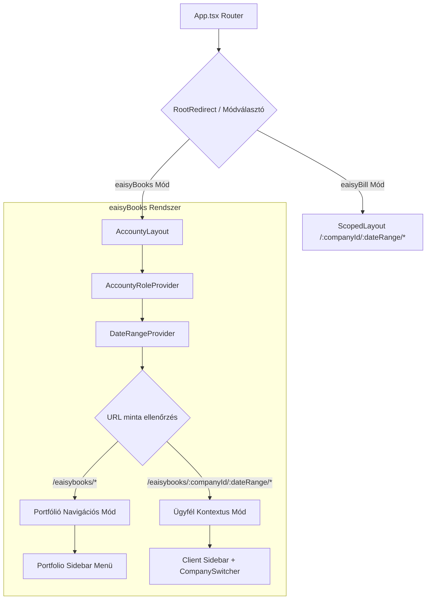
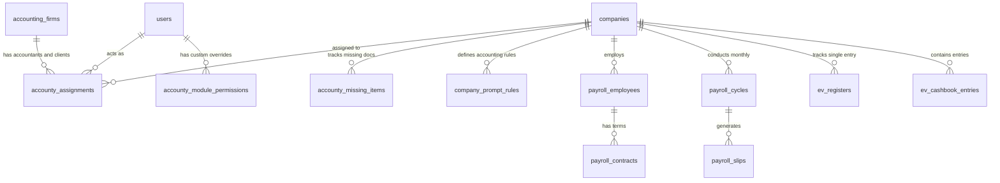

# eaisyBooks (Accounty) Architecture & System Design

---

## 1. Executive Summary & Architecture Paradigm

**`eaisyBooks`** (korábban belső kódnevén: `Accounty`) a Visibill platform professzionális könyvelőirodai ERP alrendszere. Kifejezetten olyan könyvelőirodák és független könyvelők számára készült, akik egyszerre több tucat vagy több száz ügyfélcég napi könyvelési, adózási, bérszámfejtési és hatósági folyamatait menedzselik.

### Alapvető Építészeti Alapelvek
1. **Dual-Mode Navigációs Architektúra:** Éles elválasztás a portfólió szintű (aggregált) és az ügyfél-specifikus (mélyfúrási) működés között.
2. **Kettős Szerepkör & Dinamikus DB Felülbírálat (Hybrid RBAC):** 4 szintű statikus szerepkör (`iroda_admin`, `senior_könyvelő`, `könyvelő`, `asszisztens`), kiegészítve munkatársonként és modulonként finomhangolható adatbázis-szintű R/W felülbírálattal (`accounty_module_permissions`).
3. **Kontextus-megőrző Cégváltás:** A fejlécben elhelyezett `CompanySwitcher` lehetővé teszi, hogy a könyvelő cégváltáskor az aktuális aloldalon (pl. `/payroll` vagy `/invoices`) maradjon, elkerülve a felesleges navigációt.
4. **Hibaszigetelés (Resilience):** Route-szintű `AccountyErrorBoundary`, amely egyetlen modul hibája esetén sem omlasztja össze a teljes irodai felületet vagy a portfóliót.
5. **Közös Infrastruktúra és Adatszinkronizáció:** Megosztott Supabase adatbázis, Edge Function réteg és Python Worker háttérmotor. Az ADR A-073 alapján az eaisyBill-ben vagy eaisyBooks-ban létrehozott cégek automatikusan szinkronizálódnak az iroda portfóliójába.

---

## 2. Navigáció & Útvonalstruktúra (Routing Engine)

Az alrendszer belépési pontja az `AccountyLayout` (`src/layouts/AccountyLayout.tsx`), amely az `accountyRoutes.tsx` (`src/routes/accountyRoutes.tsx`) konfigurációjára épül.



### 2.1. URL Mappázás és Alútvonalak

| Típus | Útvonal sablon | Főbb oldalak / komponensek |
|-------|----------------|----------------------------|
| **Portfólió Mód** | `/eaisybooks/portfolio` | `AccountyPortfolio` (Kanban, Grid, List) |
| | `/eaisybooks/missing-invoices` | `MissingInvoicesPage` (hiányzó bizonylatok, email kiküldés) |
| | `/eaisybooks/approval-queue` | `ApprovalQueuePage` (könyvelői jóváhagyási sor) |
| | `/eaisybooks/tax-calendar` | `TaxCalendarPage` (összevont adónaptár) |
| | `/eaisybooks/alerts` | `AlertsCenterPage` (riasztások, határidők) |
| | `/eaisybooks/reports` | `ReportsPage` (irodai KPI dashboard) |
| | `/eaisybooks/ai-assistant` | `AiAssistantPage` (könyvelői AI chat) |
| | `/eaisybooks/admin/*` | `PermissionMatrixPage`, `AccountantManagementPage`, `SettingsPage`, `AuditLogPage` |
| **Ügyfél Mód** | `/eaisybooks/:companyId/:dateRange/overview` | `ClientOverviewPage` |
| | `/eaisybooks/:companyId/:dateRange/invoices` | `ClientInvoicesPage` |
| | `/eaisybooks/:companyId/:dateRange/transactions` | `ClientTransactionsPage` |
| | `/eaisybooks/:companyId/:dateRange/approval-queue` | `ClientApprovalQueuePage` |
| | `/eaisybooks/:companyId/:dateRange/general-ledger` | `ClientGeneralLedgerPage` |
| | `/eaisybooks/:companyId/:dateRange/payroll` | `PayrollDashboard` (4 fázisú bérszámfejtési ciklus) |
| | `/eaisybooks/:companyId/:dateRange/ev` | `EvBookkeepingPage` (átalány/VSZJA/KATA, pénztárkönyv) |
| | `/eaisybooks/:companyId/:dateRange/cegkapu` | `CegkapuPage` (hivatalos tárhely szinkronizáció) |
| | `/eaisybooks/:companyId/:dateRange/representation` | `RepresentationPage` (EGYKE és meghatalmazások) |
| | `/eaisybooks/:companyId/:dateRange/rules` | `CompanyPromptRulesLibrary` (céges könyvelési szabályok) |
| **Ügyfélportál** | `/eaisybooks/client-portal` | `ClientPortalPage` (jelszómentes magic token) |
| **Legacy Route-ok**| `/accounty/*` | Automatikus HTTP 301/React Router átirányítás `/eaisybooks/*`-ra |

---

## 3. Jogosultságkezelés & RBAC Architektúra

Az eaisyBooks a legfejlettebb hibrid jogosultsági rendszert alkalmazza a platformon.

### 3.1. Hibrid Felbontási Mechanizmus (`useAccountyPermissions`)
1. **Statikus Irodai Szerepkör:** Az `accounty_assignments` táblából kerül felolvasásra (`iroda_admin`, `senior_könyvelő`, `könyvelő`, `asszisztens`).
2. **Dinamikus Adatbázis Felülbírálat:** A `useAccountyPermissions` lekéri az `accounty_module_permissions` rekordokat a bejelentkezett felhasználóra.
3. **Kiértékelési Sorrend:**
   - Ha létezik DB felülbírálati bejegyzés az adott modulra (`can_read` / `can_write`), akkor **kizárólag az érvényesül**.
   - Ha nincs egyedi rekord, a rendszer a statikus szerepkör alapértelmezéseit tekinti érvényesnek.
   - Az `iroda_admin` szerepkör implicit módon mindig teljes R/W jogosultsággal bír minden modulra.

```typescript
// Koncepcionális felbontási sorrend:
const hasReadPermission = useMemo(() => {
  if (role === 'iroda_admin') return true;
  if (dbOverride?.can_read !== undefined) return dbOverride.can_read;
  return staticRoleDefaults[role]?.[moduleName]?.canRead ?? false;
}, [role, dbOverride, moduleName]);
```

### 3.2. Irodai Szerepkörök és Hatáskörök Mátrixa

| Modul / Funkció | Asszisztens | Könyvelő | Senior Könyvelő | Iroda Admin |
|-----------------|:-----------:|:--------:|:---------------:|:-----------:|
| Portfólió megtekintése | R | R/W | R/W | R/W |
| Számlák, Tranzakciók kezelése | R/W (kijelölt) | R/W | R/W | R/W |
| Hiányzó számlák & Értesítők küldése | R/W | R/W | R/W | R/W |
| Könyvelői Jóváhagyási Sor (Approval) | ❌ | R/W | R/W | R/W |
| Bérszámfejtés: jelenlét rögzítés | R/W | R/W | R/W | R/W |
| Bérszámfejtés: számfejtés, jóváhagyás, NAV 08 | ❌ | R/W | R/W | R/W |
| EV & Pénztárkönyv: zárás, bevallások | ❌ | R/W | R/W | R/W |
| TAO & KIVA modul | R | R/W | R/W | R/W |
| Cégkapu & EGYKE meghatalmazások | R | R/W | R/W | R/W |
| Céges Prompt Szabálytár | R | R/W | R/W | R/W |
| Irodai Riportok & Teljesítmény | ❌ | R | R/W | R/W |
| Jogosultsági Mátrix (`PermissionMatrixPage`) | ❌ | ❌ | ❌ | R/W |
| Könyvelők kezelése, Iroda beállítások | ❌ | ❌ | ❌ | R/W |

---

## 4. Főbb Szakmai Rendszermodulok

### 4.1. Bérszámfejtési Alrendszer (Payroll Engine)
- **4 Fázisú Cikluskezelés:** `draft` (jelenlét és jogviszonyok összeállítása) → `calculation` (SZJA, TB, Szocho, családi és 25 év alatti kedvezmények kalkulációja) → `approval` (szakmai audit) → `closed` (bizonylatgenerálás).
- **NAV 08 ÁNYK XML Rekonstrukciós Motor (`nav08XmlParser`):** Képes a korábban benyújtott 08-as havi bevallásokból rekonstruálni a teljes dolgozói állományt, szerződéseket és korábbi számfejtéseket.
- **Bizonylat és Banki Export:** PDF bérjegyzékek, SEPA HUF átutalási állomány generálása és elektronikus bérjegyzék publikálás.

### 4.2. Egyéni Vállalkozói (EV) és Szervezeti Könyvvitel
- **3 EV Adózási Forma:** Átalányadó (40/80/90%), VSZJA (tételes), KATA.
- **Pénztárkönyv Zárási Varázsló:** Havi/időszaki egyenlegellenőrzés, negatív készpénzegyenleg figyelése, stornó analitika, nyomtatható pénztárkönyv.
- **Törvényes Nyilvántartások:** 14 SZJA analitika automatikus vezetése.
- **Szervezeti Könyvvitel:** Civil szervezetek és társasházak egyszeres könyvvitelének kezelése.

### 4.3. TAO és KIVA Modul
- Évközi adóalap és előlegkötelezettség folyamatos követése.
- Év végi zárási ellenőrző lista: adóalap növelő és csökkentő tételek kezelése.
- Adóforma-optimalizálási kalkulátor és szimuláció.

### 4.4. Cégkapu / KÜNY Tárhely & Hatósági Képviselet
- Hatósági levelek és adófolyószámla kivonatok közvetlen szinkronizációja.
- EGYKE meghatalmazások nyilvántartása határidő-riasztásokkal.

### 4.5. Cég-specifikus Könyvelési Szabálytár (`company_prompt_rules`)
- Cégenként rögzíthető természetes nyelvű vagy strukturált könyvelési szabályok.
- A háttérben futó AI osztályozó közvetlenül beépíti a szabályokat a kontírozási promptokba, garantálva a cégspecifikus logikák érvényesülését.

---

## 5. Adatbázis Modell & Kapcsolatok



### Kulcstáblák Összefoglalója

| Tábla | Elsődleges funkció | RLS stratégia |
|-------|-------------------|---------------|
| `accounty_assignments` | Könyvelő ↔ cég ↔ iroda hozzárendelés és szerepkör | Irodához rendelt tagok és cégtagok érik el |
| `accounty_module_permissions` | Modul-szintű egyedi R/W felülbírálatok | Csak `iroda_admin` írhatja, a user sajátját olvashatja |
| `accounty_missing_items` | Hiányzó számlák nyilvántartása és tokenje | Könyvelők és érvényes tokennel rendelkező ügyfelek |
| `accounty_audit_log` | Biztonsági és könyvelési műveletek naplózása | `iroda_admin` és senior könyvelő olvashatja |
| `payroll_employees` & `payroll_cycles` | Bérszámfejtési törzs és havi ciklusok | Céghez rendelt könyvelők és adminisztrátorok |
| `company_prompt_rules` | Könyvelési szabályok és konfidencia küszöbök | Könyvelők és cégtulajdonosok |

---

## 6. Hibaszigetelés és Megbízhatóság (Error Boundaries)

Az eaisyBooks az ADR A-079 alapján a route-szintű hibaszigetelést alkalmazza:
- Ha bármely almodulban (pl. a bérszámfejtési jelenléti rácsban vagy az EV pénztárkönyvben) nem várt JavaScript hiba lép fel, az `AccountyErrorBoundary` elkapja a kivételt.
- Az ErrorBoundary tartalmaz egy "Újrapróbálkozás" és egy "Vissza az áttekintéshez" gombot.
- URL-váltáskor a hibakeret állapota automatikusan visszaáll alaphelyzetbe, így a felhasználó azonnal navigálhat egy másik ügyfélre vagy modulra az alkalmazás újratöltése nélkül.
