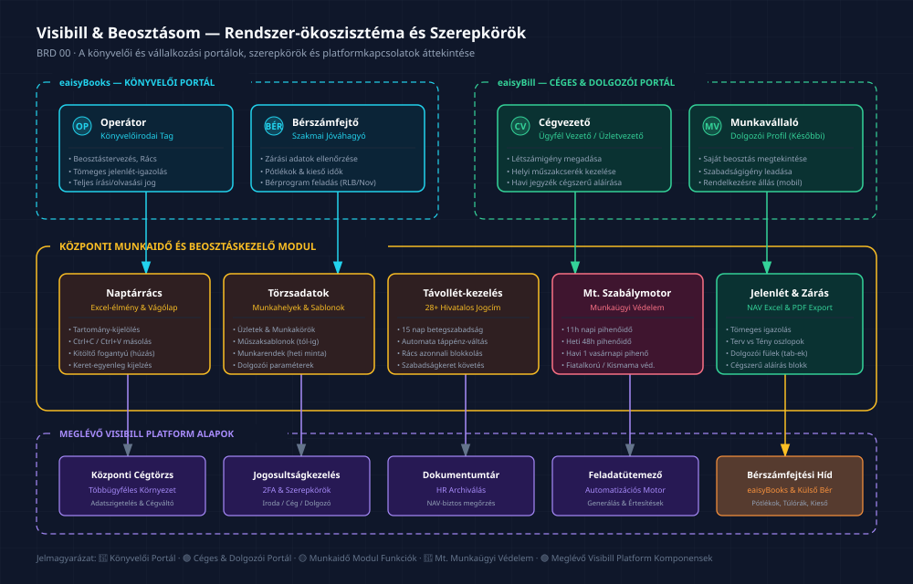

# Visibill & Beosztásom — Üzleti Követelmény Dokumentum (BRD)
## 00. Vezetői Összefoglaló és Üzleti Kontextus

> **Verzió:** 1.0 | **Dátum:** 2026-10-06 | **Státusz:** Jóváhagyásra kész  
> **Modul:** eaisyBill / eaisyBooks — Munkaidő-nyilvántartás és Beosztáskezelő  
> **Navigáció:** [Vissza az Indexhez](./INDEX.md) · [Következő: Fogalomtár & Domain Modell](./01_BRD_GLOSSARY_AND_DOMAIN_MODEL.md)

---

## 1. Vezetői Összefoglaló — Mi a Szoftver Értelme?

### 1.1 A projekt célja egy mondatban
Az **Eaisybill / eaisyBooks** rendszer kibővítése a [www.beosztasom.hu](https://www.beosztasom.hu) bemutatójában megismert és továbbfejlesztett havi munkaidő-nyilvántartási (jelenléti ív) és beosztáskezelési funkcióegyüttessel, amely a magyar Munka Törvénykönyve (Mt.) szabályait automatikusan betartva, a könyvelőirodák és KKV cégvezetők havi adminisztrációs idejét töredékére csökkenti.

### 1.2 Milyen üzleti problémát old meg?
A magyar KKV szektorban (különösen a vendéglátásban, kiskereskedelemben, gyártásban és építőiparban) a munkaidő-beosztások tervezése és a jelenléti ívek vezetése tipikusan a következő kaotikus formákban zajlik:
- Kockás füzetben vagy nehezen átlátható Excel táblákban;
- A munkaügyi szabályok (napi pihenőidők, heti 48 órás pihenő, munkaidőkeret-határok, fiatalkorúak korlátozásai) folyamatos, észrevétlen megsértésével;
- Hó végén a könyvelőirodának vagy bérszámfejtőnek kézzel elküldött, hibás vagy hiányos jelenléti ívek formájában;
- Külön bérprogramban manuálisan nyilvántartott betegszabadság- és táppénznapokkal.

A fejlesztendő modul ezt **négy alapvető pilléren** oldja meg:

| Ssz. | Alappillér | Üzleti érték és megoldás |
|:---:|:---|:---|
| **1** | **Hatósági (NAV / Munkaügyi Felügyelet) megfelelőség** | Havi szinten generált, hiteles munkaidő-jegyzék Excel és PDF formátumban, amely dolgozónként külön munkalapon tartalmazza a tervezett beosztást, a tényleges jelenlétet, a távolléteket és a törvényes pótlékokat, egyetlen havi céges aláírással hitelesítve. |
| **2** | **Drasztikus időmegtakarítás a könyvelőirodáknak** | A jelenlegi többnapos, dolgozónkénti manuális „mazsolázás” helyett sablonok, tartomány-kijelölések, Excel-szerű másolások és szabályalapú automatikus generálás révén a havi adminisztráció percekre csökken. |
| **3** | **Munkaügyi szabályok automatikus ellenőrzése (Mt. motor)** | A beosztás tervezése közben a rendszer valós időben felügyeli a napi/heti korlátokat, a 11 órás napi pihenőidőt, a heti 48 órás pihenőt, a 6 munkanap utáni kötelező pihenőnapot, a havi legalább 1 vasárnapi pihenőt, a munkaidőkeret (pl. 3 havi) egyenlegét és a védett munkavállalók (fiatalkorú, kismama) speciális szabályait. |
| **4** | **Törzsadat- és távollét-kezelés Mt. szerinti jogcímekkel** | 28+ hivatalos Mt. szerinti távolléti jogcím támogatása. A betegszabadság (első 15 munkanap, amit a munkáltató fizet) és a táppénz (15 nap után, NEAK által folyósított kieső idő) automatikus átfordulásának számítása, kézi számlálók kiváltásával. |

---

## 2. Érintettek és Felhasználói Szerepkörök

A rendszer a meglévő Visibill többcéges működési modelljére épülve négy alapvető felhasználói csoportot szolgál ki:

```
                  ┌──────────────────────────────────────────────┐
                  │          VISIBILL / EAISYBILL ÖKOSZISZTÉMA    │
                  └──────────────────────┬───────────────────────┘
                                         │
                 ┌───────────────────────┴───────────────────────┐
                 ▼                                               ▼
   [ eaisyBooks — Könyvelői Portál ]              [ eaisyBill — Céges & Dolgozói Portál ]
   • Operátor (Könyvelőirodai munkatárs)          • Cégvezető / Operatív Vezető (Üzletvezető)
   • Bérszámfejtő / Senior Könyvelő               • Munkavállaló (Önkiszolgáló profil)
```

### 2.1 Felhasználói Szerepkörök Mátrixa

| Szerepkör | Ki ő? | Hozzáférés / Feladatai | Szükséges Jogosultság |
|:---|:---|:---|:---|
| **Operátor (Könyvelőirodai munkatárs)** | A jelenlegi tényleges és legfontosabb felhasználó. Ügyfelenként (cégenként) kezeli a törzsadatokat, tervezi a beosztást, rögzíti a távolléteket, igazolja a jelenlétet és exportálja a havi jegyzéket. | Teljes szerkesztési (írási/olvasási) jog a kezelt cégek munkaidő moduljában. Cégek közötti gyorsváltóval dolgozik. | Könyvelőirodai Adminisztrátor / Senior Könyvelő / Könyvelő |
| **Bérszámfejtő** | A könyvelőiroda vagy a cég bérszámfejtési felelőse. A havi lezárt jelenlétek, túlórák, pótlékok és kieső idők adatait közvetlenül veszi át a bérszámfejtési folyamatba. | Havi zárási adatok olvasása és bérszámfejtési jóváhagyása. Bérprogram exportok generálása. | Bérszámfejtő / Könyvelő |
| **Cégvezető / Üzletvezető** | Az ügyfél cég operatív vezetője (pl. étteremvezető, boltvezető, művezető). A könyvelőiroda meghatalmazása alapján saját maga is rögzíthet műszakot, műszakcserét vagy létszámigényt. | Cég-specifikus szerkesztési hozzáférés a saját munkavállalóihoz és munkahelyeihez. | Cégtulajdonos / Cégadminisztrátor |
| **Munkavállaló** | A cég alkalmazottja vagy egyszerűsített foglalkoztatottja. (Kezdetben opcionális, később önkiszolgáló). | Kizárólag saját jóváhagyott beosztásának megtekintése, szabadságigény beadása, saját jelenlét rögzítése (ha engedélyezett). | Munkavállalói hozzáférés |

---

## 3. A Meglévő Beosztásom.hu Bemutató Elemzése

A bemutató videó alapján a jelenlegi külső rendszerben a könyvelőirodai operátor az alábbi havi munkafolyamatot vitte végig:

1. **Törzsadatok felvitele:** Cég (név, adószám, logó), telephelyek / munkahelyek (pl. gyrosos üzletek: „Nagy Sándor utca” és „Kőrösi”), munkakörök, munkavállalók adatai (Mt. jogviszony, szabályok, munkaidőkeret, szabadságkeret).
2. **Sablonok beállítása:** Munkarendek, munkaidő-sablonok (műszakidők, pl. 8:00–16:30, 30p szünet), heti beosztássablonok.
3. **Havi beosztás létrehozása:** Beosztáskezelőben új időszak felvétele (pl. „2026. szeptember”), létszámigény megadása napokra és telephelyekre.
4. **Beosztás szerkesztése:** Naptárrácsban műszakok felvitele egyesével vagy táblázatos nézetben. Ledolgozott órák és keretegyenlegek figyelése.
5. **Távollétek rögzítése:** Szabadság, betegszabadság, táppénz napok felvitele.
6. **Beosztás lezárása:** A tervezett beosztás lezárása (bár lezárás után is szerkeszthető marad).
7. **Jelenlét igazolása:** Jelenlét menüben „tömeges igazolás” — a tervezett műszakok tényleges jelenlétté alakítása, egyedi eltérések javítása.
8. **Exportálás:** Excel munkaidő-jegyzék generálása dolgozónkénti munkalapokkal, opcionális pótlék-sorokkal, aláírásra kinyomtatva.

---

## 4. Azonosított Hiányosságok és a Visibill Megkülönböztető Előnyei (Kiemelt Értékajánlat)

A külső szoftver bemutatóján a felhasználó számos ponton kifejtette aggályait és fájdalompontjait. Ezek képezik a saját fejlesztésünk **legfontosabb megkülönböztető követelményeit**:

| Fájdalompont a bemutatott rendszerben | Következmény a felhasználónak | Elvárás a Visibill saját rendszerében |
|:---|:---|:---|
| **Csak cellánkénti másolás létezik**<br>(Ctrl+C / Ctrl+V nem működik a rácsban, sávos/tartományos kijelölés nincs; csak Ctrl+Alt + egérhúzással lehet cellát duplázni). | Egy dolgozó havi beosztásának felvitele napról napra, egyesével történik („mazsolázás”). Korábbi rendszerükben öt kattintással lemásoltak egy hetet az egész hónapra. | **Valódi Excel-élmény a rácsban:** Tartomány-kijelölés (Shift / Ctrl + kattintás), Ctrl+C / Ctrl+V, húzással kitöltés (kitöltő fogantyú), „hét másolása a következő hetekre”, „hó végéig kitöltés”. |
| **Nincs automatikus generálás**<br>(Minden hónapban kézzel kell bevinni a műszakokat, pedig a cégek 80%-ában állandó a munkarend). | Hatalmas ismétlődő kézimunka minden hónap elején minden egyes kezelt cégnél. | **Szabályalapú automatikus generálás:** Cégspecifikus szabályok egyszeri beállítása; hó végén/elején egy kattintásra legenerálódik a teljes beosztás vagy másolódik az előző hónap, csak az eltéréseket kell javítani. |
| **Megjegyzés jelenik meg a távollét típusa helyett**<br>(A naptárban és az exportban a szabad szöveges megjegyzés látszik, nem a választott hivatalos kategória). | Kétszer kell leírni ugyanazt; a betegszabadságot és a táppénzt külön bérprogramban, papíron számolják. | **Hivatalos Mt. kategóriák elsődleges megjelenítése:** A kód és név jelenik meg; a 15 munkanapos betegszabadság → táppénz átfordulást a rendszer automatikusan számolja és jelzi. |
| **A kijelölés funkció csak kitöltött cellákra működik**<br>(Üres napokat nem lehet kijelölni, a helyettesítés logikája nem volt érthető a felhasználónak). | A csoportos műveletek és a gyors csere kihasználatlan maradt a bonyolultság miatt. | **Logikus és üres cellákra is működő tömeges szerkesztés:** Üres napok csoportos feltöltése műszakkal, műszakok egy lépésben történő áthelyezése másik dolgozóhoz. |
| **Munkavállalók kézi felvitele**<br>(Nincs kényelmes bérprogram-import vagy meglévő törzsadat-szinkron). | Lassú bevezetés, gépelési hibák az adóazonosítónál vagy személyes adatoknál. | **Automatikus szinkronizáció:** Meglévő Visibill / eaisyBooks dolgozótörzs azonnali használata, bérprogram CSV/Excel import oszlop-hozzárendeléssel. |
| **Beosztássablonban sem lehet másolni**<br>(A sablonszerkesztőben is minden cellát egyesével kellett kitölteni). | A sablonkészítés majdnem annyi idő, mint maga a beosztás. | **Gyors sablonszerkesztő:** Tömeges műveletekkel, cégek közötti sablonkönyvtárral. |
| **Lassú felületi működés**<br>(A munkavállalói lista betöltése és a navigáció másodpercekig homokórázott). | Rossz felhasználói élmény, frusztráció a havi zárási hajtásban. | **Szigorú teljesítménykövetelmény:** Lista- és szűrőváltás < 300 ms, rács-műveletek azonnaliak (< 100 ms), nagyteljesítményű megjelenítéssel. |

---

## 5. Hogyan Illeszkedik a Modul az Eaisybill / EaisyBooks Rendszerbe?

A munkaidő- és beosztáskezelő funkcióegyüttes nem egy elszigetelt siló, hanem a Visibill platform szerves része:


*(Vektoros formátum: [00_rendszer_attekintes.svg](./diagramms/00_rendszer_attekintes.svg) · Nagyfelbontású kép: [00_rendszer_attekintes@2x.png](./diagramms/00_rendszer_attekintes@2x.png))*

1. **Közös Cégtörzs (Többcéges működés):**
   - A könyvelőirodai ügyfelek már léteznek a Visibill központi ügyfél- és cégnyilvántartásában. A munkaidő-modul ezekhez a cégekhez kapcsolódik. Nem kell újra felvinni a cégnevet, adószámot vagy logót.
2. **Közös Felhasználó- és Jogosultságkezelés:**
   - A platform meglévő szerepkörei (irodavezető, könyvelő, cégvezető, munkavállaló) határozzák meg a hozzáféréseket. A platform cégváltó felülete natívan kezeli az új modult is.
3. **Bérszámfejtési Híd:**
   - A havi lezárt jelenlétek, túlórák, éjszakai/vasárnapi pótlékok és kieső idők (táppénz, fizetés nélküli szabadság) közvetlenül átadódnak az eaisyBooks bérszámfejtési munkafolyamatának, megszüntetve a külső bérprogramokba történő manuális adatbegépelést.
4. **Automatizációs és Ütemező Motor:**
   - A platform meglévő ütemező és automatizációs képességeit használjuk a havi beosztások ütemezett generálásához, a határidő-emlékeztetők kiküldéséhez és a jövőbeli e-mailes jelenléti ív feldolgozáshoz.
5. **Dokumentumtár és Archívum:**
   - A generált és kinyomtatott, aláírt havi munkaidő-jegyzékek automatikusan archiválódnak a cég dokumentumtárában, így egy esetleges NAV ellenőrzésnél azonnal, visszamenőleg is visszakereshetők.

---

## 6. Fejlesztési Határok: Első Működő Verzió (0–4. fázis) vs Későbbi Bővítési Fázisok (5–9. fázis)

A fejlesztési kockázatok minimalizálása érdekében a projekt határozott fázisokra oszlik:

### ✅ Első Éles Verzió Terjedelme (Kezdeti Hatókör)
- Teljes törzsadat-kezelés (munkahelyek/üzletek, munkakörök, munkavállalók teljes adatlappal, munkarendek, műszaksablonok);
- Beosztáskezelő interaktív naptárráccsal, műszakfelvitellel és a kritikus **tartomány-kijelölési, Ctrl+C/V másolási képességekkel**;
- Távollétek teljes Mt. jogcímkészlettel (szabadságkeret számítás, betegszabadság rögzítés);
- Jelenlét menü: hónapválasztás, egyedi és tömeges igazolás, lezárás;
- **Hivatalos Excel munkaidő-jegyzék export** (dolgozónként külön munkalapon, Beosztás és Jelenlét oszlopokkal, távollétekkel, pótlék-kapcsolóval, aláírási mezőkkel) és PDF export;
- Alapvető statisztikák (ledolgozott órák, normál, túlóra).

### ⏳ Későbbi Bővítési Fázisok Terjedelme (5. fázistól)
- Komplex munkaügyi szabálymotor (automata Mt. korlát figyelés valós időben a rácsban és 3 havi munkaidőkeret-elszámolás) → *5. fázis*;
- Teljes szabályalapú automatikus generálás és intelligens partner-helyettesítő algoritmus → *6. fázis*;
- Kétirányú bérszámfejtési elektronikus adatátadás és automatikus teendő-értesítések → *7. fázis*;
- Munkavállalói önkiszolgáló belépés és mobilos igénybeadás → *8. fázis*;
- Beléptetőrendszer integráció (kártyás/QR-kódos eseményfogadás) és e-mailes jelenlét-feldolgozás → *9. fázis*.

---

## 7. Üzleti Sikerkritériumok és Fő Teljesítménymutatók

1. **Időmegtakarítás:** Egy 10–25 fős KKV havi munkaidő-nyilvántartásának elkészítése kevesebb mint **harmadannyi időt** vegyen igénybe az operátor számára, mint a korábbi külső rendszerben.
2. **Hatósági Megfelelőség:** Az elkészült havi Excel/PDF munkaidő-jegyzék a könyvelőiroda szakmai vezetője és a hatósági előírások szerint 100%-ban elfogadható, hibamentes és aláírható legyen.
3. **Zéró Adatvesztés & Teljes Auditálhatóság:** Minden módosítás naplózott legyen; visszamenőleges hónapok zárás után csak indoklással és ellenőrzötten módosíthatók.
4. **Felületi Sebesség:** A naptárrácsban történő navigáció, cellamásolás és szűrés azonnali (válaszidő < 100 ms).
