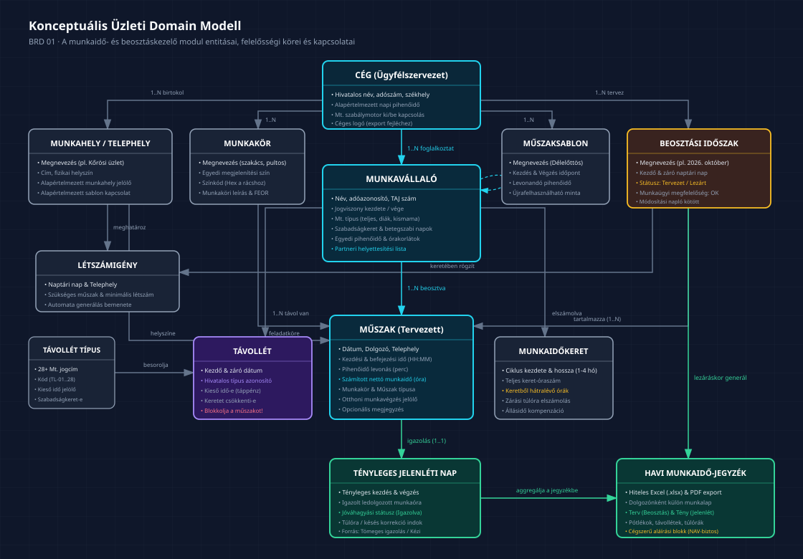
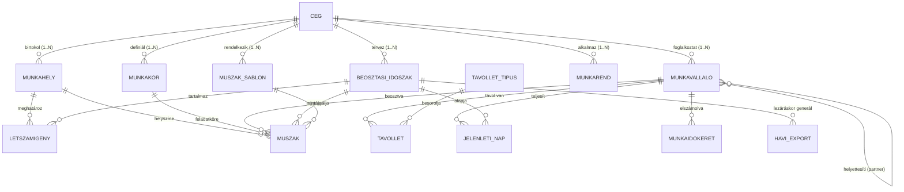

# Visibill & Beosztásom — Üzleti Követelmény Dokumentum (BRD)
## 01. Fogalomtár és Konceptuális Domain Modell

> **Verzió:** 1.0 | **Dátum:** 2026-10-06 | **Státusz:** Jóváhagyásra kész  
> **Modul:** eaisyBill / eaisyBooks — Munkaidő-nyilvántartás és Beosztáskezelő  
> **Navigáció:** [Előző: Vezetői Összefoglaló](./00_BRD_OVERVIEW_AND_EXECUTIVE_SUMMARY.md) · [Vissza az Indexhez](./INDEX.md) · [Következő: Fő Folyamatok és Felhasználói Utak](./02_BRD_CORE_WORKFLOWS_AND_USER_JOURNEYS.md)

---

## 1. Hivatalos Munkajogi és Rendszer Szintű Fogalomtár

A specifikáció és az üzleti követelmények félreérthetetlen értelmezéséhez az alábbi fogalmakat a magyar Munka Törvénykönyve (2012. évi I. törvény — Mt.) és a könyvelőirodai gyakorlat alapján rögzítjük:

| Fogalom | Munkajogi és Rendszerbeli Jelentés | Megjelenés a Felületen / Exportban |
|:---|:---|:---|
| **Munkaidő-nyilvántartás (jelenléti ív / munkaidő-jegyzék)** | A munkáltató által az Mt. 134. § alapján kötelezően vezetett nyilvántartás, amely napi bontásban, naprakészen tartalmazza a rendes és rendkívüli munkaidő kezdetét, végét, a pihenőidőt, a ledolgozott órákat és a távolléteket. A rendszer az exportban **„Munkaidő-jegyzék”** megnevezést használ. | Hó végi aláírható Excel és PDF export. |
| **Beosztás (Tervezett beosztás)** | Egy adott naptári időszakra (jellemzően egy naptári hónapra) előre elkészített munkaidő-beosztási terv: melyik dolgozó melyik napon, mettől meddig, melyik telephelyen és munkakörben köteles munkát végezni. Az Mt. szerint legalább egy hétre előre közölni kell. | A Beosztáskezelő naptárrácsa; az exportban a **„Beosztás”** oszlopcsoport. |
| **Jelenlét (Ténylegesen teljesített)** | Az a valós időtartam, amíg a dolgozó ténylegesen munkát végzett. A lezárt beosztásból igazolással (vagy beléptetőrendszerből/kézi korrekcióval) keletkezik. | A Jelenlét menü; az exportban a **„Jelenlét”** oszlopcsoport. |
| **Igazolás (Tömeges igazolás)** | Az a könyvelői/operátori jóváhagyási művelet, amellyel a tervezett beosztás műszakjait ténylegesen ledolgozott jelenlétként elfogadjuk. A **tömeges igazolás** az adott cég összes dolgozójának összes tervezett műszakját egy lépésben jóváhagyja. | „Tömeges igazolás” gomb a Jelenlét felületen. |
| **Lezárt beosztás** | Olyan státuszú beosztás, amelynek tervezési szakasza befejeződött. Az operátor számára továbbra is korrigálható marad, de ez képezi a jelenlét automatikus feltöltésének alapját. | „Lezárt beosztás” címke a beosztás fejlécében. |
| **Lezárt jelenlét** | A hó végi ellenőrzés és igazolás utáni véglegesített állapot. Ezután generálható a hivatalos munkaidő-jegyzék és adhatók át az adatok a bérszámfejtésnek. | Hó végi záró gomb; export engedélyezése. |
| **Távollét** | Olyan munkanap vagy időszak, amikor a dolgozó a munkavégzési kötelezettsége alól jogszerűen mentesül (szabadság, betegség, szülési szabadság stb.). A távollét napjára nem tervezhető be műszak. | Kék színű sáv a naptárrácsban; Távollétek menü. |
| **Betegszabadság** | A munkavállaló saját betegsége miatti keresőképtelenség **első 15 munkanapja** egy naptári évben. Ezt a munkáltató bérszámfejti és a távolléti díj 70%-ában közvetlenül ő fizeti. | Távollét kategória (fizetett munkanapok). |
| **Táppénz** | A 15 munkanap betegszabadság kimerítése utáni keresőképtelenségi időszak. Ezt a NEAK (Nemzeti Egészségbiztosítási Alapkezelő) folyósítja; a munkáltató számára **kieső idő**, bért nem számfejt rá. | Távollét kategória (bérszámfejtési kieső idő). |
| **Kieső idő** | Olyan munkaügyi távollét, amelyre a munkáltató nem köteles bért vagy távolléti díjat fizetni (pl. táppénz, fizetés nélküli szabadság, igazolatlan hiányzás). A bérszámfejtés szempontjából kritikus adat. | Exportban és bérfeladásban dedikált oszlop. |
| **Munkarend** | A dolgozó általános foglalkoztatási sémája (pl. általános munkarend: H–P 8:00–16:30; kötetlen; többműszakos; megszakítás nélküli). | Munkavállaló adatlapja és Sablonok menü. |
| **Munkaidő-sablon** | Egyetlen műszak előre definiált időbeli kerete (pl. „Délelőttös”: 06:00–14:30, 30p pihenőidő). Cégen belül és telephelyek között újra felhasználható. | Műszak felviteli ablak; Sablonok menü. |
| **Beosztássablon (Többhetes mintázat)** | Előre összeállított, ismétlődő mintázat (pl. 2 hetes vagy 4 hetes ciklus: melyik dolgozó melyik héten melyik műszakot viszi). Egyetlen gombnyomással rávetíthető a naptári hónapra. | Beosztáskezelő „Kitöltés sablonból” funkció. |
| **Munkaidőkeret** | Az Mt. 93–95. § szerinti elszámolási időszak (jellemzően 2, 3 vagy 4 hónap). A dolgozónak a keret teljes óraszámát kell ledolgoznia, de a havi beosztás rugalmas lehet (egyik hónapban 200 óra, másikban 140 óra). | Naptárrács fejléc: **keret maradék óraszám** kijelzés. |
| **Munkahely (Telephely / Üzlet)** | A munkavégzés fizikailag elkülönülő helyszíne (pl. „Központ iroda”, „Kőrösi utcai üzlet”, „Építkezés A”). Minden cégnél alapesetben létezik legalább egy „Központ”. | Rács szűrő; műszak attribútum; fejléc. |
| **Munkakör** | A munkavállaló által betöltött pozíció (pl. pultos, szakács, pénztáros, raktáros). A felületen egyedi színkóddal jelölhető. | Rács színezési opció; szűrő; statisztika. |
| **Operátor** | A beosztást és jelenlétet kezelő adminisztratív felhasználó (leggyakrabban a könyvelőiroda kijelölt munkatársa, vagy a cég meghatalmazott vezetője). | Operátorok menü; módosítási napló felelőse. |
| **Műszak** | Egy konkrét dolgozó egy adott naptári napra szóló munkavégzési egysége: dátum, kezdési időpont, befejezési időpont, pihenőidő, munkahely, munkakör, típus, otthoni munkavégzés és megjegyzés. | Cella a naptárrácsban; napi táblázat sora. |
| **Bérpótlék (Pótlék)** | Az Mt. szerinti törvényes kiegészítő díjazásra jogosító munkaórák: éjszakai pótlék (22:00–06:00), műszakpótlék, vasárnapi pótlék (50%), munkaszüneti napi pótlék (100%), rendkívüli munkaidő (túlóra pótlék). | Opcionális pótlék-sorok a havi jegyzékben. |
| **Létszámigény (Munkaerőigény)** | Telephelyenként és naponként meghatározott minimális munkatársi létszám (pl. szombatonként 5 fő eladó szükséges a nyitvatartáshoz). | Beosztástervezés 2. lépése; automata generálás alapja. |
| **Jelentkezés (Dolgozói rendelkezésre állás)** | A munkavállaló által előzetesen megadott időbeli preferencia: mikor ér rá és mikor nem tud műszakot vállalni (pl. diákoknál vagy részmunkaidőnél). | Beosztáskezelő dolgozói igények fül. |
| **Beléptetőrendszer / Ellenőrzőpont** | Külső elektronikus munkaidő-rögzítő terminál (kártyás, QR-kódos, biometrikus), amely valós be- és kilépési időbélyegeket generál. | Beléptetőrendszer menü; automata jelenlét. |

---

## 2. Konceptuális Üzleti Domain Modell

Az alábbi ábra szemlélteti a munkaidő- és beosztáskezelő modul üzleti entitásait és azok logikai kapcsolatait:

*(Vektoros formátum: [01_konceptualis_domain_modell.svg](./diagramms/01_konceptualis_domain_modell.svg) · Nagyfelbontású kép: [01_konceptualis_domain_modell@2x.png](./diagramms/01_konceptualis_domain_modell@2x.png))*

---

## 3. Üzleti Entitások és Felelősségi Körök

### 3.1 Cég (Ügyfélszervezet)
- **Üzleti szerepe:** A könyvelőiroda ügyfele; az adatszigetelés legfelsőbb szintje.
- **Főbb attribútumok:** Cég hivatalos neve, adószáma, logója, alapértelmezett napi pihenőideje (pl. 30 perc ebédszünet), munkaügyi szabályok bekapcsolása, kétfaktoros azonosítás (2FA) előírási szabályzata.
- **Kölcsönhatás:** Minden más entitás kötelezően a cég kontextusában él.

### 3.2 Munkahely / Telephely
- **Üzleti szerepe:** A munkavégzés fizikai helyszíne vagy szervezeti egysége (pl. Központ iroda, Kőrösi üzlet, építkezési helyszín).
- **Szabályok:** Minden cégnél alapértelmezetten létezik egy „Központ” munkahely. Ha a cég több üzletet üzemeltet, a dolgozók külön-külön üzletekhez oszthatók be.

### 3.3 Munkakör
- **Üzleti szerepe:** A munkavállaló szakterülete vagy feladatköre (szakács, pultos, sofőr).
- **Attribútumok:** Megnevezés, egyedi megjelenítési szín (Hex színkód a naptárrács kényelmes vizuális áttekintéséhez).

### 3.4 Munkavállaló
- **Üzleti szerepe:** A szerződéses vagy alkalmi jogviszonyban álló dolgozó.
- **Üzleti adatcsoportjai:**
  1. *Alapadatok:* Név, adóazonosító jel, TAJ szám, születési dátum, munkakör, elsődleges munkahely, jogviszony kezdete és vége, munkavállaló típusa (teljes munkaidős, részmunkaidős, fiatalkorú, kismama, alkalmi/egyszerűsített foglalkoztatott).
  2. *Szabadságkeret:* Éves alapszabadság, pótszabadságok, arányosított keret, eddig kivett szabadságok, negatív keret engedélyezése.
  3. *Munkaügyi szabályok:* Egyedi napi min/max munkaidő (pl. 4h–12h), heti max munkaidő (pl. 40h), napi pihenőidő két műszak között (pl. 11h).
  4. *Munkaidőkeret paraméterek:* Keretben dolgozik-e, keret kezdőnapja, ciklus hossza (pl. 3 hónap), kezdeti ledolgozott órák.
  5. *Igények:* Munkaszüneti napokon dolgozhat-e, kizárt napok (preferált pihenőnapok), preferált idősáv.
  6. *Partnerek:* Kikkel cserélhet műszakot (intelligens helyettesítési párhuzamok).

### 3.5 Műszak
- **Üzleti szerepe:** A beosztástervezés alapegysége egy adott napra és dolgozóra.
- **Attribútumok:** Tervezési időszak, dátum, munkavállaló, munkahely, munkakör, kezdési idő (HH:MM), befejezési idő (HH:MM), levont pihenőidő (perc), nettó munkaidő (számított óra), műszak típusa (normál, túlóra, éjszakai, ügyelet), otthoni munkavégzés jelölő, megjegyzés.

### 3.6 Távollét
- **Üzleti szerepe:** Olyan munkanap vagy időszak, amikor a dolgozó nem végez munkát.
- **Attribútumok:** Munkavállaló, kezdet dátuma, befejezés dátuma, távollét jogcíme (28+ típus közül), megjegyzés, kieső időnek minősül-e, csökkenti-e a szabadságkeretet.

### 3.7 Tényleges Jelenléti Nap
- **Üzleti szerepe:** A valóságban ledolgozott munkaidő és jogcím.
- **Attribútumok:** Dátum, dolgozó, kezdés, vég, pihenőidő, ledolgozott óraszám, jóváhagyott státusz, eltérés indoklása (ha eltér a tervezett műszaktól).

### 3.8 Havi Időszak és Export
- **Üzleti szerepe:** A havi tervezési és elszámolási ciklus egysége.
- **Állapotai:** `Tervezet` → `Lezárt beosztás` → `Jelenlét igazolva` → `Hó végi lezárt és Archivált`.

---

## 4. Alapvető Üzleti és Rendszerintegritási Szabályok

1. **Zéró Átfedés:** Egy munkavállalónak ugyanazon a naptári napon vagy egymásba nyúló idősávban nem létezhet két egymást fedő aktív műszakja.
2. **Távollét Elsőbbsége:** Ha egy dolgozóhoz jóváhagyott távollét (pl. fizetett szabadság vagy betegszabadság) van rögzítve egy adott napra, a rendszer **szigorúan tiltja** oda tervezett műszak rögzítését. A távollét automatikusan blokkolja a munkanapot.
3. **Jogviszony Érvényességi Korlát:** Nem hozható létre műszak vagy távollét a munkavállaló jogviszonyának kezdete előtt vagy kilépési dátuma után.
4. **Lezárás Utáni Módosítás Védelme:** Lezárt és bérszámfejtésnek átadott havi jelenléti ívet az operátor csak explicit feloldási jogosultsággal és kötelező indoklás rögzítésével módosíthat (ellenőrzési naplózás kötelező).
5. **Egyedi Céges Izoláció:** Tilos bármilyen adat (munkavállaló, műszak, sablon) akaratlan átszivárgása a könyvelőiroda által kezelt különböző cégek (ügyfélszervezetek) között.
