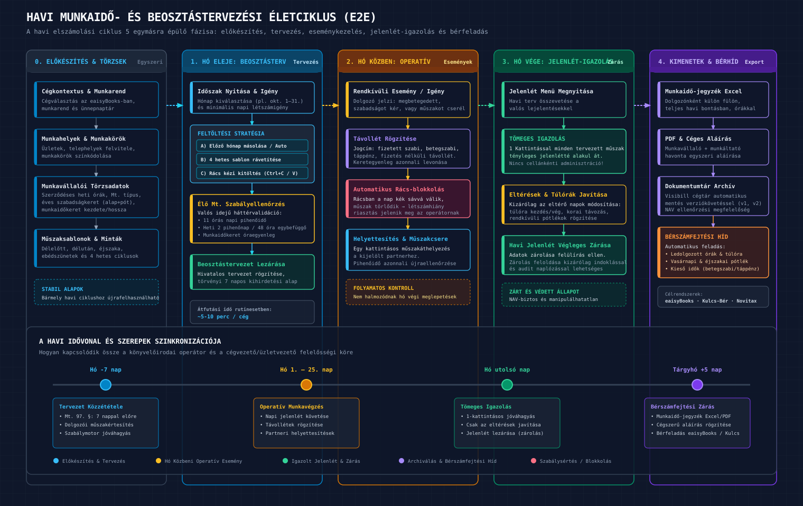
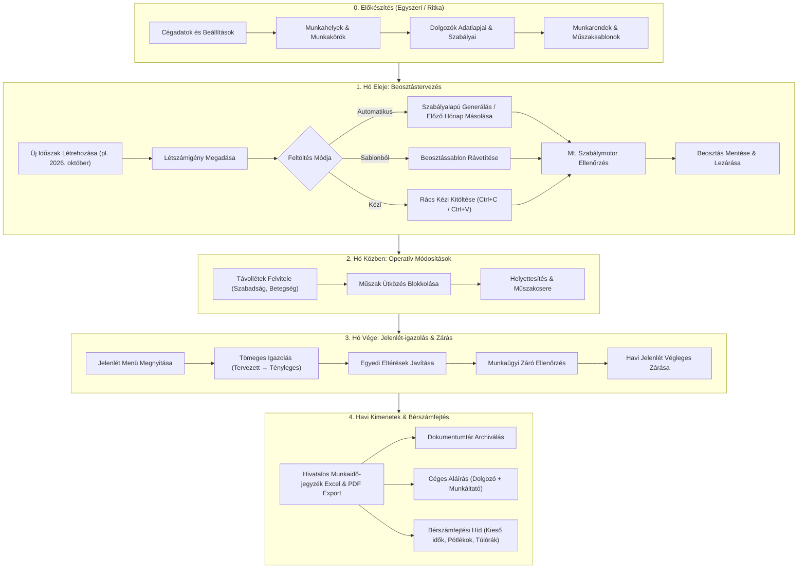
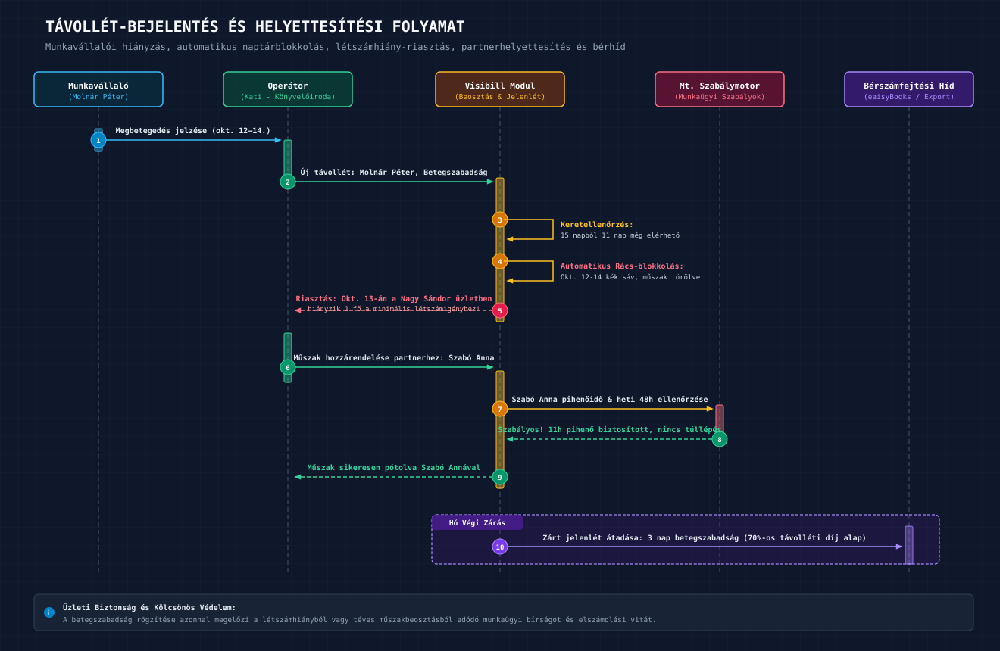
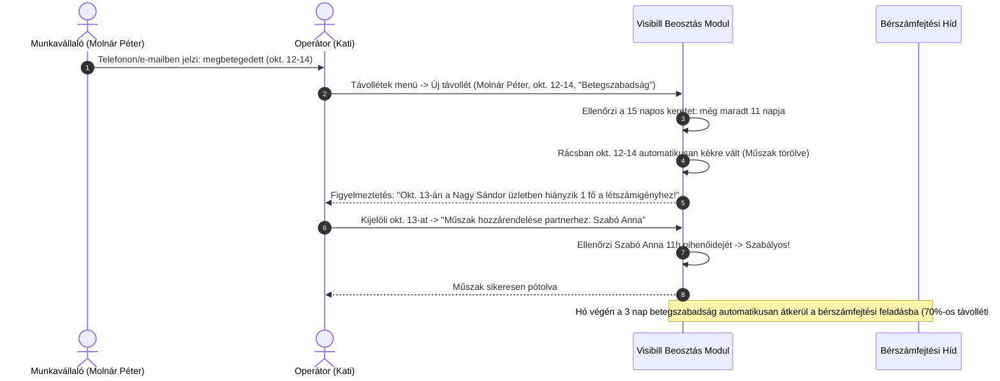

# Visibill & Beosztásom — Üzleti Követelmény Dokumentum (BRD)
## 02. Fő Üzleti Folyamatok és Felhasználói Utak

> **Verzió:** 1.0 | **Dátum:** 2026-10-06 | **Státusz:** Jóváhagyásra kész  
> **Modul:** eaisyBill / eaisyBooks — Munkaidő-nyilvántartás és Beosztáskezelő  
> **Navigáció:** [Előző: Fogalomtár & Domain Modell](./01_BRD_GLOSSARY_AND_DOMAIN_MODEL.md) · [Vissza az Indexhez](./INDEX.md) · [Következő: Beosztástervezés Követelményei](./03_BRD_FUNCTIONAL_REQUIREMENTS_SCHEDULING.md)

---

## 1. A Teljes Körű Havi Üzleti Munkafolyamat

A rendszer a könyvelőiroda és az ügyfél cég havi elszámolási ciklusára épül. Az alábbi ábra összefoglalja az 5 fázisból álló havi életciklust:

*(Vektoros formátum: [02_havi_munkafolyamat_e2e.svg](./diagramms/02_havi_munkafolyamat_e2e.svg) · Nagyfelbontású kép: [02_havi_munkafolyamat_e2e@2x.png](./diagramms/02_havi_munkafolyamat_e2e@2x.png))*

---

## 2. A Havi Munkafolyamat Lépései Részletesen

### 2.1 Előkészítés és Törzsadatok (Egyszeri beállítás)
1. **Cégkontextus:** A könyvelőiroda kiválasztja az ügyfelet a cégváltóban.
2. **Telephelyek / Üzletek:** Munkahelyek felvitele (pl. „Központ iroda”, „Nagy Sándor utca üzlet”, „Kőrösi üzlet”).
3. **Munkakörök:** Munkakörök rögzítése és színkódolása (pl. Pultos: narancssárga, Szakács: kék, Bolti eladó: zöld).
4. **Munkavállalók importálása / felvitele:** Teljes adatlap kitöltése (szerződéses adatok, Mt. típus, szabadságkeret, munkaidőkeret, partneri helyettesítő kapcsolatok).
5. **Műszaksablonok:** Napi műszak-idősávok (pl. „Délelőttös 06:00–14:30”, „Délutános 14:00–22:30”, 30 perc ebédszünettel).
6. **Munkarendek és Sablonok:** 2 vagy 4 hetes ismétlődő minták összeállítása.

### 2.2 Hó Eleji Beosztástervezés
1. **Időszak nyitása:** Az operátor a Beosztáskezelőben új időszakot hoz létre (pl. „2026. november 1–30.”).
2. **Létszámigény rögzítése:** Ha az ügyfélnél releváns, naponként megadja a minimális létszámot üzletenként (pl. Hétfő–Péntek: 4 fő, Szombat: 6 fő, Vasárnap: zárva).
3. **Mátrix feltöltése:**
   - *Automatikus generálással:* Egy gombnyomással átmásolja az előző hónapot, vagy a rögzített munkarend alapján legenerálja a hónapot.
   - *Sablonból:* Rávetíti az ismétlődő 4 hetes beosztássablont.
   - *Kézi gyorskitöltéssel:* A rácsban vagy a táblázatos kitöltőben felviszi a műszakokat, és a továbbfejlesztett vágólap-funkciókkal (Ctrl+C / Ctrl+V, sor kijelölése, hét másolása a hónap végéig) másodpercek alatt feltölti a sorokat.
4. **Szabályellenőrzés:** A naptárrács azonnal zöld jelzést ad, ha a beosztás megfelel az Mt.-nek („A beosztás megfelel a munkaügyi előírásoknak”), vagy listázza a pihenőidő- és keret-sértéseket.
5. **Tervezet lezárása:** Az operátor „Lezárja” a beosztást, rögzítve a tervezési alapot.

### 2.3 Hó Közbeni Eseménykezelés
1. **Szabadságok és hiányzások:** Amikor egy dolgozó bejelenti a szabadságát vagy betegségét, az operátor rögzíti a Távollétek menüben.
2. **Automatikus blokkolás:** A távollét azonnal kék sávként megjelenik a naptárrácsban, és letiltja az adott napra vonatkozó műszakot.
3. **Műszak áthelyezése:** Az operátor a kieső műszakot egy kattintással átruházza a kijelölt partnerre vagy helyettesítő munkatársra („Műszak áthelyezése”).

### 2.4 Hó Végi Jelenlét-igazolás
1. **Jelenlét menü megnyitása:** Hónap végén az operátor belép a Jelenlét menübe.
2. **Tömeges igazolás:** Egyetlen kattintással az összes dolgozó tervezett műszakját elfogadja tényleges jelenlétként („Tömeges igazolás”), amennyiben a cég normál mederben működött.
3. **Eltérések korrekciója:** Csak azokat a napokat javítja egyedileg, ahol a valóság eltért a tervtől (pl. 2 óra túlóra pénteken, vagy fél nappal korábbi távozás).
4. **Jelenlét lezárása:** Az igazolt állapot véglegesítése.

### 2.5 Hivatalos Kimenetek és Bérszámfejtési Átadás
1. **Havi munkaidő-jegyzék generálása:** Excel fájl letöltése, amely dolgozónként külön fülön tartalmazza a teljes havi adatokat, a távolléti jogcímeket, a pótlékokat és az aláírási helyeket.
2. **PDF export és nyomtatás:** A cégvezető és a dolgozók számára kinyomtatva, havonta egyszer cégszerűen aláírva.
3. **Dokumentumtár archiválás:** Az exportált állomány automatikusan bekerül a Visibill cégtárába NAV ellenőrzés céljából.
4. **Bérszámfejtési híd:** Az összesített ledolgozott órák, túlórák, éjszakai/vasárnapi pótlékok és kieső idők (táppénz napok száma) átadódnak a bérszámfejtési folyamatnak.

---

## 3. Részletes Felhasználói Utak

### 1. Felhasználói Út: A Könyvelőirodai Operátor Gyors Havi Ciklusa (10 perces zárás)

> **Szereplő:** Kati, könyvelőirodai munkatárs, aki 25 KKV ügyfelet kezel.  
> **Cél:** A „Páratlan Ízek Kft.” (2 üzlet, 14 dolgozó) októberi beosztásának és jelenlétének lezárása minimális kézimunkával.

| Lépés | Kati Tevékenysége | Rendszer Reakciója & Előnye |
|:---:|:---|:---|
| **1** | Belép az eaisyBooks felületre, a cégváltóban kiválasztja a „Páratlan Ízek Kft.”-t, majd rákattint a Munkaidő / Beosztáskezelőre. | Azonnal betöltődik a cég specifikus felülete; jogosultságok rendben vannak. |
| **2** | Új időszakot nyit: „2026. október”. Rákattint az **„Előző hónap másolása”** gombra. | A rendszer a szeptemberi műszakokat a naptári napok és a hét napjai szerint ráilleszti októberre, automatikusan kihagyva az október 23-i nemzeti ünnepet. |
| **3** | Kovács János beosztásánál át kell alakítani a 2. hetet: a hétfői műszakot Shift+Kattintással kijelöli, lenyomja a **Ctrl+C**-t, majd kijelöli a kedd–péntek cellákat és **Ctrl+V**-vel beilleszti. | A műszakok azonnal átmásolódnak. Nem kell cellánként kattintgatni és gépelni. |
| **4** | Látja a fejlécben: a munkaügyi ellenőrző zöld pipát mutat („A beosztás megfelel a munkaügyi előírásoknak”). Rákattint a **„Mentés és lezárás”** gombra. | A beosztás lezárt státuszt kap. |
| **5** | Október 28-án átkattint a Jelenlét menüre, és rákattint a **„Tömeges igazolás”** gombra. | Az összes dolgozó tervezett műszakja ténylegesen igazolt jelenlétté alakul. |
| **6** | Tudja, hogy Tóth Éva október 15-én 2 órával tovább maradt: rákattint az adott napi cellára, átírja a befejezést 18:00-ra (16:00 helyett). | A rendszer újraszámolja a napi munkaidőt, túlóraként regisztrálja a 2 órát, és frissíti a statisztikát. |
| **7** | Rákattint a **„Munkaidő-jegyzék Exportálása”** gombra. | Elkészül a NAV-kompatibilis Excel (14 dolgozói munkalappal) és a nyomtatható PDF. Kati elküldi a cégvezetőnek aláírásra, a béradatokat pedig egy kattintással átadja a bérszámfejtőnek. |

---

### 2. Felhasználói Út: Teljesen Automatizált Havi Munkafolyamat (Érintésmentes Működés)

> **Szereplő:** „Precíziós Fém Kft.” — 8 fős szerelőcsapat, akik kötött, állandó munkarendben (H–P 08:00–16:30) dolgoznak.  
> **Cél:** A havi adminisztráció teljes automatizálása.

1. **Szabálybeállítás (egyszeri):** A cég beállításaiban rögzítve van: *„Generálás forrása: Általános munkarend szerint; Időzítés: Hó utolsó napján automatikusan; Jelenlét-kitöltés: Lezárt beosztás szerint”*.
2. **Automatikus lefutás:** Október 31-én éjfélkor a Visibill ütemező motorja automatikusan legenerálja a novemberi beosztást, figyelembe véve az ünnepnapokat.
3. **Értesítés:** Az operátor reggel e-mailben és a felületen értesítést kap: *„A Precíziós Fém Kft. novemberi beosztása automatikusan elkészült, szabálysértés nem található.”*
4. **Egyetlen teendő:** Ha a hónap során nem volt táppénz vagy rendkívüli esemény, az operátornak mindössze annyi a dolga, hogy hó végén letölti a véglegesített munkaidő-jegyzéket.

---

### 3. Felhasználói Út: Munkavállalói Távollét Bejelentése és Kezelése

> **Szereplő:** Molnár Péter (dolgozó) és Kati (operátor).  
> **Cél:** 3 nap betegszabadság rögzítése és a kieső műszak helyettesítése.

*(Vektoros formátum: [02_helyettesitesi_folyamat_sequence.svg](./diagramms/02_helyettesitesi_folyamat_sequence.svg) · Nagyfelbontású kép: [02_helyettesitesi_folyamat_sequence@2x.png](./diagramms/02_helyettesitesi_folyamat_sequence@2x.png))*

---

## 4. Kivételes Események és Hibakezelési Folyamatok

### 4.1 Munkaügyi Szabálysértés Tervezés Közben
- **Esemény:** Az operátor egy dolgozónak 14 órás műszakot oszt be, vagy két egymást követő napon úgy ad meg műszakot, hogy a pihenőidő csak 8 óra (Mt. minimum: 11 óra).
- **Rendszerválasz:**
  - A naptárrács érintett cellája azonnal narancssárga/piros szegéllyel jelenik meg.
  - A fejléc állapotsávja figyelmeztet: *„1 szabálysértés található a beosztásban: [Dolgozó neve, Dátum]: A napi pihenőidő kevesebb mint 11 óra (tényleges: 8 óra).”*
  - A rendszer részletes felugró ablakban javaslatot tesz a javításra (pl. kezdési időpont kitolása 08:00-ra).
  - Szándékos felülbírálás esetén az operátornak kötelező megjegyzést fűznie hozzá (pl. „Munkáltatói egyedi megállapodás alapján”).

### 4.2 Lezárt Hónap Utólagos Módosítása (NAV Biztonság)
- **Esemény:** Egy már lezárt és exportált hónapban (pl. szeptember) utólag derül ki, hogy egy orvosi igazolás alapján egy dolgozó nem igazolatlanul volt távol, hanem kórházban volt.
- **Rendszerválasz:**
  - A lezárt hónap védett: módosításához az operátornak rá kell kattintania a **„Zárolás feloldása módosításhoz”** gombra.
  - A rendszer megerősítő párbeszédpanelt jelenít meg, ahol kötelező megadni a **feloldás indokát**.
  - A feloldást és a módosított adatokat a rendszer ellenőrzési naplóban rögzíti.
  - Új munkaidő-jegyzék generálásakor a rendszer automatikusan verziószámot léptet (pl. `Munkaido_Jegyzek_2026_09_v2.xlsx`), és megőrzi az eredeti változatot is a dokumentumtárban.
