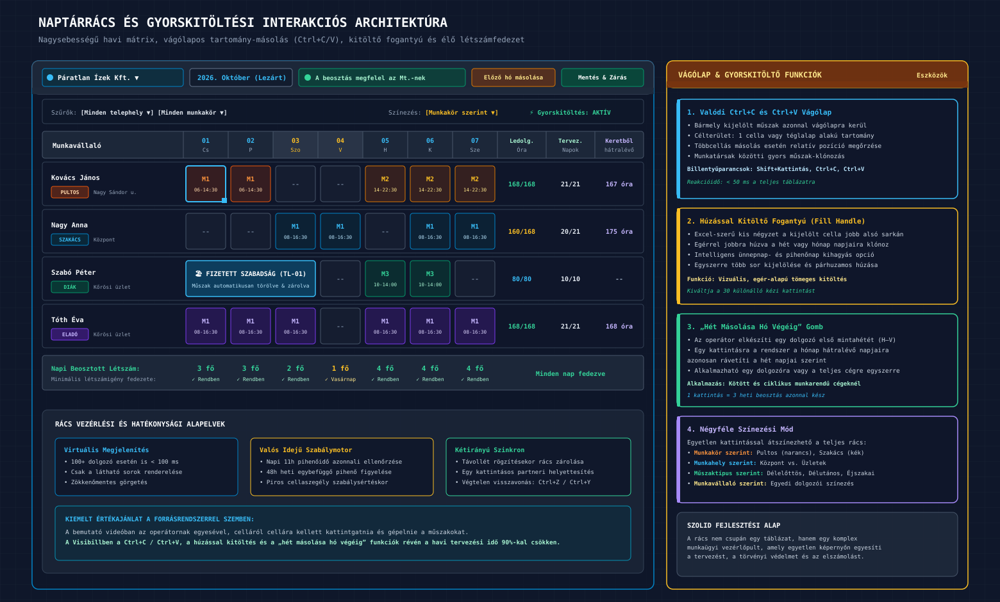

# Visibill & Beosztásom — Üzleti Követelmény Dokumentum (BRD)
## 03. Beosztástervezés és Naptárrács Részletes Követelményei

> **Verzió:** 1.0 | **Dátum:** 2026-10-06 | **Státusz:** Jóváhagyásra kész  
> **Modul:** eaisyBill / eaisyBooks — Munkaidő-nyilvántartás és Beosztáskezelő  
> **Navigáció:** [Előző: Fő Folyamatok és Felhasználói Utak](./02_BRD_CORE_WORKFLOWS_AND_USER_JOURNEYS.md) · [Vissza az Indexhez](./INDEX.md) · [Következő: Távollétek & Jelenlét](./04_BRD_ABSENCE_AND_ATTENDANCE_MANAGEMENT.md)

---

## 1. Rendszerszintű és Navigációs Követelmények

Az alábbi táblázat rögzíti a platform alapvető infrastruktúra- és felületi követelményeit:

| Követelmény ID | Megnevezés | Üzleti Leírás és Részletek | Forrás / Típus |
|:---|:---|:---|:---:|
| **REQ-SYS-01** | **Többügyféles Cégkontextus** | Egy operátor több céget (ügyfelet) kezel. A cégek adatai (munkahelyek, dolgozók, beosztások, szabályok) szigorúan elszigeteltek. A fejlécben elérhető a gyors cégváltó felület. | [Leirat] |
| **REQ-SYS-02** | **Szerepkörök és Hozzáférések** | Négy fő szerepkör: Operátor (Könyvelőiroda), Munkavállaló, Bérszámfejtő, Cégvezető. A jogosultságok modul- és adatszinten szabályozottak. | [Leirat] |
| **REQ-SYS-03** | **Kétfaktoros Hitelesítés (2FA)** | Felhasználónként egyénileg bekapcsolható; cégszinten külön kötelezővé tehető az operátorok, a bérszámfejtők és a munkavállalók számára. | [Leirat] |
| **REQ-SYS-04** | **Nyelv és Lokalizáció** | Alapértelmezett magyar nyelvű felület; felhasználónként és dolgozónként angol nyelvi opció. | [Leirat] |
| **REQ-SYS-05** | **Értesítési Rendszer** | Értesítések menü felületi badge-dzsel, e-mail értesítések és sürgős emlékeztetők (pl. havi jelenlét kitöltésének elmaradása, határidő közeledte). | [Leirat] |
| **REQ-SYS-06** | **GDPR & Adatvédelem** | Személyes és egészségügyi adatok (pl. táppénz, baleset) védelme; cégszintű törlési és felhasználói fiók-törlési jogosultság naplózva; ÁSZF és Adatkezelési tájékoztató elérhetősége. | [Leirat] |
| **REQ-SYS-07** | **Szigorú Teljesítmény** | A bemutatott külső rendszer lassú betöltéseivel szemben: a listák és szűrők betöltése < 300 ms, a rács-műveletek és cellamásolások azonnaliak (< 100 ms), nagyteljesítményű táblázatos megjelenítéssel. | **[Kiemelt Értékajánlat]** |
| **REQ-SYS-08** | **Ellenőrzési Napló** | Minden beosztás-, műszak-, távollét- és jelenlét-módosítás (ki, mikor, mit, melyik cégnél) visszakereshetően naplózásra kerül, mivel hatósági NAV/munkaügyi vizsgálat tárgya. | [Kiegészítés] |

---

## 2. Felületi Menüstruktúra (Bal Oldali Navigáció)

A könyvelőirodai operátorok megszokott logikáját támogatva az alábbi strukturált menürendszer valósul meg a Munkaidő főmodul alatt:

```
┌────────────────────────────────────────────────────────┐
│  EAISYBILL / EAISYBOOKS — MUNKAIDŐ & BEOSZTÁS MENÜ     │
├────────────────────────────────────────────────────────┤
│  🔔 Értesítések         (Rendszerüzenetek, figyelmeztetők)
│  📅 Beosztáskezelő      (Havi beosztások, naptárrács)
│  🏖️ Távollétek          (Szabadság, betegség, Mt. jogcímek)
│  ⏱️ Jelenlét            (Tényleges jelenlét, igazolás, export)
│  📊 Statisztikák        (Ledolgozott órák, túlóra kimutatások)
│  💬 Üzenetek            (Belső kommunikáció operátor és dolgozók közt)
├────────────────────────────────────────────────────────┤
│  👥 FELHASZNÁLÓK                                       │
│     • Munkavállalók     (Dolgozói törzsadatok, szabályok, keret)
│     • Operátorok        (Adminisztrátori hozzáférések)
├────────────────────────────────────────────────────────┤
│  ⚙️ OPCIÓK                                              │
│     • Munkahelyek       (Telephelyek, üzletek, építkezések)
│     • Munkakörök        (Pozíciók, színkódok)
├────────────────────────────────────────────────────────┤
│  📋 SABLONOK                                           │
│     • Munkarendek       (Általános heti munkarendek)
│     • Munkaidősablonok  (Műszak-időpontok: tól–ig, pihenőidő)
│     • Beosztássablonok  (Többhetes ismétlődő mátrixok)
├────────────────────────────────────────────────────────┤
│  🚪 BELÉPTETŐRENDSZER   (Későbbi fázis)                │
│     • Belépések         (Nyers belépési időbélyegek)
│     • Ellenőrzőpontok   (Terminálok, dinamikus azonosítók)
├────────────────────────────────────────────────────────┤
│  🔧 EGYEBEK                                            │
│     • Beállítások       (Adataim, értesítések, céges szabályok)
│     • Dokumentumok      (Havi jegyzékek, ÁSZF, szabályzatok)
└────────────────────────────────────────────────────────┘
```

---

## 3. Beosztáskezelő Modul — Funkcionális Követelmények

A Beosztáskezelő a rendszer operatív központja. Itt történik az időszakok kezelése, a létszámigény megadása és a havi naptárrács szerkesztése.

### 3.1 Időszak Létrehozása és Alapadatok

| Követelmény ID | Követelmény Leírása |
|:---|:---|
| **REQ-BK-01** | **Új beosztás nyitása:** Az operátor a „Hozzáad” gombbal új tervezési időszakot hozhat létre. |
| **REQ-BK-02** | **Kötelező mezők:** Megnevezés (pl. „2026. október”), Időszak kezdete (tól) és vége (ig) naptárválasztóval (alapértelmezés: adott naptári hónap első és utolsó napja). |
| **REQ-BK-03** | **Átfedés vizsgálat:** A rendszer figyelmeztet, ha a megadott időszak átfedi egy már létező beosztás időintervallumát ugyanannál a cégnél. |
| **REQ-BK-04** | **Munkaidő megadása kapcsoló:** Ki/be kapcsolható opció: meg kívánja-e adni a napi munkaidőt / létszámigényt telephelyenként a beosztás felvitele előtt. |
| **REQ-BK-05** | **Munkavállalói jelentkezések kezelése:** Kapcsoló: figyelembe vegye-e a dolgozók előzetesen leadott rendelkezésre állási jelentkezéseit (ha a dolgozói önkiszolgálás aktív). |
| **REQ-BK-06** | **Tervezési folyamat módjai:** A beállítások alapján a rendszer a következő lépésre irányít: (A) Mentés és kész; (B) Tovább a létszámigény megadására; (C) Jelentkezési időszak nyitása a dolgozóknak. |

### 3.2 Munkaidő Megadása (Létszámigény lépés)

| Követelmény ID | Követelmény Leírása |
|:---|:---|
| **REQ-BK-10** | **Telephelyenkénti igény:** A beosztáshoz tartozó napokra telephelyenként (üzletenként) megadható a szükséges műszak és a minimális létszám (pl. „Kőrösi üzlet, Délelőttös műszak: 3 fő, Délutános: 2 fő”). |
| **REQ-BK-11** | **Kitöltés sablonból:** Gombnyomásra felajánlja az adott munkahelyhez rendelt alapértelmezett műszaksablont, kitöltve a hét napjait. |
| **REQ-BK-12** | **Ünnepnapok kezelése:** Jelölőnégyzet: „Munkaszüneti napok automatikus kihagyása”. Bekapcsolva a nemzeti ünnepekre (pl. március 15., augusztus 20., október 23.) nem ír elő létszámigényt. |
| **REQ-BK-13** | **Tervezés alapja:** A megadott létszámigény bemenetként szolgál az automatikus beosztás-generáló algoritmusnak és a rács alsó létszám-összesítő sávjának. |

---

## 4. A Naptárrács (A Rendszer Fő Munkafelülete)

A Beosztáskezelő fő felülete egy interaktív, két-dimenziós mátrix:
- **Sorok:** A cég aktív munkavállalói.
- **Oszlopok:** A hónap naptári napjai (1-től 28/30/31-ig), a hét napjának rövidítésével (H, K, Sze, Cs, P, Szo, V). A hétvégék és munkaszüneti napok eltérő háttérszínnel kiemeltek.


*(Vektoros formátum: [03_naptarracs_es_gyorskitoltes_architektura.svg](./diagramms/03_naptarracs_es_gyorskitoltes_architektura.svg) · Nagyfelbontású kép: [03_naptarracs_es_gyorskitoltes_architektura@2x.png](./diagramms/03_naptarracs_es_gyorskitoltes_architektura@2x.png))*

```
┌────────────────────────────────────────────────────────────────────────────────────────┐
│ [Cégváltó: Páratlan Ízek Kft.]  Beosztás: 2026. Október (Lezárt)                       │
│ Szűrők: [Minden munkahely ▼] [Minden munkakör ▼]   Színezés: [Munkakör ▼]             │
│ [🟢 A beosztás megfelel az Mt. szabályoknak] [Előző hónap másolása] [Automatikus generálás]│
├───────────────────────┬────┬────┬────┬────┬────┬────┬────┬────────┬────────┬────────────┤
│ Munkavállaló          │ 01 │ 02 │ 03 │ 04 │ 05 │ 06 │ 07 │ Óra    │ Napok  │ Keretből   │
│                       │ Cs │ P  │ Szo│ V  │ H  │ K  │ Sze│ ledolg.│ tervez.│ hátralévő  │
├───────────────────────┼────┼────┼────┼────┼────┼────┼────┼────────┼────────┼────────────┤
│ Kovács János (Pultos) │ M1 │ M1 │ -- │ -- │ M2 │ M2 │ M2 │ 168/168│ 21/21  │ 167 óra    │
│ Nagy Anna (Szakács)   │ -- │ -- │ M1 │ M1 │ -- │ M1 │ M1 │ 160/168│ 20/21  │ 175 óra    │
│ Szabó Péter (Diák)    │Szab│Szab│Szab│ -- │ M3 │ M3 │ -- │  80/80 │ 10/10  │  --        │
├───────────────────────┴────┴────┴────┴────┴────┴────┴────┴────────┴────────┴────────────┤
│ Napi összes létszám:  │ 4  │ 4  │ 3  │ 3  │ 4  │ 5  │ 4  │ (Létszámigény fedezet: OK) │
└────────────────────────────────────────────────────────────────────────────────────────┘
```

### 4.1 Rács Vezérlő és Kijelző Funkciók

| Követelmény ID | Követelmény Leírása |
|:---|:---|
| **REQ-BK-20** | **Dolgozói statisztikai mutatók a sor fejlécében:** Minden dolgozó neve mellett valós időben megjelenik: (1) **Ledolgozott / kötelező óraszám** (pl. 160/168 óra); (2) **Ledolgozott napok száma** (pl. 20/21 nap); (3) **Munkaidőkeret egyenleg** (a keretből még hátralévő óraszám, pl. „Keretből: 167 óra”). |
| **REQ-BK-21** | **Megjelenítési szűrők:** Szűrés munkahelyre (adott üzlet vagy összes), munkakörre (szakácsok, pultosok), valamint egyedi munkavállalókra. |
| **REQ-BK-22** | **Négyféle színezési mód:** A cellák színe egy kattintással váltható: (1) Munkakör szerint; (2) Munkahely szerint; (3) Munkavállaló szerint; (4) Műszak megnevezése/típusa szerint. |
| **REQ-BK-23** | **Nézet-kapcsolók:** Ki/be kapcsolható rétegek: foglalt időpontok, távollétek, pihenőidők, kilépett dolgozók elrejtése. |
| **REQ-BK-24** | **Napi és heti összesítő sáv:** A rács alján napi bontásban látható a beosztott dolgozók száma és munkaóráik összege, összevetve a definiált létszámigénnyel (hiány esetén piros riasztás). |
| **REQ-BK-25** | **Üres sorok elrejtése & Sormagasság:** Egy kattintásos nézetváltás a kompakt áttekinthetőség és a részletes adatkivonat között. |
| **REQ-BK-26** | **Visszavonás és Újra végrehajtás:** Minden rácsbeli szerkesztési művelet (beillesztés, törlés, módosítás) visszavonható (Ctrl+Z) és újra végrehajtható (Ctrl+Y). |

---

## 5. Műszakfelvitel és a Továbbfejlesztett Másolási Képességek (Kiemelt Értékajánlat)

A bemutató videó alapján a legnagyobb napi operátori fájdalompont a cellánkénti, egérrel történő „mazsolázás” volt. A Visibill ezt a **teljes körű billentyűzet- és vágólap-támogatással** váltja ki:

### 5.1 Excel-szerű Tartomány-kijelölés és Vágólap Műveletek

| Követelmény ID | Követelmény Leírása |
|:---|:---|
| **REQ-BK-30** | **Tartomány-kijelölés:** Az operátor nemcsak egyetlen cellát, hanem egész sorokat, teljes heteket vagy téglalap alakú cellatartományokat jelölhet ki: (1) Egérrel történő kattintás és húzás; (2) `Shift + Nyílbillentyűk`; (3) Dolgozó nevére kattintva a dolgozó teljes havi sora kijelölésre kerül. |
| **REQ-BK-31** | **Valódi Ctrl+C és Ctrl+V Támogatás:** Kijelölt műszak(ok) másolása vágólapra (Ctrl+C), majd tetszőleges célcellába vagy céltartományba történő beillesztése (Ctrl+V) egyetlen pillanat alatt. |
| **REQ-BK-32** | **Húzással kitöltés (Kitöltő fogantyú):** A kijelölt cella vagy cellatartomány jobb alsó sarkán megjelenő fogantyú (kitöltő négyzet) egérrel jobbra húzható, automatikusan megsokszorozva a műszakot a hét vagy a hónap további napjaira. |
| **REQ-BK-33** | **Kontextus-menüs gyorsműveletek (Jobb egérgomb):**<br>• *„Hét másolása a hónap többi hetére”* (az 1. hét mintája automatikusan rásimul a 2., 3., 4. hétre);<br>• *„Műszak másolása péntekig”* (munkanapokra vetítés, hétvége kihagyásával);<br>• *„Műszak törlése a kijelölt tartományban”* (`Delete` billentyű). |
| **REQ-BK-34** | **Üres cellák kijelölése és tömeges feltöltése:** A bemutatott rendszer korlátjával ellentétben üres napok csoportja is kijelölhető, és egyetlen művelettel felülírható egy választott műszaksablonnal. |

### 5.2 Műszak Hozzáadása és Alternatív Táblázatos Kitöltő

| Követelmény ID | Követelmény Leírása |
|:---|:---|
| **REQ-BK-40** | **Műszak űrlap mezői:** Munkavállaló, Munkahely, Munkakör, Dátum, Kezdési idő (HH:MM), Befejezési idő (HH:MM), Pihenőidő (perc — alapértelmezés a céges beállításból, pl. 30 perc), Műszak típusa (Normál, Túlóra, Éjszakai, Ügyelet, Készenlét), Otthoni munkavégzés kapcsoló, Megjegyzés. |
| **REQ-BK-41** | **Nettó munkaidő automatikus számítása:** A kezdés és befejezés különbségéből a rendszer automatikusan levonja a pihenőidőt (pl. 08:00–16:30, 30p szünet = pontosan 8.00 ledolgozott munkaóra). |
| **REQ-BK-42** | **Alternatív Táblázatos Kitöltő Nézet:** Dolgozónként megnyitható vertikális, jelenléti ív jellegű táblázat (Sorszám, Dátum, Nap, Kezdés, Vége, Szünet, Összes óra, Hely, Munkakör). Ideális a gyors numerikus billentyűzettel történő adatrögzítéshez. |

---

## 6. Sablonok és Szabályalapú Automatikus Generálás

### 6.1 Sablonkezelés

| Követelmény ID | Követelmény Leírása |
|:---|:---|
| **REQ-SB-01** | **Munkarendek:** Általános heti munkarendek definiálása (pl. H–P 08:00–16:30; kötetlen; 12/24 órás váltás). Dolgozóhoz rendelhető alapadat. |
| **REQ-SB-02** | **Munkaidősablonok:** Műszaktípusok rögzítése névvel, tól–ig időponttal és pihenőidővel. Cégen belül bárhol újrafelhasználható, másolható. |
| **REQ-SB-03** | **Beosztássablonok:** Többhetes (1–6 hetes) ismétlődő mátrixok létrehozása. Támogatja a csoportos műveleteket és a Ctrl+C/V másolást a sablonszerkesztőben is. |
| **REQ-SB-04** | **Könyvelőirodai Sablonkönyvtár:** Sablonok megosztása és átmásolása a könyvelőiroda által kezelt különböző cégek között (pl. azonos profilú éttermeknél ugyanaz a műszaksablon használható). |

### 6.2 Szabályalapú Automatikus Beosztás-generálás

| Követelmény ID | Követelmény Leírása |
|:---|:---|
| **REQ-AG-01** | **Cégszintű generálási szabály:** Meghatározható a beosztás-generálás logikája: (1) Előző hónap beosztásának másolása; (2) Általános munkarend szerinti generálás; (3) Beosztássablon rávetítése; (4) Létszámigény és szabálymotor szerinti algoritmus. |
| **REQ-AG-02** | **Ütemezett háttérfutás:** A rendszer a hónap meghatározott napján (pl. hó vége előtt 3 nappal) automatikusan létrehozza a következő hónap tervezetét a háttérben, és értesíti az operátort. |
| **REQ-AG-03** | **Távollétek automatikus figyelembevétele:** A generálás során a rendszer kihagyja azokat a napokat, ahol a dolgozónak már rögzített szabadsága vagy betegszabadsága van. |
| **REQ-AG-04** | **Előző hónap manuális másolása:** Egy kattintásos operátori gomb: az előző hónap műszakjait a hét napjai szerint ráilleszti az új hónapra (első hétfő → első hétfő), a munkaszüneti napokat intelligensen kezelve. |
