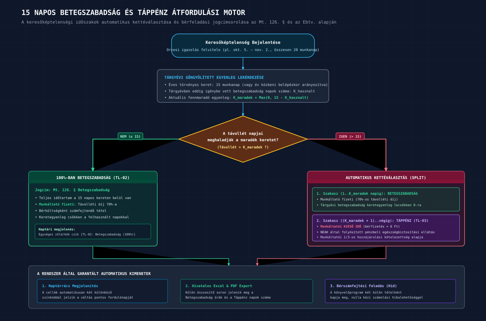
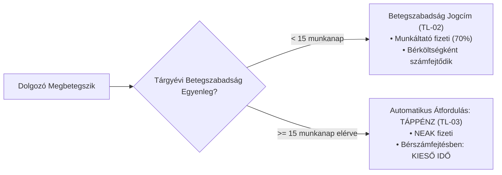

# Visibill & Beosztásom — Üzleti Követelmény Dokumentum (BRD)
## 04. Távollétek, Betegszabadság és Jelenlét-igazolás

> **Verzió:** 1.0 | **Dátum:** 2026-10-06 | **Státusz:** Jóváhagyásra kész  
> **Modul:** eaisyBill / eaisyBooks — Munkaidő-nyilvántartás és Beosztáskezelő  
> **Navigáció:** [Előző: Beosztástervezés Követelményei](./03_BRD_FUNCTIONAL_REQUIREMENTS_SCHEDULING.md) · [Vissza az Indexhez](./INDEX.md) · [Következő: Munkaügyi Szabálymotor](./05_BRD_LABOR_LAW_RULES_ENGINE_AND_COMPLIANCE.md)

---

## 1. Távollét-kezelés és Mt. szerinti Jogcímek

A Munka Törvénykönyve (Mt.) értelmében a munkaidő-nyilvántartásnak pontos jogcímmel kell tartalmaznia minden olyan időszakot, amikor a dolgozó nem végez munkát. A távollétek nemcsak a jelenléti ív hitelességét biztosítják, hanem közvetlenül meghatározzák a bérszámfejtést (fizetett távolléti díj vs. kieső idő).

### 1.1 A Meglévő Rendszer Hibájának Kiküszöbölése (Kiemelt Értékajánlat)
A forrásanyagban elemzett bemutatott rendszerben a távollét rögzítésekor a szabad szöveges **megjegyzés** került a naptárrácsba és az exportba a választott **típus** helyett (pl. a dolgozónak kézzel be kellett írnia a megjegyzésbe, hogy „betegszabadság” vagy „táppénz”).
- **Visibill Követelmény:** A rendszerben a **hivatalos Mt. jogcímkategória és megnevezés az elsődleges adat**. A szabad szöveges megjegyzés opcionális kiegészítő információ. Az exportban a hivatalos jogcímkód és név jelenik meg.

---

## 2. A Hivatalos Mt. Távollét-típusok Katalógusa

A rendszer az alábbi 28 jogcímet támogatja, amelyek meghatározzák a bérfizetést és a szabadságkeret csökkentését:

| Kód | Hivatalos Távollét Jogcím | Mt. Hivatkozás | Kieső idő? (Bérmentes) | Csökkenti a Szabadságkeretet? | Bérszámfejtési Hatás |
|:---:|:---|:---|:---:|:---:|:---|
| **TL-01** | **Fizetett rendes szabadság** | Mt. 115–125. § | Nem | **Igen** | Távolléti díj (100%) |
| **TL-02** | **Betegszabadság (első 15 nap)** | Mt. 126. § | Nem | Nem | Távolléti díj 70%-a (munkáltató fizeti) |
| **TL-03** | **Táppénz (15 nap felett)** | Ebtv. | **Igen** | Nem | NEAK folyósítás (munkáltatói kieső idő) |
| **TL-04** | **Baleseti táppénz** | Ebtv. | **Igen** | Nem | Üzemi baleset miatti kieső idő (100% NEAK) |
| **TL-05** | **Szülési szabadság (CSED)** | Mt. 127. § | **Igen** | Nem | Egészségbiztosítási pénzbeli ellátás |
| **TL-06** | **Gyermekgondozási díj (GYED)** | Ebtv. | **Igen** | Nem | Pénzbeli ellátás, munkáltatói kieső idő |
| **TL-07** | **Gyermekgondozást segítő ellátás (GYES)**| Cstv. | **Igen** | Nem | Családtámogatási ellátás |
| **TL-08** | **Gyermeknevelési támogatás (GYET)** | Cstv. | **Igen** | Nem | Főállású anyaság ellátása |
| **TL-09** | **Apasági szabadság** | Mt. 118. § | Nem | Nem (külön keret: 10 nap)| Távolléti díj (első 5 nap 100%, 6-10. nap 40%) |
| **TL-10** | **Szülői szabadság** | Mt. 118/A. § | Nem | Nem (külön keret: 44 nap)| Távolléti díj 10%-a |
| **TL-11** | **Hozzátartozó halála (rendkívüli)** | Mt. 55. § (1) b) | Nem | Nem | 2 munkanap távolléti díj |
| **TL-12** | **Gondozói munkaidő-kedvezmény** | Mt. 55. § (1) l) | **Igen** | Nem | Max. 5 munkanap súlyos beteg hozzátartozóra |
| **TL-13** | **Kötelező orvosi vizsgálat** | Mt. 55. § (1) c) | Nem | Nem | Távolléti díj a vizsgálat időtartamára |
| **TL-14** | **Véradás (rendkívüli távollét)** | Mt. 55. § (1) d) | Nem | Nem | Távolléti díj (legalább 4 óra) |
| **TL-15** | **Fizetés nélküli szabadság (általános)** | Mt. 130–132. § | **Igen** | Nem | Teljes kieső idő, biztosítási jogviszony szünetel |
| **TL-16** | **Fizetés nélküli szabadság — gyermekápolás**| Mt. 128. § | **Igen** | Nem | Gyermek 3. életévéig tartó kieső idő |
| **TL-17** | **Örökbefogadói díj** | Ebtv. | **Igen** | Nem | Pénzbeli ellátási kieső idő |
| **TL-18** | **Gyermekek otthongondozási díja (GYOD)**| Szoc. tv. | **Igen** | Nem | Tartós ápolási kieső idő |
| **TL-19** | **Ápolási díj** | Szoc. tv. | **Igen** | Nem | Tartós gondozási kieső idő |
| **TL-20** | **Munkavégzés alóli felmentés** | Mt. 69–70. § | Nem | Nem | Felmondási időre járó távolléti díj |
| **TL-21** | **Igazolt távollét (egyéb)** | Mt. 55. § | Eseti | Nem | Pl. bírósági/hatósági idézés |
| **TL-22** | **Igazolatlan távollét** | Mt. szankció | **Igen** | Nem | Jogellenes mulasztás; bérlevonási jogcím |
| **TL-23** | **Jogszerű sztrájk időtartama** | Sztrájktörvény | **Igen** | Nem | Díjazás nélküli mentesülés |
| **TL-24** | **Előzetes letartóztatás / Elzárás** | Btk. | **Igen** | Nem | Személyi szabadság korlátozása (kieső idő) |
| **TL-25** | **Szabadságvesztés** | Bv. tv. | **Igen** | Nem | Börtönbüntetés időtartama |
| **TL-26** | **Kamarai tevékenység szünetelése** | Kamarai tv. | **Igen** | Nem | Ügyvédi, állatorvosi, egészségügyi szünetelés |
| **TL-27** | **Tanulószerződés szüneteltetése** | Szkt. | **Igen** | Nem | Duális szakképzés szünetelése |
| **TL-28** | **Egyéb igazolt mentesülés** | Egyedi | Eseti | Nem | Szabad szöveges indoklással |

---

## 3. A 15 Napos Betegszabadság → Táppénz Automatikus Átfordulás Motorja

A könyvelőirodák egyik legnagyobb manuális adminisztrációs terhe a betegszabadságok napjainak számlálása.

*(Vektoros formátum: [04_betegszabadsag_tappenzen_atfordulas_flowchart.svg](./diagramms/04_betegszabadsag_tappenzen_atfordulas_flowchart.svg) · Nagyfelbontású kép: [04_betegszabadsag_tappenzen_atfordulas_flowchart@2x.png](./diagramms/04_betegszabadsag_tappenzen_atfordulas_flowchart@2x.png))*

### 3.1 Üzleti Szabályok
1. **Éves göngyölítés:** A rendszer naptári évenként (január 1. – december 31.) nyilvántartja a dolgozó által igénybe vett betegszabadság munkanapok számát.
2. **Év közbeni belépés arányosítása:** Ha a munkavállaló év közben lép be, a 15 napos keret időarányosan csökken, figyelembe véve a korábbi munkáltatói igazolást (rögzíthető a dolgozó adatlapján).
3. **Automatikus küszöb-váltás:** Ha egy összefüggő orvosi igazolás (pl. 20 napos keresőképtelenség) alatt a dolgozó eléri a 15 napot:
   - A rendszer az 1–15. munkanapot automatikusan **Betegszabadság**-ként könyveli el;
   - A 16. munkanaptól kezdődően a rendszer automatikusan **Táppénz (Kieső idő)**-re fordítja át a jogcímet;
   - Az operátornak nem kell manuálisan szétválasztania a két periódust, a bérszámfejtési exportban a két tétel külön soron jelenik meg.

---

## 4. Szabadságkeret és Egyenlegkezelés

1. **Éves törvényes keret kiszámítása:**
   - Alapszabadság: 20 munkanap (minden munkavállalónak);
   - Életkor szerinti pótszabadság: 25. életévtől sávosan növekvő (1–10 munkanap);
   - Gyermekek utáni pótszabadság: 1 gyermek után 2, 2 gyermek után 4, 3+ gyermek után 7 munkanap;
   - Egyéb pótszabadságok: apasági, fiatalkorú pótszabadság (5 nap), megváltozott munkaképességű (5 nap).
2. **Kivett és fennmaradó napok:**
   - A rács fejlécében és a dolgozó adatlapján valós időben látható: *„Éves keret: 25 nap \| Kivett: 12 nap \| Maradék: 13 nap”*.
3. **Negatív keret engedélyezése:**
   - A vállalkozás beállításaiban bekapcsolható: *„A fennmaradó szabadságnapok száma lehet negatív is”*. Ez lehetővé teszi, hogy ha a munkavállaló előreveszi a következő hónapokban esedékes szabadságát, a rendszer ne dobjon blokkoló hibát.

---

## 5. Jelenlét-kezelés és Jóváhagyási Folyamat

A Jelenlét modul felelős a tervezett beosztás valósággal való összevetéséért, a jóváhagyásért és a hó végi elszámolás véglegesítéséért.

### 5.1 Funkcionális Követelmények

| Követelmény ID | Követelmény Megnevezése | Üzleti Leírás |
|:---|:---|:---|
| **REQ-JL-01** | **Hónap kiválasztása & Szabályfrissítés** | A Jelenlét menüben kiválasztható a feldolgozandó hónap. Belépéskor a rendszer automatikusan lefutatja a munkaügyi ellenőrzést az aktuális adatokra. |
| **REQ-JL-02** | **Tervezett vs. Tényleges Nézet** | A felület dolgozónként egymás mellett mutatja a tervezett beosztást és a tényleges jelenléti órákat, világosan megjelölve az eltéréseket. |
| **REQ-JL-03** | **Tömeges Igazolás** | Egyetlen kattintásos művelet: a lezárt beosztás összes műszakja az összes dolgozónál tényleges jelenlétté minősül. A távollétek automatikusan átkerülnek. Ez az operátori időmegtakarítás alapja. |
| **REQ-JL-04** | **Egyedi Igazolás és Korrekció** | Dolgozónként vagy naponként módosítható a tényleges kezdés, befejezés és pihenőidő (pl. túlóra rögzítése). |
| **REQ-JL-05** | **Jelenlét Végleges Lezárása** | Az ellenőrzés után az operátor lezárja a havi jelenlétet. Ez a művelet aktiválja a végleges Excel exportot és a bérszámfejtési átadást. |
| **REQ-JL-06** | **Automatikus jelenlét-kitöltési stratégiák** | A munkavállaló adatlapján beállítható: (A) *„Nincs automatika”* (kézi kitöltés); (B) *„Lezárt beosztás szerint”* (a beosztás lezárásakor automatikusan jelenlétté válik); (C) *„Munkarend szerint”* (hó végén a dolgozó általános munkarendjével töltődik fel). |
| **REQ-JL-07** | **Kétoszlopos Megfelelőség az Exportban** | A hivatalos havi jegyzékben egymás mellett szerepel a **„Beosztás”** oszlopcsoport (terv) és a **„Jelenlét”** oszlopcsoport (tény), garantálva az Mt. 134. §-nak való megfelelést. |
| **REQ-JL-08** | **Beléptetőrendszeri integráció (Előkészítés)** | A rendszer architektúrája képes fogadni külső beléptető terminálok be-/kilépési eseményeit, és ezek alapján javaslatot tenni a tényleges jelenléti időpontokra. |
