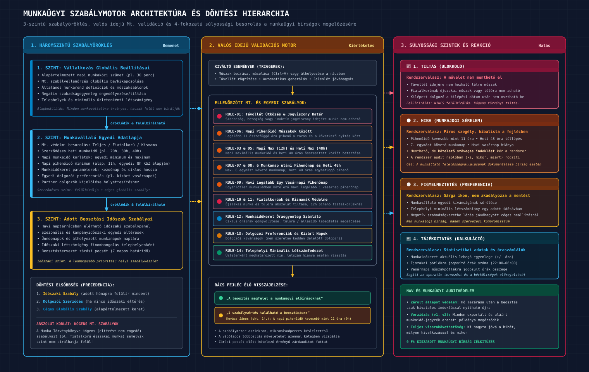
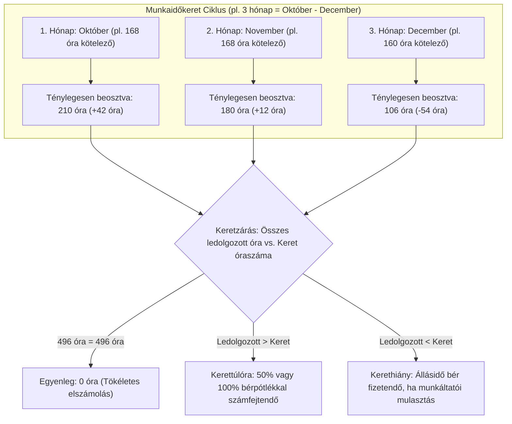

# Visibill & Beosztásom — Üzleti Követelmény Dokumentum (BRD)
## 05. Munkaügyi Szabálymotor és Mt. Megfelelőség

> **Verzió:** 1.0 | **Dátum:** 2026-10-06 | **Státusz:** Jóváhagyásra kész  
> **Modul:** eaisyBill / eaisyBooks — Munkaidő-nyilvántartás és Beosztáskezelő  
> **Navigáció:** [Előző: Távollétek & Jelenlét](./04_BRD_ABSENCE_AND_ATTENDANCE_MANAGEMENT.md) · [Vissza az Indexhez](./INDEX.md) · [Következő: Exportok, Bérszámfejtés & Integráció](./06_BRD_EXPORTS_PAYROLL_AND_INTEGRATION.md)

---

## 1. Munkajogi Háttér és Célkitűzés

A munkaidő-beosztás tervezése Magyarországon szigorú munkajogi korlátok közé szorított tevékenység. A Munka Törvénykönyve (2012. évi I. törvény — Mt.) rendelkezéseinek megsértése súlyos munkaügyi bírságot és kártérítési felelősséget von maga után a munkáltató terhére.

A Visibill munkaügyi szabálymotorjának célja, hogy **megelőző jelleggel, valós időben figyelmeztesse az operátort vagy a cégvezetőt**, ha a tervezett beosztás jogszabályba vagy egyedi dolgozói megállapodásba ütközik.

---

## 2. Háromszintű Szabályöröklési Modell

A szabálymotor rugalmas hierarchiára épül: a cég globális szabályait a dolgozó egyedi szerződése felülbírálhatja, amelyet pedig egy adott beosztási időszakra egyedileg lehet finomhangolni:


*(Vektoros formátum: [05_munkaugyi_szabalyomotor_hierarchia.svg](./diagramms/05_munkaugyi_szabalyomotor_hierarchia.svg) · Nagyfelbontású kép: [05_munkaugyi_szabalyomotor_hierarchia@2x.png](./diagramms/05_munkaugyi_szabalyomotor_hierarchia@2x.png))*

```
┌─────────────────────────────────────────────────────────────┐
│  1. SZINT: Vállalkozás Globális Beállításai (Cégszint)       │
│  • Alapértelmezett napi pihenőidő (pl. 30 perc)             │
│  • Mt. szabályellenőrzés globális be/ki kapcsolása          │
│  • Munkavállalói egyedi igények figyelésének engedélyezése  │
└──────────────────────────────┬──────────────────────────────┘
                               │ öröklődik és felülbírálható
┌──────────────────────────────▼──────────────────────────────┐
│  2. SZINT: Munkavállaló Egyedi Adatlapja (Dolgozói szint)   │
│  • Munkavállaló Mt. besorolása (teljes, fiatalkorú, kismama)│
│  • Egyedi napi min/max korlátok (pl. 4h–12h), heti max óra  │
│  • Napi pihenőidő minimum (pl. 11h), munkaidőkeret adatai   │
│  • Egyedi igények (kizárt pihenőnapok, műszakváltási pihenő)│
└──────────────────────────────┬──────────────────────────────┘
                               │ öröklődik és felülbírálható
┌──────────────────────────────▼──────────────────────────────┐
│  3. SZINT: Adott Beosztási Időszak (Időszak szint)          │
│  • „Munkaügyi szabályok beállítása” gomb a Beosztáskezelőben│
│  • Rendkívüli időszaki felülbírálás (pl. szezonalitás esetén)│
└─────────────────────────────────────────────────────────────┘
```

---

## 3. Ellenőrzött Munkaügyi Szabályok Katalógusa

A szabálymotor a beosztás szerkesztése közben, a generálás lefutásakor és a jelenlét megnyitásakor az alábbi Mt. szabályokat ellenőrzi:

| Szabály Kód | Megnevezés | Mt. Törvényi Előírás | Paraméter Forrása | Súlyosság | Rendszerválasz |
|:---:|:---|:---|:---|:---:|:---|
| **RULE-01** | **Távollét Ütközés** | Szabadság, betegség, igazolt távollét napjára nem rendelhető el munkavégzés. | Távollét-nyilvántartás | 🔴 **TILTÁS** | Műszak felvitele blokkolva; létező műszak automatikusan törlődik. |
| **RULE-02** | **Jogviszony Határok** | A dolgozó csak a jogviszony kezdete és kilépési dátuma között osztható be. | Dolgozó alapadatok | 🔴 **TILTÁS** | Érvényességi időn kívül a cella inaktív, műszak nem hozható létre. |
| **RULE-03** | **Napi Munkaidő Maximum** | Főszabály szerint max. 12 óra (készenléti jellegű munkakörben max. 24 óra). | Dolgozó adatlap (alap: 12h) | 🟠 **HIBA** | Piros cellakeret, hibalista a fejlécben. |
| **RULE-04** | **Napi Munkaidő Minimum** | Részmunkaidőnél vagy szerződés szerint meghatározott minimum (pl. 4 óra). | Dolgozó adatlap (alap: 4h) | 🟠 **HIBA** | Sárga/piros jelölés a rácsban. |
| **RULE-05** | **Heti Munkaidő Maximum** | Főszabály szerint max. 48 óra (rendkívüli munkával együtt) egy naptári héten. | Dolgozó adatlap (alap: 40h/48h) | 🟠 **HIBA** | Heti összesítőben túllépés riasztás. |
| **RULE-06** | **Napi Pihenőidő Két Műszak Között** | A munka befejezése és a másnapi kezdés között legalább **11 egybefüggő óra** pihenőidőt kell biztosítani (Mt. 104. §). | Dolgozó adatlap (alap: 11h) | 🟠 **HIBA** | Piros szegély a rácsban: „Két műszak közötti pihenőidő < 11h”. |
| **RULE-07** | **6 Munkanap Utáni Pihenőnap** | Megszakítás nélkül legfeljebb 6 egymást követő munkanap osztható be, a 7. napon kötelező pihenőnapot biztosítani. | Cég / Mt. kapcsoló | 🟠 **HIBA** | Piros cellajelzés a 7. egymást követő munkanapon. |
| **RULE-08** | **Heti 48 Órás Egybefüggő Pihenőidő** | A munkavállalót hetenként legalább 48 óra egybefüggő pihenőidő illeti meg (vagy heti két pihenőnap, havonta legalább egy vasárnappal). | Cég / Dolgozó kapcsoló | 🟠 **HIBA** | Heti összesítő ellenőrzés. |
| **RULE-09** | **Havi Legalább Egy Vasárnapi Pihenőnap** | Egyenlőtlen munkaidő-beosztásnál havonta legalább egy vasárnapra heti pihenőnapot kell beosztani (Mt. 105. §). | Cég / Mt. kapcsoló | 🟠 **HIBA** | Hó végi ellenőrzés figyelmeztet, ha minden vasárnap munkanap volt. |
| **RULE-10** | **Fiatalkorú Munkavállaló Védelme** | 18 év alatti dolgozónál napi max. 8 óra, heti max. 40 óra, éjszakai munka és túlóra szigorúan tilos; napi pihenőidő legalább 12 óra! | Dolgozó Mt. típusa: `fiatalkorú` | 🔴 **TILTÁS / HIBA** | Éjszakai műszak vagy 8h feletti beosztás azonnal tiltva. |
| **RULE-11** | **Várandós és Kisgyermekes Dolgozó Védelme** | Várandósság megállapításától a gyermek 3 éves koráig éjszakai munka, túlóra és készenlét nem rendelhető el. | Dolgozó Mt. típusa: `kismama` | 🔴 **TILTÁS** | Túlóra és éjszakai műszak tiltása. |
| **RULE-12** | **Munkaidőkeret Kerethatár Figyelés** | A keret teljes óraszámának betartása; a keret végén fennmaradó hiány vagy túllépés jelzése. | Munkaidőkeret ciklus | 🔵 **INFO / HIBA** | Folyamatos óraszámláló; keretzáráskor elszámolás. |
| **RULE-13** | **Munkavállalói Egyedi Igények** | Preferált pihenőnapok, kizárt idősávok, műszakváltási pihenőidő betartása. | Dolgozó igények fül | 🟡 **FIGYELMEZTETÉS** | Sárga felkiáltójel: „A dolgozó nem szeretne vasárnap dolgozni”. Nem blokkol. |

---

## 4. Súlyossági Szintek és Felületi Visszajelzés

A szabálymotor négy jól elkülönülő szinten kommunikál a felhasználóval:

1. 🔴 **TILTÁS:** A rendszer nem engedi a művelet mentését (pl. távollét napjára nem vihető fel műszak; fiatalkorúnak nem osztható be 23:00-kor kezdődő műszak).
2. 🟠 **HIBA (Munkajogi Sérelem):** Munkajogi szabálysértés (pl. 9 órás pihenőidő). A felület piros szegéllyel kiemeli a cellát, a beosztás fejlécében megjelenik a hibalista. Az operátor dönthet úgy, hogy kivételes indoklással felülbírálja (pl. egyedi kollektív szerződés alapján), ekkor az ellenőrzési napló rögzíti a felülbírálást.
3. 🟡 **FIGYELMEZTETÉS:** Nem törvényi tiltás, hanem belső preferencia sérülése (pl. a dolgozó jelezte, hogy szerdán nem szeretne beosztást kapni). Sárga jelzés, nem akadályozza a mentést.
4. 🔵 **TÁJÉKOZTATÁS:** Tájékoztató jellegű számítások (pl. munkaidőkeret aktuális egyenlege, éjszakai pótlékra jogosító órák száma).

---

## 5. Munkaidőkeret Elszámolási Logika (Mt. 93–95. §)

A munkaidőkeret alkalmazása elterjedt a többműszakos vagy idényjellegű cégeknél (pl. vendéglátás, mezőgazdaság, építőipar).



### 5.1 Keretszámítás Lépései
1. **Keret definiálása:** Dolgozónként megadható: (A) Keret kezdődátuma (pl. 2026. október 1.); (B) Keret hossza (1–4 hónap, alapesetben 3 hónap).
2. **Kötelező keret-óraszám:** A rendszer kiszámítja a ciklusba eső általános munkanapok számát megszorozva a napi szerződéses munkaidővel (pl. 62 munkanap × 8 óra = 496 óra).
3. **Valós idejű keret-maradék kijelzés:** A naptárrácsban a dolgozó neve mellett folyamatosan látható: *„Keretből hátralévő: 167 óra”*.
4. **Keretzárás:** A 3. hónap végén a rendszer automatikusan elkészíti a keret-elszámolási jegyzőkönyvet:
   - Ha a dolgozó többet dolgozott a keretnél: a többlet **rendkívüli munkaidőnek (túlórának)** minősül, és túlórapótlékkal számfejtődik;
   - Ha kevesebbet dolgozott: a munkáltató köteles megfizetni az alapbért (állásidő), ha a beosztás hiányossága miatta történt.

---

## 6. Munkaközi Szünet és Pihenőidő Előírások (Mt. 103. és 104. §)

1. **Munkaközi szünet (ebédszünet):**
   - Ha a napi munkaidő meghaladja a 6 órát: legalább **20 perc** munkaközi szünetet kell biztosítani;
   - Ha a napi munkaidő meghaladja a 9 órát: további **25 perc** (összesen legalább 45 perc) szünet kötelező;
   - A munkaközi szünet alapesetben **nem része a munkaidőnek** (le kell vonni a kezdés és vég különbségéből).
2. **Napi pihenőidő:**
   - Legalább **11 összefüggő óra** a munka befejezése és a következő munkanapi kezdés között;
   - Kivételes esetekben (osztott munkaidő, többműszakos vagy megszakítás nélküli tevékenység) kollektív szerződéssel csökkenthető 8 órára, de ekkor a heti pihenőidőt meg kell növelni.
