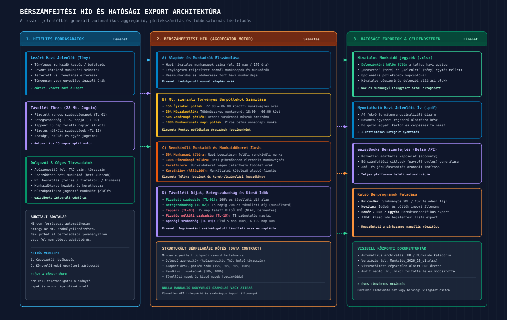
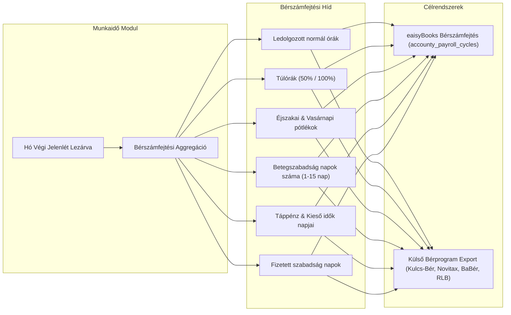

# Visibill & Beosztásom — Üzleti Követelmény Dokumentum (BRD)
## 06. Hatósági Exportok, Bérszámfejtés és Rendszerintegráció

> **Verzió:** 1.0 | **Dátum:** 2026-10-06 | **Státusz:** Jóváhagyásra kész  
> **Modul:** eaisyBill / eaisyBooks — Munkaidő-nyilvántartás és Beosztáskezelő  
> **Navigáció:** [Előző: Munkaügyi Szabálymotor](./05_BRD_LABOR_LAW_RULES_ENGINE_AND_COMPLIANCE.md) · [Vissza az Indexhez](./INDEX.md) · [Következő: Fejlesztési Roadmap & Nyitott Kérdések](./07_BRD_ROADMAP_PHASING_AND_OPEN_QUESTIONS.md)

---

## 1. A Rendszer Legfontosabb Kimenete: A Hivatalos Munkaidő-jegyzék

A szoftver végső célja és legfontosabb kimeneti terméke a havi **Munkaidő-jegyzék (Hiteles Jelenléti Ív)**.
A bemutató videó és a könyvelőirodai elvárások alapján az így generált Excel és PDF dokumentumot a Nemzeti Adó- és Vámhivatal (NAV), valamint a Munkaügyi Felügyelet ellenőrzései elfogadják, és elegendő havonta egyszer kinyomtatva és cégszerűen aláírva lefűzni.

### 1.1 Munkaidő-jegyzék Excel Specifikáció (.xlsx)

| Követelmény ID | Megnevezés | Üzleti Elvárás és Részletes Specifikáció |
|:---|:---|:---|
| **REQ-EX-01** | **Hónap Választás** | Bármely korábbi, lezárt hónap kiválasztható és egy kattintással letölthető. |
| **REQ-EX-02** | **Dolgozónként Külön Munkalap** | Az Excel munkafüzetben minden egyes munkavállaló adatai **külön alsó munkalapon (munkalapfülön)** kapnak helyet, a munkalap fülén a dolgozó nevével. |
| **REQ-EX-03** | **Munkalap Fejléce** | Cég hivatalos neve, adószáma, székhelye, a cég logója; Dolgozó neve, adóazonosító jele, munkaköre, munkahelye, munkarendje, heti munkaideje. |
| **REQ-EX-04** | **„Beosztás” Oszlopcsoport (Terv)** | Napi sorok a hónap 1. napjától az utolsó napjáig: • Tervezett kezdési időpont (HH:MM); • Tervezett befejezési időpont (HH:MM); • Tervezett munkaidő (óra). |
| **REQ-EX-05** | **„Jelenlét” Oszlopcsoport (Tény)** | Ténylegesen teljesített adatok: • Tényleges kezdési időpont; • Tényleges befejezési időpont; • Levont munkaközi szünet (perc); • Ténylegesen ledolgozott munkaidő (óra, 2 tizedesjegy). |
| **REQ-EX-06** | **Távollétek Oszlop** | Távollét esetén a hivatalos Mt. kategória neve és óraszáma (pl. *„Fizetett szabadság — 8.00 óra”*, *„Betegszabadság — 8.00 óra”*). A megjegyzés külön zárójelben vagy megjegyzés oszlopban jelenik meg. |
| **REQ-EX-07** | **Pótlék-sorok Kapcsoló (Opcionális)** | A felhasználó az exportáláskor eldöntheti egy kapcsolóval: *„Pótlék-sorok megjelenítése”*. • Ha be van kapcsolva: Megjelennek a külön sorok: Éjszakai pótlék (óra), Vasárnapi pótlék (óra), Munkaszüneti napi pótlék (óra), Túlóra pótlék (óra). • Ha ki van kapcsolva: Egyszerűsített, tiszta táblázat generálódik az állandó nappali munkarendű cégek számára. |
| **REQ-EX-08** | **Havi Összesítő Blokkok** | A munkalap alján összegző sorok: • Összes ledolgozott óra; • Ebből normál munkaidő; • Rendkívüli munkaidő (túlóra órák); • Szabadságnapok és órák száma; • Betegszabadság napok száma; • Táppénzes (kieső) napok száma. |
| **REQ-EX-09** | **Hiteles Aláírási Blokk** | A munkalap alján előre megformázott aláírási vonalak: • *„Munkavállaló aláírása”* (dátummal); • *„Munkáltatói jogkör gyakorlójának aláírása”* (cégszerű bélyegző/aláírás helye). |

---

## 2. Statisztikák és Lekérdezések

A Statisztikák menüpont a vezetői döntéshozatalt és a könyvelői elszámolást támogatja:

| Követelmény ID | Funkció | Leírás |
|:---|:---|:---|
| **REQ-ST-01** | **Intervallum szűrés** | Tetszőleges kezdő és záró dátum megadása (nemcsak tört hónap, hanem negyedév, félév vagy egyedi időszak). |
| **REQ-ST-02** | **Adatforrás választó** | Háromféle forrás választható: (1) Csak a tényleges jelenléti adatok; (2) Csak a lezárt beosztások; (3) Minden tervezett beosztás. |
| **REQ-ST-03** | **Összesítő riport** | Dolgozónkénti táblázat: Név, Munkakör, Telephely, Összes ledolgozott óra, Normál óra, Túlóra, Éjszakai pótlék órák, Vasárnapi órák, Távollét napok. |
| **REQ-ST-04** | **Dolgozói részletező karton** | Bármely dolgozó sorára kattintva megnyitható a havi naptári bontás, amely azonnal kinyomtatható dolgozói igazolásként. |
| **REQ-ST-05** | **Excel export** | Zöld „Exportálás” gomb: a statisztikai táblázat azonnali letöltése Excel munkafüzetként. |

---

## 3. Bérszámfejtési Híd és eaisyBooks Integráció

A modul közvetlen hidat képez a jelenléti adatok és a bérszámfejtési folyamat között, megszüntetve a könyvelőirodák manuális adatbeviteli terheit:

*(Vektoros formátum: [06_berszamfejtesi_hid_integracio.svg](./diagramms/06_berszamfejtesi_hid_integracio.svg) · Nagyfelbontású kép: [06_berszamfejtesi_hid_integracio@2x.png](./diagramms/06_berszamfejtesi_hid_integracio@2x.png))*

### 3.1 Bérszámfejtési Adatstruktúra
A hó végi zárás után a rendszer az alábbi strukturált adatkészletet adja át:
- **Dolgozó azonosítók:** Adóazonosító jel, TAJ szám, céges törzsszám;
- **Alapbér elszámolás:** Havi munkanapok, ledolgozott munkanapok, ledolgozott órák;
- **Pótlékórák:**
  - 15%-os éjszakai pótlék óraszáma (22:00–06:00 közötti munkavégzés);
  - 30%-os műszakpótlék óraszáma (többműszakos munkarendnél 18:00–06:00 között);
  - 50%-os vasárnapi pótlék óraszáma;
  - 100%-os munkaszüneti napi pótlék óraszáma;
  - 50%-os munkanapi túlóra óraszáma;
  - 100%-os pihenőnapi túlóra óraszáma.
- **Kieső idők és Távollétek:**
  - Betegszabadság munkanapok száma (munkáltatói 70%-os távolléti díj alap);
  - Táppénzes naptári napok száma (NEAK ellátás, bérlevonás alap);
  - Fizetett szabadságnapok száma (100%-os távolléti díj alap);
  - Fizetés nélküli szabadság napjai (társadalombiztosítás szünetelésének bejelentése a T1041-es nyomtatványon).

---

## 4. Rendszerintegrációk a Meglévő Visibill Platformmal

| Integrációs Terület | Meglévő Visibill Rendszerelem | Integrációs Működés a Munkaidő Modulban |
|:---|:---|:---|
| **Cégtörzs (Többügyféles Környezet)** | Központi Cég- és Ügyféltörzs | A munkaidő-modul a kiválasztott cég azonosítójához kapcsolódik. A cégnév, adószám, székhely és logó automatikusan a meglévő cégrekordból töltődik be az exportokba. |
| **Jogosultságkezelés** | Központi Szerepkör-nyilvántartás | A könyvelők az irodai szerepköreik alapján automatikusan megkapják a szerkesztési jogokat. A dolgozók a munkavállalói szerepkörrel csak a saját adataikat láthatják. |
| **Dokumentumtár** | Központi Dokumentumtár | Minden exportált havi munkaidő-jegyzék Excel és PDF formátumban automatikusan elmentődik a cég dokumentumtárába `HR / Munkaidő` kategóriában, verziószámozva. A visszatöltött aláírt példány szintén itt tárolódik. |
| **Automatizáció & Ütemezés** | Központi Feladatütemező Rendszer | Az automatikus beosztás-generálás, a betegszabadság göngyölítés és a hó végi teendő-emlékeztetők a platform aszinkron feladatkezelőjén keresztül futnak le. |
| **Munkaerőköltség** | Munkavállalói Díjszabások Törzse | A ledolgozott órák és pótlékok a jövőben közvetlenül összeköthetők a cég projektjeinek munkaerőköltségével, pontos valós idejű vezetői eredménykimutatást adva. |

---

## 5. Beléptetőrendszer és Ellenőrzőpontok Interfész Specifikáció (Jövőbeli Fázis)

Bár a könyvelőirodai ügyfeleknél az első fázisban nem aktív, a modul üzleti adatmodellje előkészített a külső beléptető terminálok fogadására:

1. **Ellenőrzőpontok:**
   - Fizikai bejárati terminál, forgóvilla vagy táblagépes szoftveres terminál telephelyhez és munkahelyhez rendelve.
   - Dinamikus dolgozói azonosító támogatása (mobilalkalmazásban percenként változó QR kód a visszaélések ellen, vagy fix RFID kártya).
2. **Belépések Eseménynaplója:**
   - Külső elektronikus adatkapcsolat (terminál interfész), amely fogadja az eseményt: dolgozói azonosító, időbélyeg, mozgásirány (be/ki) és ellenőrzőpont azonosító.
3. **Automatikus Jelenlétté Alakítás:**
   - A beérkezett nyers be- és kilépési időbélyegekből a rendszer intelligens kerekítési szabályokkal (pl. 5 perces tűrés, műszakkezdéshez igazítás) automatikusan létrehozza a tényleges jelenléti rekordokat, és jelzi az eltéréseket a tervezett műszakhoz képest (pl. 15 perc késés).
