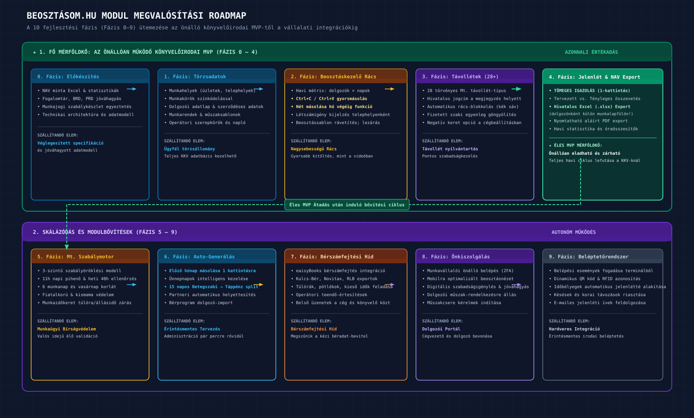

# Visibill & Beosztásom — Üzleti Követelmény Dokumentum (BRD)
## 07. Fejlesztési Roadmap, MVP Terjedelem és Nyitott Kérdések

> **Verzió:** 1.0 | **Dátum:** 2026-10-06 | **Státusz:** Jóváhagyásra kész  
> **Modul:** eaisyBill / eaisyBooks — Munkaidő-nyilvántartás és Beosztáskezelő  
> **Navigáció:** [Előző: Hatósági Exportok & Integráció](./06_BRD_EXPORTS_PAYROLL_AND_INTEGRATION.md) · [Vissza az Indexhez](./INDEX.md)

---

## 1. Fejlesztési Alapelvek és Ütemezési Stratégia

A modul fejlesztési sorrendjét az alábbi négy alapelv határozza meg:
1. **Érték korai szállítása:** A könyvelőirodai operátorok a lehető leghamarabb kapjanak egy működő, kézzel használható, de az exportokat már hibátlanul előállító rendszert.
2. **Meglévő képességekre építés:** Nem építünk újra meglévő platformfunkciókat (cégtörzs, felhasználókezelés, jogosultságok, dokumentumtár, feladatütemező rendszer).
3. **Bonyolultság fokozatos bevezetése:** Először a naptárrács, a manuális gyorskitöltés és a havi zárás készül el; az automata generáló motor és a komplex Mt. szabálymotor erre a stabil alapra épül rá.
4. **Alacsony prioritású elemek későbbre sorolása:** A dolgozói önkiszolgáló felület és a fizikai beléptetőrendszer integrációja a későbbi fázisokba kerül, mivel a könyvelőirodai ügyfeleknél ma nincs rájuk azonnali igény.

---

## 2. A 10 Fejlesztési Fázis Részletes Áttekintése (Fázis 0–9)

*(Vektoros formátum: [07_roadmap_fazisok_timeline.svg](./diagramms/07_roadmap_fazisok_timeline.svg) · Nagyfelbontású kép: [07_roadmap_fazisok_timeline@2x.png](./diagramms/07_roadmap_fazisok_timeline@2x.png))*

```mermaid
gantt
    title Beosztásom.hu Modul Megvalósítási Ütemterv
    dateFormat  X
    axisFormat %s
    section MVP Mérföldkő (0-4. fázis)
    0. Előkészítés & Minták             :active, p0, 0, 1
    1. Törzsadatok & Munkarendek        :p1, after p0, 2
    2. Beosztáskezelő & Naptárrács (Ctrl+C/V) :p2, after p1, 3
    3. Távollétek (28+ jogcím)          :p3, after p2, 2
    4. Jelenlét & NAV Excel Export (MVP):crit, p4, after p3, 3
    section Bővítések (5-9. fázis)
    5. Mt. Szabálymotor & Munkaidőkeret :p5, after p4, 3
    6. Szabályalapú Automatikus Generálás:p6, after p5, 3
    7. Bérszámfejtési Híd & Értesítések :p7, after p6, 2
    8. Dolgozói Önkiszolgálás (Mobil)   :p8, after p7, 3
    9. Beléptetőrendszer & E-mail Import:p9, after p8, 3
```

### 2.1 A Fázisok Részletes Tartalma

| Fázis Sorszám | Fázis Megnevezése | Fő Feladatok és Szállítandó Elemek | Várható Kimenet / Mérföldkő |
|:---:|:---|:---|:---|
| **0. Fázis** | **Előkészítés & Tervezés** | • Hivatalos NAV Excel munkaidő-jegyzék és statisztika minták bekérése Viktortól; • Fogalomtár, BRD, PRD és technikai architektúra jóváhagyása; • Munkajogi szabályok paraméterezési tervének véglegesítése. | Jóváhagyott specifikációs csomag és mintaadatok. |
| **1. Fázis** | **Törzsadatok & Sablonok** | • Munkahelyek (telephelyek, üzletek) és munkakörök (színekkel); • Munkavállalói adatlap (alapadatok, jogviszony, szabadságkeret, munkaidőkeret adatai); • Operátori hozzáférések, jogosultságok; • Munkarendek és munkaidősablonok (műszaktípusok: kezdés, vég, pihenőidő); • Ellenőrzési naplózás alapjai. | Egy ügyfél (pl. 2 üzletes étterem) teljes törzsadatbázisa felvihető és karbantartható. |
| **2. Fázis** | **Beosztáskezelő Alap (A Rács)** | • Új időszak nyitása, létszámigény megadása napokra és üzletekre; • Interaktív naptárrács: dolgozók × napok mátrix, napi/heti mutatók, keret-egyenleg kijelzés, szűrők, színezések, sormagasság váltás; • Műszakfelvitel űrlapon és alternatív táblázatos kitöltő nézetben; • **Kritikus másolási funkciók:** Tartomány-kijelölés (Shift/Ctrl+kattintás), Ctrl+C és Ctrl+V másolás, húzással kitöltés (kitöltő fogantyú), „hét másolása a hónap végéig”; • Beosztássablonok kezelése; mentés és lezárás. | Egy havi beosztás gyorsabban és kényelmesebben összeállítható, mint a bemutatott külső rendszerben. |
| **3. Fázis** | **Távollétek Kezelése** | • Távollét rögzítése a teljes 28+ Mt. jogcímkészlettel; • Hivatalos típus elsődleges megjelenítése a megjegyzés helyett; • Megjelenítés a rácsban (kék blokk), műszakfelvitel szigorú tiltása a távolléti napokra; • Fizetett szabadság egyenleg automatikus göngyölítése (negatív keret engedélyezésével). | A szabadságok és hiányzások pontosan lefedik az Mt. előírásokat. |
| **4. Fázis** | **Jelenlét & Hatósági Export (MVP!)** | • Jelenlét menü: hónapválasztó, tervezett vs. tényleges összevetés; • **Tömeges igazolás** (egyetlen kattintással az összes tervezett műszak jóváhagyása); • Egyedi korrekciók (túlórák, késések javítása); jelenlét lezárása; • **Hivatalos Excel munkaidő-jegyzék export** (dolgozónként külön fül, Beosztás és Jelenlét oszlopok, távollét jogcímekkel, pótlék-kapcsoló, cégszerű aláírás blokk); • Nyomtatható PDF export és automatikus dokumentumtári mentés; • Statisztikák (ledolgozott órák, normál, túlóra). | **MVP Mérföldkő:** A könyvelőiroda egy teljes havi ciklust önállóan le tud zárni, és hatóságilag elfogadható dokumentumot kap! |
| **5. Fázis** | **Munkaügyi Szabálymotor & Munkaidőkeret** | • Szabályok 3-szintű öröklése (cég → dolgozó → beosztás); • Valós idejű Mt. szabályellenőrzés a rácsban (11h pihenőidő, 48h heti pihenő, havi 1 vasárnap, 6 munkanap korlát, fiatalkorú és kismama védelme); • Munkaidőkeret motor: keretórák számítása, maradék egyenleg figyelése, keretzárási túlóra/állásidő elszámolás. | Automatikus védelem a munkaügyi bírságok ellen. |
| **6. Fázis** | **Automatizálás & Tömeges Generálás (Kiemelt Értékajánlat)** | • Cégszintű generálási szabályok és ütemezett automatikus beosztás-készítés a Visibill motorral; • „Előző hónap másolása” egy kattintásra az ünnepnapok intelligens kezelésével; • Csoportos műveletek üres cellákra is, műszakok áthelyezése másik dolgozóhoz, partneri intelligens helyettesítés; • 15 napos betegszabadság → táppénz automatikus átfordulás; • Munkavállaló-import bérprogramból oszlop-hozzárendeléssel. | A havi adminisztráció percekre csökken: a generált beosztást csak ellenőrizni kell. |
| **7. Fázis** | **Bérszámfejtési Híd & Értesítések** | • Bérszámfejtési adatátadás gépi formátumban (CSV/XLSX vagy elektronikus interfészen) az eaisyBooks és külső bérprogramok felé; • Túlórák, pótlékórák és kieső idők automatikus átadása; • Teendő-értesítések az operátornak (lezáratlan beosztás, exportra váró cég); • Belső üzenetek modul. | Megszűnik a bérszámfejtési adatok kézi átgépelése. |
| **8. Fázis** | **Dolgozói Önkiszolgálás** | • Munkavállalói önálló belépés, 2FA kötelezettség; • Mobilbarát nézet: saját jóváhagyott beosztás megtekintése; • Szabadságigény beadása és jóváhagyási workflow; • Jelentkezés (dolgozói rendelkezésre állás megadása a tervezéshez). | A cégvezető és a dolgozók közvetlenül bekapcsolódnak az adatáramlásba. |
| **9. Fázis** | **Beléptetőrendszer & Bővítések** | • Belépési események fogadása terminálokból (elektronikus adatkapcsolaton keresztül); • Dinamikus QR-kódos vagy RFID azonosítás az ellenőrzőpontokon; • Belépési időbélyegek automatikus jelenlétté alakítása; • E-mailben érkező jelenléti ívek és módosítási kérések félautomata feldolgozása. | Érintésmentes jelenléti adatrögzítés. |

---

## 3. Az MVP Pontos Értelmezése (0–4. fázis)

> **Az MVP Sikerkritériuma:**  
> A könyvelőirodai operátor egy valós KKV ügyfélre (pl. 2 üzletből álló, 15 fős vendéglátóipari cég) képes a teljes havi ciklust végigvinni a rendszerben:
> 1. Felviszi a munkahelyeket, munkaköröket és dolgozókat;
> 2. Megnyitja az adott hónapot és a továbbfejlesztett naptárrácsban (Ctrl+C / Ctrl+V, sor/hét másolás) feltölti a műszakokat;
> 3. Rögzíti a tárgyhavi szabadságokat és betegszabadságokat;
> 4. Hó végén a Jelenlét menüben egy kattintással végrehajtja a tömeges igazolást, rögzíti az eseti eltéréseket, és lezárja a hónapot;
> 5. Letölti a hivatalos, dolgozónkénti munkalapokat tartalmazó Excel munkaidő-jegyzéket, amely kinyomtatva és cégszerűen aláírva NAV-biztos alátámasztást nyújt.

---

## 4. Kockázati Mátrix és Kockázatkezelési Stratégia

| Kockázat | Valószínűség | Hatás | Kezelési és Megelőzési Stratégia |
|:---|:---:|:---:|:---|
| **Export mintafájlok hiánya** | Közepes | Magas | A bemutató során Viktor által felajánlott Excel és statisztika exportokat a 0. fázisban be kell kérni. Ha nem érkezik meg időben, a bemutató videó alapján készítjük el az első prototípust, amelyet vezető könyvelővel véleményeztetünk. |
| **Munkajogi jogszabályok változása** | Magas | Közepes | A szabálymotort és a távolléti jogcímeket adatbázis-szinten paraméterezhetővé tesszük (nem kódba égetett értékek), évente frissülő ünnepnaptárral. |
| **Rács lassulása nagy létszámnál** | Közepes | Magas | A bemutatott külső rendszer hibájából tanulva: nagyteljesítményű táblázatmegjelenítési technológia, amely kizárólag a képernyőn látható sorokat dolgozza fel, garantálva a folyamatos görgetést és akadásmentes szerkesztést. |
| **Dolgozói funkciók kihasználatlansága** | Magas | Alacsony | A dolgozói önkiszolgálást és a beléptetőrendszert a 8–9. fázisba ütemeztük, így semmilyen felesleges fejlesztési kapacitást nem vonunk el az operátori MVP-től. |
| **Bérprogram-formátumok sokfélesége** | Magas | Közepes | Első körben univerzális, oszlop-hozzárendeléses CSV és XLSX export/import formátumot alakítunk ki, amely bármely bérprogramba (Kulcs-Bér, RLB, Novitax) betölthető. |
| **Személyes és egészségügyi adatok védelme (GDPR)**| Alacsony | Magas | Szerepkör-alapú izoláció (csak a könyvelő és a jogosult látja a táppénz okát), ellenőrzési napló és a Visibill titkosított adatbázis-kezelése. |

---

## 5. Tisztázandó Üzleti és Termékfejlesztési Kérdések

Az alábbi kérdéseket a fejlesztés megkezdése előtt javasolt véglegesíteni az érintettekkel:

1. **Hivatalos Export Mintafájlok:** Rendelkezésre áll-e a bemutatott szoftverből kimentett konkrét Excel munkaidő-jegyzék és statisztika-export minta?
2. **Műszaktípusok Végleges Készlete:** A bemutatóban elhangzottakon túl milyen egyedi műszaktípusok szükségesek (pl. normál, éjszakai, ügyelet, készenlét, túlóra, oktatás/tréning)?
3. **Automatikus Jelenlét-kitöltés Értékei:** A munkavállaló adatlapján pontosan milyen opciók legyenek elérhetők: *„Nincs / Lezárt beosztás szerint / Munkarend szerint”*?
4. **Munkarend Képernyő Mezői:** A Sablonok → Munkarendek menüpontban milyen mélységű paraméterezést kér a megrendelő (ciklusos váltások, kötetlen munkarend)?
5. **Részleges (Órás) Távollét Kezelése:** Szükséges-e a napon belüli, tört idejű távollét támogatása (pl. 2 óra orvosi vizsgálat, a nap többi részében munkavégzés), vagy az Mt. szerinti egész napos távollétek elégségesek?
6. **Dolgozói Bejelentkezési Igény:** Tervezi-e a könyvelőiroda bármely meglévő KKV ügyfele, hogy a munkavállalóknak önálló belépést adjon, vagy az elkövetkező 12 hónapban kizárólag a könyvelők és cégvezetők fogják használni a rendszert?
7. **Célzott Bérprogramok:** Mely bérprogramokhoz szükséges elsőként közvetlen gépi feladást készíteni (pl. Kulcs-Bér, Novitax, RLB, Nexon)?
8. **Értesítési Csatornák:** Az operátori és cégvezetői értesítéseknél az e-mail és a felületi értesítés elegendő-e, vagy elvárás a közvetlen SMS/Push értesítés is?
