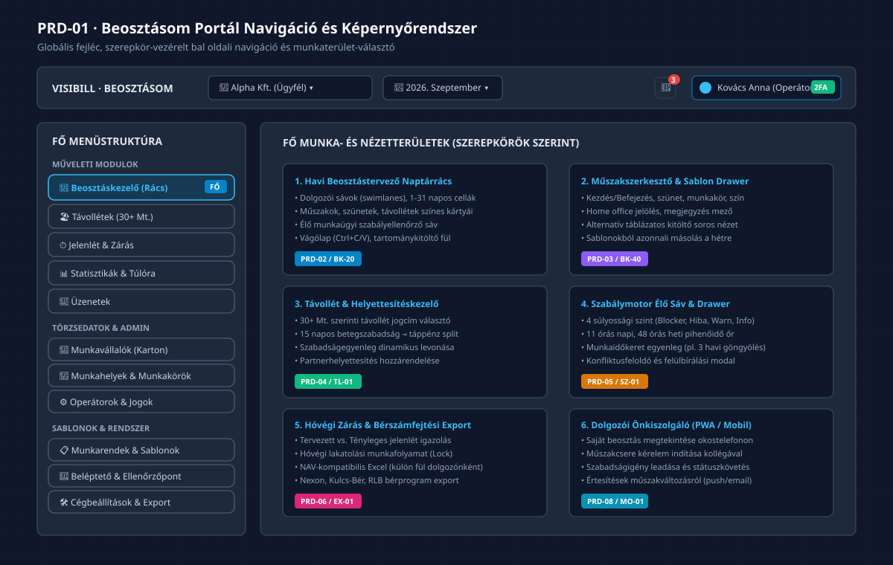

# PRD-01: Portál Navigáció, Globális Vezérlők és Menürendszer

[Vissza a PRD Indexhez](./INDEX.md) · [Következő: PRD-02 Havi Beosztástervező Naptárrács](./PRD-02-havi-beosztastervezo-naptarracs.md)

---

## 1. Termék- és Felületcélkitűzés

A **Beosztásom** modul az Eaisybill vállalatirányítási platformba szervesen beépülő, böngészőből és mobil eszközökről elérhető munkaidő-nyilvántartási és beosztástervező felület. A navigációs rendszer célja, hogy a könyvelőirodai operátorok, cégvezetők és bérszámfejtők számára azonnali, egykattintásos hozzáférést biztosítson a többcéges ügyfélkörhöz, a havi beosztási időszakokhoz és az operatív munkafelületekhez.

### 1.1 Kiemelt Felületi Értékajánlat
- **Azonnali Cég- és Hónapváltás:** A fejlécből egyetlen kattintással elérhető cégválasztó és időszakváltó, amely a teljes munkaterületet szűri.
- **Szerepkör-alapú Nézetvezérlés:** Az operátori, cégvezetői és munkavállalói felületek szigorúan a jogosultsági szintnek megfelelő menüpontokat jelenítik meg.
- **Valós Idejű Rendszerértesítések:** Globális harangikon jelvénnyel a sürgős teendőkről (pl. lezáratlan beosztás, új szabadságkérelem, szabálysértési riasztás).

---

## 2. Képernyőelrendezés és Portálarchitektúra

A portál képernyője három fő strukturális zónára oszlik:
1. **Globális Felső Fejléc (Top Navigation Bar):** Állandóan látható, rögzített fejléc (magasság: 56px).
2. **Bal Oldali Főmenü (Sidebar Navigation):** Összecsukható, ikonokkal ellátott vertikális menüsáv (szélesség: 260px, összecsukva: 68px).
3. **Központi Munkaterület (Main Content Area):** Dinamikus, kártyás elrendezésű zóna, amely az aktuálisan kiválasztott modul képernyőjét rendereli.

```
┌────────────────────────────────────────────────────────────────────────────────────────┐
│ [Logo] VISIBILL · BEOSZTÁSOM   [🏢 Cégválasztó ▾]   [📅 Időszak ▾]     🔔 [3]   [👤 Profil 2FA]│
├──────────────────┬─────────────────────────────────────────────────────────────────────┤
│ MŰVELETI MENÜK   │ KÖZPONTI MUNKATERÜLET                                               │
│ • Beosztáskezelő │                                                                     │
│ • Távollétek     │                                                                     │
│ • Jelenlét       │                                                                     │
│ • Statisztikák   │                                                                     │
│ • Üzenetek       │                                                                     │
│ ADMINISZTRÁCIÓ   │                                                                     │
│ • Munkavállalók  │                                                                     │
│ • Munkahelyek    │                                                                     │
│ • Sablonok       │                                                                     │
│ • Beállítások    │                                                                     │
└──────────────────┴─────────────────────────────────────────────────────────────────────┘
```

---

## 3. Vizuális Rendszerarchitektúra Diagram


*(Vektoros formátum: [01_portal_navigacio_es_nezetrendszer.svg](./diagramms/01_portal_navigacio_es_nezetrendszer.svg) · Nagyfelbontású kép: [01_portal_navigacio_es_nezetrendszer@2x.png](./diagramms/01_portal_navigacio_es_nezetrendszer@2x.png))*

---

## 4. Globális Fejléc Specifikáció

### 4.1 Cégválasztó Komponens (`CompanySwitcher`)
- **Funkció:** Többcéges könyvelőirodai működés alapköve. Az operátor itt választja ki, melyik ügyfél adataival dolgozik.
- **Kereső:** Szabadszavas gyorskereső a legördülő menüben cégnevére és adószámára.
- **Viselkedés:** Cégváltáskor a rendszer megőrzi a kiválasztott naptári hónapot, de újratölti a céghez tartozó telephelyeket, munkavállalókat és beosztásokat (&lt;300ms).

### 4.2 Időszakválasztó Komponens (`PeriodSelector`)
- **Funkció:** Aktuális beosztási és jelenléti hónap kiválasztása.
- **Megjelenítés:** `ÉÉÉÉ. Hónap` formátum (pl. `2026. Szeptember`).
- **Gyorsváltók:** „Előző hónap” (◀) és „Következő hónap” (▶) léptetőgombok.

### 4.3 Értesítési Központ (`NotificationBadge` & `NotificationPopover`)
- **Jelvény:** Piros körben a még nem olvasott értesítések száma (max: `99+`).
- **Tartalom:**
  - Hóközi sürgős feladatok (pl. *„Alpha Kft. szeptemberi beosztása még nincs lezárva”*).
  - Szabadság- és műszakcsere kérelmek érkezése a munkavállalóktól.
  - Szabálysértési értesítések (Mt. pihenőidő megsértése).
- **Interakció:** Kattintásra legördülő lebegő panel gyorsműveleti gombokkal („Megtekintés”, „Összes olvasottnak jelölése”).

### 4.4 Felhasználói Profil és Biztonság (`UserProfileMenu`)
- **Megjelenítés:** Bejelentkezett felhasználó avatarja, teljes neve és szerepköre (pl. `Kovács Anna (Operátor)`).
- **2FA Állapotjelző:** Zöld `2FA` címke, ha a kétfaktoros hitelesítés aktív; sárga felkiáltójel, ha a cégszabályzat kötelezővé teszi, de még nincs konfigurálva.
- **Menüpontok:** Adataim, Értesítési preferenciák, Nyelvváltás (Magyar / Angol), Kijelentkezés.

---

## 5. Bal Oldali Menüstruktúra és Jogosultsági Mátrix

A menürendszer funkcionális blokkokba szervezve biztosítja a gyors tájékozódást:

| Menüpont | Ikon (Lucide) | Funkció és Cél | Láthatóság (Szerepkör) | Követelmény ID |
|:---|:---:|:---|:---:|:---:|
| **Beosztáskezelő** | `Calendar` | Havi beosztások tervezése, naptárrács, gyorskitöltés | Operátor, Vezető | `BK-01` |
| **Távollétek** | `Palmtree` | 30+ Mt. szerinti szabadság, betegszabadság, táppénz | Operátor, Vezető, Dolgozó | `TL-01` |
| **Jelenlét** | `Clock` | Tényleges jelenlét igazolása, hóvégi zárás, export | Operátor, Bérszámfejtő | `JL-01` |
| **Statisztikák** | `BarChart3` | Munkaidő, túlóra és keretegyenleg kimutatások | Operátor, Vezető, Bérszámfejtő | `ST-01` |
| **Üzenetek** | `MessageSquare` | Belső üzenetváltás a dolgozók és a vezetőség között | Minden szerepkör | `UZ-01` |
| **Munkavállalók** | `Users` | Dolgozói törzskartonok, Mt. szabályok, egyenlegek | Operátor, Vezető | `MV-01` |
| **Munkahelyek** | `Building2` | Telephelyek, üzletek, nyitvatartási idők | Operátor, Vezető | `OP-01` |
| **Munkakörök** | `Briefcase` | Munkaköri megnevezések, színkódok, besorolások | Operátor, Vezető | `OP-02` |
| **Sablonok** | `Layers` | Munkarendek, munkaidősablonok és mintabeosztások | Operátor | `SB-01` |
| **Beléptetőrendszer** | `DoorOpen` | Fizikai terminálok és virtuális belépések naplója | Operátor | `BL-01` |
| **Beállítások** | `Settings` | Céges paraméterek, 2FA, kötelező szabályok | Operátor | `BE-01` |
| **Dokumentumok** | `FileText` | ÁSZF, Adatkezelési tájékoztató, jogi nyilatkozatok | Minden szerepkör | `DK-01` |

---

## 6. A 4 Kötelező UI Állapot

1. **Betöltési Állapot (Loading / Skeleton):**
   - Menüváltáskor a fejléc fix marad, a központi munkaterületen nem jelenhet meg villogó fehér lap vagy nyers „Betöltés...” felirat.
   - Helyette a [docs/design/07-loading-patterns.md](file:///d:/ThinkAI/Visibill/eaisybill-prod/docs/design/07-loading-patterns.md) szerinti pulzáló kártya- és gombszkeletonok jelennek meg.
2. **Üres Állapot (Empty State):**
   - Ha egy újonnan felvett cégnél még nincsenek adatok (pl. üres a beosztáskezelő), barátságos üres állapot kártya jelenik meg:
     - Illusztráció / Lucide ikon (`CalendarPlus`);
     - Cím: *„Még nincs beosztás rögzítve erre a hónapra”*;
     - Magyarázat: *„Hozzon létre egy új beosztást a Hozzáadás gombbal, vagy másolja át az előző hónap beállításait!”*;
     - Elsődleges CTA gomb: `Új beosztás létrehozása`.
3. **Sikeres Művelet (Success State):**
   - Cég- vagy hónapváltás, profilmentés után azonnali zöld toast értesítés (`bg-emerald-600`, 3 másodperces automatikus eltűnéssel).
4. **Hibaállapot (Error State & Retry):**
   - Hálózati kimaradás esetén diszkrét, de egyértelmű hibaüzenet sáv: *„Nem sikerült betölteni a cég adatait. Ellenőrizze internetkapcsolatát!”* mellette `Újrapróbálkozás` gombbal.

---

## 7. Design System és Token Megfeleltetés

- **Színek:** A felület a Visibill design tokenjeit használja:
  - Háttér: `bg-background` (`#0f172a`), Kártyák: `bg-card` (`#1e293b`), Keretek: `border-border` (`#334155`).
  - Elsődleges kiemelés: `text-primary` (`#38bdf8`), Aktív menüpont: `bg-primary/10 text-primary border-l-2 border-primary`.
- **Ikonkészlet:** Kizárólag Lucide React ikonok (méret: 18px a menüben, 16px a fejlécekben).
- **Reszponzivitás:**
  - Asztali nézet (&gt;1024px): Állandó nyitott oldalsáv.
  - Tablet nézet (768px – 1024px): Automatikusan ikonossá összecsukódó menüsáv tooltip felugrókkal.
  - Mobil nézet (&lt;768px): Hamburger menüvel nyíló lebegő Drawer és alsó navigációs sáv.
