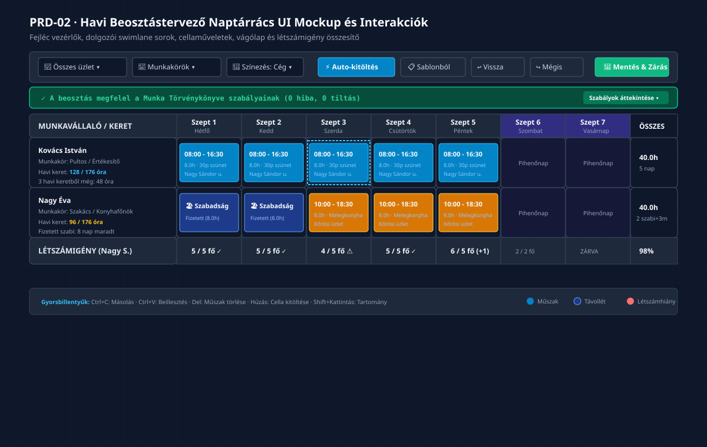

# PRD-02: Havi Beosztástervező Naptárrács és Interakciók

[Előző: PRD-01 Portál Navigáció](./PRD-01-navigacio-es-menustruktura.md) · [Vissza a PRD Indexhez](./INDEX.md) · [Következő: PRD-03 Műszakszerkesztő és Sablonkezelő](./PRD-03-muszakszerkeszto-es-sablonkezelo.md)

---

## 1. Termék- és Felületcélkitűzés

A **Havi Beosztástervező Naptárrács** a Beosztásom modul központi, legnagyobb forgalmú felülete. Itt történik a munkavállalók műszakjainak, pihenőnapjainak és feladatainak operatív szervezése a hónap minden napjára. A felület célja, hogy a hagyományos, nehezen kezelhető Excel táblázatok hatékonyságát ötvözze a modern webes felületek ergonómiájával, valós idejű óraszámítással és szabályellenőrzéssel.

### 1.1 Kiemelt Felületi Értékajánlat
- **Komplex Mátrix Áttekinthetőség:** Dolgozók soraiban (swimlanes) egyidejűleg látható a hónap összes napja (1–31), a napi műszakok és a kumulált havi órák.
- **Excel-szerű Produktivitás:** Többcellás tartománykijelölés (egérhúzással), vágólapkezelés (`Ctrl+C`, `Ctrl+V`), kitöltő fül (fill handle) és billentyűzetes gyorsnavigáció.
- **Létszámigény Sáv:** A rács alján valós időben követhető, hogy a megtervezett műszakok kielégítik-e a telephelyenként előírt minimális dolgozói létszámot.

---

## 2. Naptárrács UI Mockup és Szerkezeti Elrendezés

*(Vektoros formátum: [02_naptarracs_interakcios_ui_mockup.svg](./diagramms/02_naptarracs_interakcios_ui_mockup.svg) · Nagyfelbontású kép: [02_naptarracs_interakcios_ui_mockup@2x.png](./diagramms/02_naptarracs_interakcios_ui_mockup@2x.png))*

---

## 3. Fejléc Vezérlők és Szűrősáv Specifikáció

A naptárrács feletti eszköztár azonnali műveleteket és nézettestreszabást biztosít:

| Vezérlő Elem | Típus / Komponens | Lehetséges Értékek és Viselkedés | Követelmény ID |
|:---|:---:|:---|:---:|
| **Munkahely szűrő** | `Select` (Legördülő) | „Összes munkahely” vagy konkrét telephely (pl. *Nagy Sándor u.*, *Kőrösi üzlet*). Szűréskor csak a kijelölt telephely műszakai és dolgozói jelennek meg. | `BK-27` |
| **Munkakör szűrő** | `Select` (Legördülő) | „Összes munkakör” vagy szűrés (pl. *Pultos*, *Szakács*, *Felszolgáló*). | `BK-27` |
| **Színezési mód** | `Select` (Legördülő) | Színkódolás alapja: **Munkakör szerint** (alapértelmezett), **Munkahely szerint**, **Dolgozó szerint**, vagy **Műszaktípus szerint**. | `BK-28` |
| **Auto-kitöltés gomb** | `Button` (Primary) | Modális varázsló megnyitása: létszámigény, munkarend vagy előző hónap másolása alapján feltölti a rácsot. | `BK-24` |
| **Sablonból kitöltés** | `Button` (Secondary) | Előre definiált beosztássablon ráhúzása a kijelölt hétre vagy hónapra. | `BK-24` |
| **Visszavonás (Undo)** | `IconButton` (`Undo2`) | Utolsó rácsművelet visszavonása (`Ctrl+Z`). | `BK-32` |
| **Mégis (Redo)** | `IconButton` (`Redo2`) | Visszavont művelet ismételt végrehajtása (`Ctrl+Y`). | `BK-32` |
| **Nézetbeállítások** | `DropdownMenu` | • Üres sorok elrejtése (toggle) • Sormagasság csökkentése (kompakt nézet) • Kilépett dolgozók megjelenítése (toggle) | `BK-31` |
| **Mentés és Zárás** | `Button` (Success) | A havi beosztás állapotának „Lezárt”-ra állítása, átadás a jelenlét-igazolásnak. | `BK-61` |

---

## 4. Dolgozói Sorok (Swimlane-ek) és Oszlopok Részletezése

### 4.1 Bal Oldali Rögzített Dolgozói Kártyaoszlop (Fixed Left Column)
A táblázat bal széle vízszintes görgetés közben rögzített marad (szélesség: 250px):
- **1. sor:** Dolgozó teljes neve (félkövér, 13px) kattintható linkkel a munkavállalói kartonra.
- **2. sor:** Elsődleges munkakör és telephely.
- **3. sor (Havi Kötelező Óraszámláló):** Valós időben számított mutató: `Ledolgozott / Havi norma óra` (pl. `128 / 176 óra`). Színkód:
  - Zöld: kereten belül (pontosan 100%).
  - Kék: még feltöltés alatt (&lt;100%).
  - Sárga / Narancs: túlóra keletkezett (&gt;100%).
- **4. sor (Munkaidőkeret Egyenleg):** Ha a dolgozó többhavi (pl. 3 havi) munkaidőkeretben dolgozik: a keretből még hátralévő órák száma (pl. *„Még 48 óra a 3 havi keretből”*).

### 4.2 Naptári Napok Oszlopai (1..31)
- **Hétköznapok (Hétfő – Péntek):** Standard sötétszürke háttér (`#0f172a`), oszlopszélesség: 110px.
- **Hétvégék (Szombat – Vasárnap):** Kiemelt kékeslila háttérárnyalat (`#1e1b4b`), amely segíti a vizuális tájékozódást.
- **Munkaszüneti Napok és Ünnepnapok:** Piros naptári dátumfejléc (pl. *Október 23.*, *December 25.*) és automatikus munkaszüneti nap címke.
- **Áthelyezett Munkanapok:** Munkanapként kezelt szombatok narancssárga kiemeléssel.

### 4.3 Cellákban Megjelenő Elemek
1. **Műszak Kártya:**
   - Idősáv: `08:00 - 16:30` (félkövér fehér szöveg).
   - Nettó munkaidő és szünet: `8.0h · 30p szünet`.
   - Telephely vagy Munkakör címke (színezési mód szerint).
   - Ikonok a kártyán:
     - 🏠 *Home office* munkavégzés jelölése;
     - 💬 *Megjegyzés* megléte (tooltip mutatja a szöveget);
     - ⚠️ *Szabálysértési sarokjelölő* (piros vagy narancssárga háromszög).
2. **Távollét Kártya:**
   - Kék hátterű, zárolt blokk.
   - Megnevezés: a pontos Mt. szerinti jogcím (pl. `🏖️ Fizetett szabadság`, `Betegszabadság`, `Táppénz`).
   - Elszámolt óra: `8.0h` (vagy részmunkaidő esetén arányos óraszám).
   - Viselkedés: a cellába nem húzható és nem másolható műszak; kattintásra a távollét módosítása nyílik meg.
3. **Üres Cella (Pihenőnap):**
   - Felirat: `Pihenőnap` halvány szürke szöveggel.
   - Duplakattintásra új műszak felvitele nyílik meg az adott napra.

### 4.4 Jobb Oldali Havi Összesítő Oszlop
- Összes ledolgozott óra a hónapban (pl. `160.0h`).
- Összes ledolgozott napok száma (pl. `20 nap`).
- Távolléti napok száma jogcímenként összesítve.

---

## 5. Alsó Létszámigény Sáv (Staffing Requirement Bar)

A naptárrács alján rögzített összesítő sáv mutatja, hogy naponként és műszakonként megvan-e az előírt dolgozói létszám:
- **Számítás:** `Tervezett létszám / Szükséges létszám` telephelyenként (pl. *Nagy Sándor utcai üzlet: 5 / 5 fő*).
- **Színkódolás:**
  - 🟢 **Zöld pipa (`5 / 5 fő ✓`):** A létszám pontosan fedezi az igényt.
  - 🔴 **Piros figyelmeztetés (`4 / 5 fő ⚠️`):** Létszámhiány! Nincs elegendő dolgozó beosztva.
  - 🟡 **Sárga jelzés (`6 / 5 fő (+1)`):** Túltervezés, több dolgozó van beosztva a szükségesnél.
  - ⚪ **Szürke („ZÁRVA”):** Hétvégi vagy ünnepnapi zárvatartás.

---

## 6. Interakciók, Vágólap és Gyorsműveletek

### 6.1 Vágólap Műveletek (Clipboard Operations)
- `Ctrl + C`: Kijelölt egyedi cella vagy tartomány másolása a belső vágólapra.
- `Ctrl + V`: Vágólapon lévő műszak(ok) beillesztése a célcellára vagy tartományra.
  - *Ütközésvédelem:* Ha a beillesztés távolléti napra esne, a rendszer figyelmeztet és kihagyja az adott napot.
- `Delete` vagy `Backspace`: Kijelölt műszak(ok) azonnali törlése (megerősítő kérdés 5+ cellánál).

### 6.2 Egér- és Érintésvezérelt Gyorskitöltés (Fill Handle)
- Egy cella kijelölésekor a jobb alsó sarkában kis kék négyzet (kitöltő fül) jelenik meg.
- A fül vízszintes jobbra húzásával a műszak automatikusan átmásolódik a hét többi napjára.
- *Intelligens kihagyás:* Húzás közben az opcióknál beállítható: *„Hétvégék és ünnepnapok automatikus kihagyása”*.

### 6.3 Jobb Gombos Kontextus Menü
Bármelyik cellára jobb gombbal kattintva az alábbi gyorsmenü jelenik meg:
1. `Műszak szerkesztése` (Modal megnyitása)
2. `Másolás` (`Ctrl+C`)
3. `Beillesztés` (`Ctrl+V`)
4. `Másolás a hét többi munkanapjára`
5. `Helyettesítés kijelölése`
6. `Törlés`

---

## 7. A 4 Kötelező UI Állapot

1. **Betöltési Állapot (Skeleton Loader):**
   - Hónapváltáskor a rács szerkezete azonnal megjelenik, a cellákban 12 darab szürke pulzáló téglalap jelzi a műszakok betöltését (&lt;400ms válaszidő).
2. **Üres Állapot:**
   - Új hónap nyitásakor a rács tiszta munkanapokkal jelenik meg. A rács tetején lebegő kártya kínálja fel:
     - `⚡ Automatikus kitöltés létszámigény szerint`
     - `📋 Kitöltés előző hónap másolásával`
     - `➕ Kézi tervezés megkezdése`
3. **Sikeres Művelet (Optimistic UI):**
   - Bármilyen cellamódosítás azonnal, helyben megtörténik (&lt;50ms), a háttérben mentődik. A fejlécben zöld mentési pipa villan fel: *„Minden módosítás mentve”*.
4. **Hibaállapot (Conflict Feedback):**
   - Szabálysértés esetén a cella nem blokkolja a gépelést, de azonnal megjelenik a narancssárga sarokjelölő és a fejléc élő szabálysávjában a hibaösszesítő.
