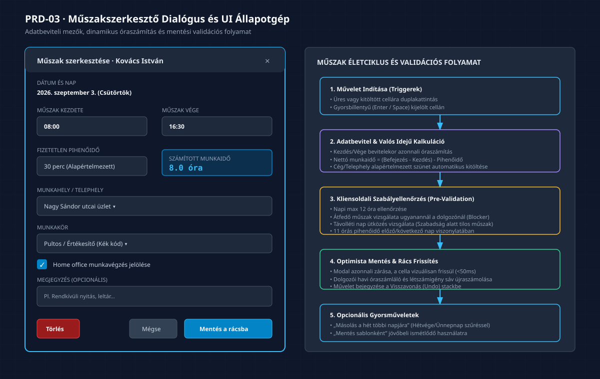

# PRD-03: Műszakszerkesztő Dialógus, Gyorskitöltő és Sablonkezelő

[Előző: PRD-02 Naptárrács](./PRD-02-havi-beosztastervezo-naptarracs.md) · [Vissza a PRD Indexhez](./INDEX.md) · [Következő: PRD-04 Távollét és Helyettesítés](./PRD-04-tavollet-es-helyettesites-kezelo.md)

---

## 1. Termék- és Funkciócélkitűzés

A **Műszakszerkesztő és Sablonkezelő** felület a napi munkaidő-bejegyzések manuális és félautomata rögzítésének eszköztára. Célja a minimális kattintásszámú műszakfelvitel, a gyors gépelhetőség, valamint az ismétlődő munkarendek és beosztásminták azonnali újrafelhasználhatósága.

### 1.1 Kiemelt Felületi Értékajánlat
- **Intelligens Műszak Dialógus:** A kezdés és befejezés megadásakor a rendszer azonnal kiszámolja a nettó munkaidőt a céges szünet levonásával.
- **Alternatív Táblázatos Gyorskitöltő:** Soros, jelenléti ív formátumú felület a hónap napjaira, ahol Tab billentyűvel másodpercek alatt végig lehet gépelni egy dolgozó teljes havi műszakjait.
- **Többszintű Sablonkezelés:** Munkarendek, időpontsablonok és heti beosztássablonok mentése és csoportos alkalmazása.

---

## 2. Műszakszerkesztő UI Dialógus és Állapotgép

*(Vektoros formátum: [03_muszakszerkeszto_modal_es_allapotgep.svg](./diagramms/03_muszakszerkeszto_modal_es_allapotgep.svg) · Nagyfelbontású kép: [03_muszakszerkeszto_modal_es_allapotgep@2x.png](./diagramms/03_muszakszerkeszto_modal_es_allapotgep@2x.png))*

---

## 3. Műszakszerkesztő Mezőspecifikáció (`ShiftEditorDialog`)

A dialógus (vagy asztali felületen jobb oldali `Sheet / Drawer`) az alábbi beviteli mezőket tartalmazza:

| Mező Neve | Típus | Validációs Szabályok és Korlátok | Alapértelmezett Érték | Hibaüzenet Hibás Bevitelnél | Követelmény ID |
|:---|:---:|:---|:---:|:---|:---:|
| **Munkavállaló** | `Select` / Readonly | Kötelező; ha a rácsból nyitották, az adott dolgozó fix | Kijelölt dolgozó | *„Munkavállaló megadása kötelező!”* | `BK-40` |
| **Dátum** | `DatePicker` | Érvényes naptári nap a beosztási időszakon belül | Kijelölt nap | *„A dátum a beosztási időszakon kívül esik!”* | `BK-40` |
| **Kezdés időpontja** | `TimePicker` (`ÓÓ:PP`) | Kötelező, formátum: `00:00` – `23:59` | `08:00` (vagy sablon) | *„Érvénytelen időformátum!”* | `BK-40` |
| **Befejezés időpontja** | `TimePicker` (`ÓÓ:PP`) | Kötelező; éjfél utáni átnyúlás esetén következő napi jelzés | `16:30` (vagy sablon) | *„A befejezés nem lehet azonos a kezdéssel!”* | `BK-40` |
| **Fizetetlen pihenőidő** | `NumberInput` (Perc) | Numerikus egész; 0 ≤ perc ≤ 180; Mt. szerint 6 óra felett min. 20 perc | `30` perc (cégbeállításból) | *„A pihenőidő nem haladhatja meg a teljes időtartamot!”* | `BK-40` |
| **Számított munkaidő** | Kijelző (`Badge`) | Csak olvasható: `(Vége - Kezdés) - Pihenő` | Dinamikusan `8.0h` | – | `BK-43` |
| **Munkahely / Telephely** | `Select` (Legördülő) | Kötelező; a cég telephelyei közül | Dolgozó alapértelmezettje | *„Munkahely kiválasztása kötelező!”* | `BK-40` |
| **Munkakör** | `Select` (Legördülő) | Kötelező; a cég munkakörei közül, színkóddal | Dolgozó alapértelmezettje | *„Munkakör kiválasztása kötelező!”* | `BK-40` |
| **Műszak típusa** | `Select` (Legördülő) | `Normál`, `Éjszakai`, `Ügyelet`, `Készenlét`, `Túlóra`, `Oktatás` | `Normál` | – | `BK-45` |
| **Home office** | `Checkbox` | Opcionális bejelölés | `false` | – | `BK-40` |
| **Megjegyzés** | `Textarea` | Opcionális szabad szöveg (max. 250 karakter) | Üres | *„Túl hosszú megjegyzés (max. 250 karakter)!”* | `BK-40` |

---

## 4. Alternatív Táblázatos Kitöltő Nézet (`TabularShiftEntryView`)

A bemutató videóban a könyvelőirodai felhasználók kiemelték: a havi adatrögzítéshez gyakran kényelmesebb egy egyenes vonalú, Excel-szerű **soros táblázat**, ahol a dolgozó egész havi naptára függőlegesen jelenik meg.

### 4.1 Táblázat Szerkezete és Oszlopai
1. **Sorszám & Dátum:** `1. Szept 1. (Hétfő)` ... `30. Szept 30. (Kedd)`.
2. **Kezdés mező (`Input`):** Automatikusan fókuszálható cella, billentyűzetről beírható (pl. `8` → automatikusan `08:00`).
3. **Befejezés mező (`Input`):** Automatikusan fókuszálható (pl. `1630` → automatikusan `16:30`).
4. **Pihenőidő (`Input`):** Alapértelmezett 30 perc, azonnal felülírható.
5. **Nettó Munkaidő (Számított):** Valós idejű óraszám (pl. `8.0 óra`).
6. **Munkakör & Munkahely:** Céges alapértelmezésekkel feltöltve.
7. **Sor Műveletek:** `Másolás lefelé` ikon, `Törlés` ikon.

### 4.2 Billentyűzet-központú Gépelési Élmény
- `Tab`: Ugrás a következő cellára (Kezdés → Befejezés → Következő napi Kezdés).
- `Enter`: Sor jóváhagyása és ugrás a következő naptári napra.
- `Ctrl + D`: Előző sor adatainak lemásolása az aktuális sorba.
- `Kitöltés gomb` a lap alján: Az összes beírt sor egyetlen tranzakcióban átkerül a központi naptárrácsba (`BK-43`).

---

## 5. Sablonkezelő Modul Specifikáció (`TemplatesModule`)

A rendszer három szintű sablonozást támogat a manuális munka 80%-os kiváltására:

### 5.1 Munkarendek Sablonjai (`WorkSchedules`)
- **Általános Munkarend (5+2):** Hétfőtől péntekig heti 40 óra, szombat és vasárnap heti pihenőnap.
- **Egyenlőtlen Munkarend (Munkaidőkeret):** Havi vagy többhavi órakeret, változó hosszúságú műszakokkal és rugalmas pihenőnap-kiosztással.
- **Folyamatos Munkarend (12/24 vagy 12/48):** Ipari vagy vendéglátóipari váltott műszakok éjszakai és hétvégi munkavégzéssel.

### 5.2 Munkaidősablonok (`TimeTemplates`)
Előre rögzített időpont-párok gyors hozzárendeléshez:
- `Délelőttös (DE)`: 06:00 – 14:30 (30 perc szünet, 8.0h)
- `Délutános (DU)`: 14:00 – 22:30 (30 perc szünet, 8.0h)
- `Éjszakás (ÉJ)`: 22:00 – 06:30 (30 perc szünet, 8.0h)
- `Hosszú műszak (12h)`: 08:00 – 20:45 (45 perc szünet, 12.0h)

### 5.3 Beosztássablonok (`RosterTemplates`)
Teljes heti minta (Hétfő – Vasárnap) előre beállított műszakokkal egy adott csapat vagy munkakör számára.
- **Alkalmazás:** Egyetlen kattintással ráhúzható egy dolgozóra vagy egy teljes telephely összes dolgozójára a kijelölt hetekre.
- **Ünnepnap kezelés:** Bejelölhető kapcsoló: *„Ünnepnapok automatikus kihagyása a sablon alkalmazásakor”* (`BK-12`).

---

## 6. A 4 Kötelező UI Állapot

1. **Betöltési Állapot:** A dialógus megnyitásakor a meglévő műszak adatai azonnal (&lt;100ms) betöltődnek. Sablonok listázásakor kártyaszkeletonok láthatók.
2. **Üres Állapot:** Új műszak felvitelekor a mezők az intelligens alapértelmezésekkel (dolgozó munkaköre, cég alap munkahelye, standard 08:00–16:30) indulnak, így az operátornak gyakran csak a `Mentés` gombra kell kattintania.
3. **Sikeres Állapot:** Mentés után a dialógus bezárul, a naptárrács cellája felvillanva zöldre vált, jelezve a sikeres lokális frissülést.
4. **Hibaállapot (Inline Validation):**
   - Ha a kezdési időpont későbbi, mint a befejezés (és nincs bejelölve az éjszakai átnyúlás): a mező alatt azonnal megjelenik a piros hibaüzenet: *„A kezdésnek meg kell előznie a befejezést!”*.
   - A `Mentés` gomb ilyenkor inaktív (`disabled`), megakadályozva az érvénytelen adatok beküldését.
