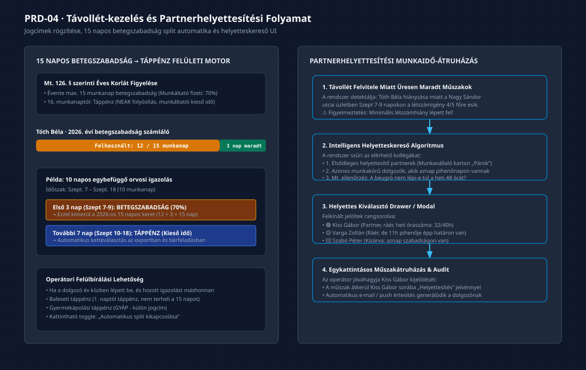

# PRD-04: Távollét- és Helyettesítéskezelő Felület

[Előző: PRD-03 Műszakszerkesztő](./PRD-03-muszakszerkeszto-es-sablonkezelo.md) · [Vissza a PRD Indexhez](./INDEX.md) · [Következő: PRD-05 Szabálymotor](./PRD-05-szabalymotor-es-eloe-megfeleloseg.md)

---

## 1. Termék- és Funkciócélkitűzés

A **Távollét- és Helyettesítéskezelő** felület rögzíti és követi nyomon a munkavállalók minden olyan időszakát, amikor munkavégzési kötelezettségük alól mentesülnek (szabadság, betegség, gyermekgondozás, hatósági távollétek). A felület biztosítja a 30+ törvényes Mt. jogcím pontos nyilvántartását, automatikusan számolja az éves szabadság- és betegszabadság-kereteket, valamint intelligens ajánlóval támogatja az üresen maradt műszakok kollégákhoz történő átruházását.

### 1.1 Kiemelt Felületi Értékajánlat
- **15 Napos Betegszabadság Split Motor:** Orvosi igazolás felvitelekor a felület automatikusan kettéválasztja a távollétet az első 15 munkanapra (munkáltatói 70%-os betegszabadság) és az azt követő napokra (NEAK táppénz, kieső idő).
- **Élő Szabadságkeret Számláló:** Fizetett szabadság rögzítésekor a rendszer valós időben mutatja az éves kivehető, kivett és hátralévő napok egyenlegét.
- **Intelligens Partnerhelyettesítés:** Távollét rögzítésekor a rendszer automatikusan felkínálja a legmegfelelőbb helyettesítő kollégákat a pihenőidők és heti órakeretek sérelme nélkül.

---

## 2. Távollét és Helyettesítés UI Munkafolyamat


*(Vektoros formátum: [04_tavollet_es_helyettesites_ui_flow.svg](./diagramms/04_tavollet_es_helyettesites_ui_flow.svg) · Nagyfelbontású kép: [04_tavollet_es_helyettesites_ui_flow@2x.png](./diagramms/04_tavollet_es_helyettesites_ui_flow@2x.png))*

---

## 3. Távollét Rögzítő Űrlap Mezőspecifikáció (`AbsenceDialog`)

A felületen az alábbi mezőkkel rögzíthető új távollét:

| Mező Neve | Típus | Validáció és Szabályok | Alapértelmezett | Hibaüzenet | Követelmény ID |
|:---|:---:|:---|:---:|:---|:---:|
| **Munkavállaló** | `Select` (Kereshető) | Kötelező; aktív jogviszonyban lévő dolgozó | Kiválasztott dolgozó | *„Munkavállaló megadása kötelező!”* | `TL-02` |
| **Kezdő dátum** | `DatePicker` | Érvényes naptári nap; kezdés ≤ befejezés | Aktuális nap | *„A kezdés nem lehet későbbi a végdátumnál!”* | `TL-02` |
| **Befejező dátum** | `DatePicker` | Érvényes naptári nap | Kezdő dátum | *„Érvénytelen időszak!”* | `TL-02` |
| **Távollét jogcíme** | `Select` (Kategorizált) | Kötelező; az Mt. jogcímkatalógusból (30+ elem) | `Fizetett szabadság` | *„Jogcím kiválasztása kötelező!”* | `TL-02` |
| **Érintett munkanapok** | Kijelző (`Badge`) | Csak olvasható; a tartományba eső munkanapok száma | Dinamikusan számolt | – | `TL-09` |
| **Szabadságegyenleg** | Kijelző kártya | Mutatja a levonás előtti és utáni egyenleget | Pl. `18 → 15 nap` | *„Figyelem: Az éves szabadságkeret túllépve!”* | `TL-07` |
| **Automatikus split** | `Switch` (Kapcsoló) | Csak betegség jogcímnél; 15 nap utáni táppénz váltás | `Bekapcsolva (true)` | – | `TL-08` |
| **Megjegyzés** | `Textarea` | Opcionális szabad szöveg (orvosi igazolás száma stb.) | Üres | – | `TL-02` |

---

## 4. A 30+ Mt. Távollét Jogcímkatalógus Csoportosítása

A legördülő menü logikai kategóriákba rendezve segíti a könyvelői választást:

### 4.1 Rendes és Rendkívüli Szabadságok
1. **Fizetett szabadság (alapszabadság és pótszabadság):** Munkaidő-elszámolás: 8.0h/nap (részmunkaidőnél arányos). Csökkenti az éves szabadságkeretet.
2. **Apasági szabadság:** Gyermek születésekor apának járó 10 munkanap (állam által térített).
3. **Szülői szabadság:** Gyermek 3 éves koráig igényelhető 44 munkanap.
4. **Hozzátartozó halála miatti mentesülés:** 2 munkanap mentesülés a munkavégzés alól.

### 4.2 Keresőképtelenség és Egészségügyi Távollétek
5. **Betegszabadság (1–15 munkanap):** Munkáltatói kifizetés (távolléti díj 70%-a).
6. **Táppénz (16. munkanaptól):** NEAK által folyósított ellátás, munkáltatói kieső idő.
7. **Baleseti táppénz:** Üzemi baleset vagy foglalkozási megbetegedés (első naptól 100%-os táppénz).
8. **Gyermekápolási táppénz (GYÁP):** Beteg gyermek otthoni ápolása (életkortól függő napok).
9. **Keresőképtelenség ellátás nélkül:** Nem jogosult táppénzre (pl. biztosítási jogviszony hiánya).

### 4.3 Családtámogatási és Gyermekgondozási Jogcímek
10. **Csecsemőgondozási díj (CSED):** Szülési szabadság időtartama (24 hét).
11. **Gyermekgondozási díj (GYED):** Gyermek 2 éves koráig.
12. **Gyermekgondozást segítő ellátás (GYES):** Gyermek 3 éves koráig.
13. **Gyermeknevelési támogatás (GYET):** 3 vagy több gyermek nevelésekor.
14. **Gyermekek otthongondozási díja (GYOD):** Tartósan beteg vagy önellátásra képtelen gyermek ápolása.

### 4.4 Egyéb Törvényes és Hatósági Mentesülések
15. **Fizetés nélküli szabadság:** Munkavállaló kérelmére engedélyezett, kieső idő.
16. **Igazolt távollét:** Hatósági idézés, véradás, kötelező orvosi vizsgálat.
17. **Igazolatlan hiányzás:** Jogalap nélküli mulasztás; munkabér-levonás és fegyelmi következmény.
18. **Munkavégzés alóli felmentés:** Felmondási idő alatti kötelező munkáltatói felmentés.
19. **Katonai és önkéntes tartalékos szolgálat:** Törvényi mentesülés.
20. **Jogszerű sztrájk időtartama:** Mt. szerinti kieső idő.

---

## 5. Intelligens Partnerhelyettesítési Munkafolyamat

Amikor egy munkavállaló távollétét (pl. váratlan betegség) rögzítik, a rendszer nem hagyja vakon üresen a korábban beosztott műszakokat:

```
[ Távollét rögzítése ] ──→ [ Üresen maradt műszakok detektálása ]
                                         │
                                         ▼
                            [ Helyettes-ajánló algoritmus ]
                                         │
                                         ▼
                        ┌─────────────────────────────────┐
                        │ 1. Kijelölt partnerek („Párok”) │
                        │ 2. Azonos munkakörű dolgozók    │
                        │ 3. Mt. pihenőidő ellenőrzés     │
                        └────────────────┬────────────────┘
                                         │
                                         ▼
                            [ 1-Kattintásos Átruházás ]
                                         │
                                         ▼
                        [ Beosztás és Értesítés frissül ]
```

### 5.1 Jelöltek Rangsorolása a Felületen
A helyettesítő fiókban a rendszer rangsorolva listázza a szóba jöhető kollégákat:
1. 🟢 **Zöld kártya (Ajánlott):** Kifejezetten kijelölt pár/helyettes, aznap szabadnapos, heti óraszáma nem haladja meg a keretet, 11 órás pihenőideje maradéktalanul biztosított.
2. 🟡 **Sárga kártya (Feltételes):** Ráér és átveheti, de heti túlórája keletkezik (+8 óra pótlékteher).
3. 🔴 **Piros kártya (Tiltott):** Nem választható (aznap maga is távolléten van, vagy megsérülne a 11 órás kötelező pihenőidő).

---

## 6. A 4 Kötelező UI Állapot

1. **Betöltési Állapot:** Távollétek menü megnyitásakor naptár- és táblázatszkeletonok jelennek meg a dolgozói egyenlegek kalkulációjáig (&lt;300ms).
2. **Üres Állapot:** Ha a hónapban még senkinek nincs távolléte: *„Ebben a hónapban még nincs rögzített távollét. Új távollét felviteléhez kattintson a Távollét hozzáadása gombra!”*.
3. **Sikeres Állapot:** Távollét mentésekor a naptárrács azonnal kékre vált az érintett napokon, a szabadságegyenleg leugrik, és toast értesítés nyugtáz: *„Távollét sikeresen rögzítve!”*.
4. **Hibaállapot (Szabályütközés):**
   - Ha az operátor olyan napra próbál fizetett szabadságot rögzíteni, amikor a dolgozó már táppénzen van: figyelmeztető piros modális ablak kéri az átfedés feloldását.
