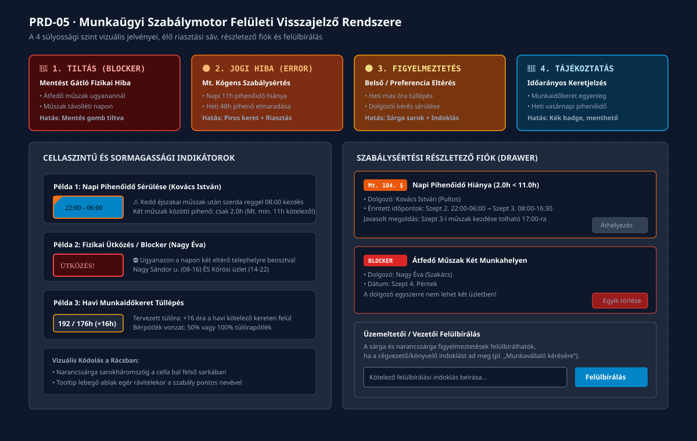

# PRD-05: Munkaügyi Szabálymotor és Élő Megfelelőségi Rendszer

[Előző: PRD-04 Távollét és Helyettesítés](./PRD-04-tavollet-es-helyettesites-kezelo.md) · [Vissza a PRD Indexhez](./INDEX.md) · [Következő: PRD-06 Jelenlét Zárás és Export](./PRD-06-jelenlet-zaras-es-berszamfejtesi-export.md)

---

## 1. Termék- és Funkciócélkitűzés

A **Munkaügyi Szabálymotor** a Beosztásom modul automatikus minőségbiztosítási és jogszabály-megfelelőségi központja. Célja a Munka Törvénykönyve (Mt.) kógens előírásainak és a vállalkozás belső szabályzatainak folyamatos, valós idejű felügyelete a beosztás tervezése közben, megóvva a munkáltatót a munkaügyi bírságoktól és a dolgozói túlterheléstől.

### 1.1 Kiemelt Felületi Értékajánlat
- **Zéró Munkaügyi Bírság Garancia:** A rendszer még a mentés és zárás előtt észleli az Mt. kötelező pihenőidő- és munkaidő-korlátainak megsértését.
- **4 Súlyossági Szint szerinti Osztályozás:** Tiszta elhatárolás a mentést fizikai szinten gátló blokkoló hibák, a törvényi szabálysértések és az enyhébb belső figyelmeztetések között.
- **Konfliktusfeloldó Fiók (Drawer):** Részletes magyarázó kártyák, amelyek nemcsak jelzik a hibát, hanem azonnali korrekciós műveletet (áthelyezés, törlés, csere) ajánlanak fel.

---

## 2. Szabálymotor Visszajelzési Hierarchia

*(Vektoros formátum: [05_szabalymotor_feluleti_visszajelzes_hierarchia.svg](./diagramms/05_szabalymotor_feluleti_visszajelzes_hierarchia.svg) · Nagyfelbontású kép: [05_szabalymotor_feluleti_visszajelzes_hierarchia@2x.png](./diagramms/05_szabalymotor_feluleti_visszajelzes_hierarchia@2x.png))*

---

## 3. A 4 Súlyossági Szint Felületi Specifikációja

A szabálymotor a felületen négy jól megkülönböztethető vizuális szintet alkalmaz:

| Szint | Szemantikus Megnevezés | Ikon & Színkód | Felületi Megjelenés | Műveleti Következmény | Követelmény ID |
|:---|:---|:---:|:---|:---|:---:|
| **1. Szint** | 🔴 **TILTÁS (BLOCKER)** | `AlertOctagon` (`#ef4444`) | Piros villogó keret a cellán, piros fejléc banner | **Mentés gomb tiltva!** Fizikailag lehetetlen állapot (pl. átfedő műszak két helyen). | `SZ-01` |
| **2. Szint** | 🟠 **JOGI HIBA (ERROR)** | `AlertTriangle` (`#f97316`) | Narancssárga sarokjelölő, piros Drawer tétel | **Mt. törvénysértés.** Csak vezetői indoklással vagy javítással engedélyezett a zárás. | `SZ-02` |
| **3. Szint** | 🟡 **FIGYELMEZTETÉS** | `AlertCircle` (`#f59e0b`) | Sárga sarokjelölő a cellán, sárga badge | **Belső szabályeltérés.** Túlóra keletkezik, vagy dolgozói kérés sérül; menthető. | `SZ-03` |
| **4. Szint** | 🔵 **TÁJÉKOZTATÁS** | `Info` (`#0ea5e9`) | Kék információs pont, tooltip | **Statisztikai jelzés.** Munkaidőkeret állapota, egyenlegek alakulása. | `SZ-04` |

---

## 4. Ellenőrzött Munkaügyi Szabályok Katalógusa

A szabálymotor az alábbi jogszabályi és céges feltételeket vizsgálja:

### 4.1 Napi és Heti Pihenőidők (Mt. 104–106. §)
- **Napi 11 órás pihenőidő:** Két egymást követő műszak befejezése és kezdete között legalább 11 egybefüggő órának el kell telnie.
  - *Kivétel (osztott napi pihenőidő):* Ha a dolgozói kartonon engedélyezve van, min. 8 óra, de a heti átlagban kompenzálandó.
- **Heti 48 órás pihenőidő:** A munkavállalót hetente legalább 48 óra megszakítás nélküli heti pihenőidő illeti meg.
- **6 munkanap utáni pihenőnap:** Legfeljebb 6 egymást követő munkanap után kötelezően legalább 1 pihenőnapot kell beosztani.
- **Havi 1 vasárnapi pihenőnap:** Többműszakos vagy vasárnap is nyitva tartó cégnél havonta legalább 1 vasárnapra heti pihenőnapot kell biztosítani.

### 4.2 Napi és Heti Munkaidő-korlátok (Mt. 99. §)
- **Napi maximális munkaidő:** Egy munkanapon a beosztás szerinti rendes és túlóra együttesen nem haladhatja meg a **12 órát** (készenléti jellegű munkakörnél 24 órát).
- **Heti maximális munkaidő:** A heti munkaidő rendkívüli munkaidővel együtt sem haladhatja meg a **48 órát**.
- **Fiatalkorú munkavállalók védelme:** 18 év alatti dolgozónál éjszakai munka (22:00–06:00) és túlóra szigorúan tilos; napi munkaideje legfeljebb 8 óra lehet.

### 4.3 Munkaidőkeret Egyenleg és Göngyölítés (Mt. 93–95. §)
- A rendszer számon tartja a keret teljes időtartamát (pl. 3 havi munkaidőkeret: Szeptember 1. – November 30.).
- Folyamatosan mutatja a keret kötelező óraszámát és az eddig beosztott órákat.
- Időarányos figyelmeztetést ad, ha a második hónap végén a dolgozó jelentős mínuszban (&lt;80%) vagy túlórában (&gt;115%) áll.

---

## 5. Szabálysértési Részletező Fiók (`RuleViolationDrawer`)

A naptárrács tetején lévő élő szabálysávra kattintva jobb oldalról becsúszó panel nyílik meg:
- **Összesítő fejléc:** *„2 hiba és 3 figyelmeztetés található a beosztásban”*.
- **Hibalista kártyák:**
  - Dolgozó neve és munkaköre;
  - Megsértett jogszabály neve (pl. *„Mt. 104. § – Napi pihenőidő hiánya”*);
  - Érintett műszakok pontos időadatai (pl. *„Szept 2. 22:00-06:00 → Szept 3. 08:00-16:30 (Pihenő: 2.0 óra)”*);
  - Javasolt korrekciós művelet (`Műszak kezdés eltolása`, `Műszak törlése`, `Csere partnerre`).
- **Vezetői Felülbírálási Űrlap:**
  - Csak Operátor és Vezető szerepkörben érhető el.
  - Kötelező szöveges indoklás megadása (pl. *„Ügyfél kérésére, dolgozó írásban hozzájárult”*).
  - A felülbírálás ténye bekerül az audit naplóba a felhasználó nevével és időbélyeggel (`R-08`).

---

## 6. A 4 Kötelező UI Állapot

1. **Betöltési Állapot:** Rács nyitásakor a szabálymotor a háttérben fut le (&lt;200ms alatt 100 dolgozóra). A szabálysáv szürke szkeletonként indul.
2. **Hiba- és Szabálysértésmentes Állapot (Clean State):**
   - Zöld sáv: *„✓ A beosztás megfelel a Munka Törvénykönyve és a vállalkozás összes előírásának”*.
3. **Riasztási Állapot (Alert State):**
   - Piros/Narancs sáv: *„⚠️ 2 jogi szabálysértés és 1 létszámhiány található!”* mellette `Részletek megtekintése` gombbal.
4. **Felülbírált Állapot:**
   - Sárga sáv pajzs ikonnal: *„A beosztásban 2 felülbírált figyelmeztetés szerepel (Indoklás rögzítve)”*.
