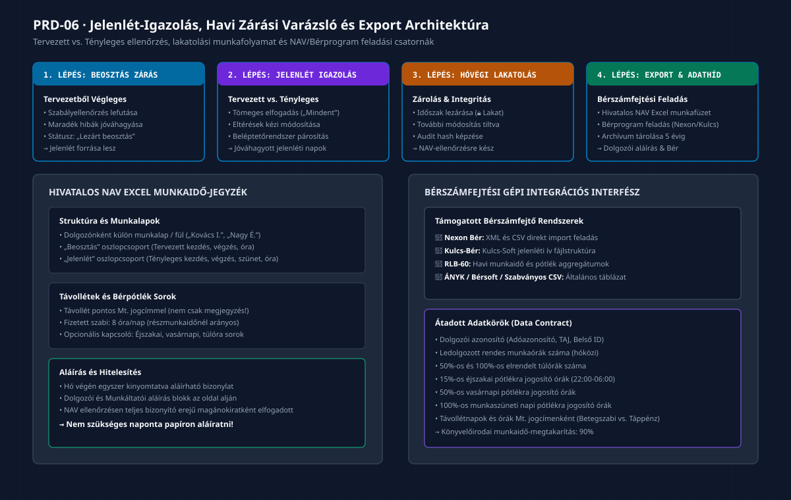

# PRD-06: Jelenlét-Igazolás, Hóvégi Zárás és Bérszámfejtési Export

[Előző: PRD-05 Szabálymotor](./PRD-05-szabalymotor-es-eloe-megfeleloseg.md) · [Vissza a PRD Indexhez](./INDEX.md) · [Következő: PRD-07 Törzsadat és Munkavállaló Karton](./PRD-07-torzsadat-es-munkavallalo-karton.md)

---

## 1. Termék- és Funkciócélkitűzés

A **Jelenlét, Hóvégi Zárás és Bérszámfejtési Export** modul a rendszer legfontosabb üzleti kimenete. Célja a hónap során megtervezett és ledolgozott munkaidő igazolása, a tervezett és tényleges adatok közötti eltérések kezelése, valamint az adóhatóság (NAV) és a bérszámfejtő programok által kötelezően megkövetelt hivatalos munkaidő-nyilvántartás (bizonylat) előállítása.

### 1.1 Kiemelt Felületi Értékajánlat
- **NAV által Elfogadott Hóvégi Összesítő:** Egyetlen kattintással generálható Excel munkaidő-jegyzék, amelyen dolgozónként külön munkalapon szerepel a tervezett és tényleges munkaidő, valamint az aláírási sáv. Elég havonta egyszer kinyomtatni és aláíratni.
- **Tömeges Jelenlét-elfogadás:** Ha nem volt eltérés, az operátor egyetlen gombnyomással („Elfogadom az összeset”) a lezárt beosztást tényleges jelenlétté minősítheti.
- **Automatikus Bérszámfejtési Adathíd:** Strukturált adatátadás a népszerű magyar bérprogramok (Nexon, Kulcs-Bér, RLB, ÁNYK) felé, kiküszöbölve a kézi adatrögzítést.

---

## 2. Hóvégi Zárás és Export Munkafolyamat

*(Vektoros formátum: [06_havi_zaras_es_export_varazslo_flow.svg](./diagramms/06_havi_zaras_es_export_varazslo_flow.svg) · Nagyfelbontású kép: [06_havi_zaras_es_export_varazslo_flow@2x.png](./diagramms/06_havi_zaras_es_export_varazslo_flow@2x.png))*

---

## 3. Jelenlét-Igazolás Képernyő Specifikáció (`AttendanceVerificationView`)

A Jelenlét menüpont felülete a hónap lezárásának operatív munkaterülete:

### 3.1 Fejléc Vezérlők
- **Hónapválasztó:** Az ellenőrizni kívánt időszak kiválasztása (pl. *2026. Augusztus*).
- **Szűrők:** Telephely, Munkakör és Dolgozó szerinti szűrés.
- **Tömeges Igazolás Gomb (`BulkApproveButton`):**
  - Felirat: `✓ Összes elfogadása a lezárt beosztás szerint` (`JL-03`).
  - Működés: Egyetlen megerősítés után az összes dolgozó összes tervezett műszakját és távollétét tényleges jelenlétté konvertálja.
- **Hóvégi Zárás Gomb (`LockMonthButton`):**
  - Csak akkor kattintható, ha minden nap igazolva van.
  - Elindítja a zárási varázslót.

### 3.2 Tervezett vs. Tényleges Eltérés-Összehasonlító Táblázat
Minden dolgozóhoz egy napi soros összehasonlító nézet tartozik:

| Dátum és Nap | Tervezett Beosztás | Tényleges Jelenlét (Szerkeszthető) | Eltérés / Státusz | Művelet |
|:---|:---:|:---:|:---:|:---:|
| **Szept 1. (H)** | 08:00 – 16:30 (8.0h) | 08:00 – 16:30 (8.0h) | ✓ Egyezik | Módosítás |
| **Szept 2. (K)** | 08:00 – 16:30 (8.0h) | **08:00 – 18:30 (10.0h)** | ⚠️ **+2.0h Túlóra** | Eltérés oka... |
| **Szept 3. (Sze)**| 08:00 – 16:30 (8.0h) | **🏖️ Fizetett szabadság** | ℹ️ Szabadságra váltott | Igazolva |
| **Szept 4. (Cs)** | Pihenőnap | **08:00 – 16:30 (8.0h)** | ⚠️ **Beugrós műszak** | Jóváhagyva |

---

## 4. Hóvégi Zárási Varázsló (`ClosureWizardModal`)

A zárás 3 lépéses folyamatban garantálja az adatintegritást:

1. **1. Lépés: Teljességi és Szabályossági Ellenőrzés:**
   - A rendszer ellenőrzi, hogy van-e igazolatlan nap vagy nyitott távollét.
   - Ellenőrzi a szabálymotor állapotát: van-e feloldatlan Blocker hiba.
2. **2. Lépés: Statisztikai Összegzés Elfogadása:**
   - Összesített cég szintű mutatók: Ledolgozott órák, Túlórák, Szabadságnapok, Betegszabadság napok.
   - Operátori megerősítés checkbox: *„Kijelentem, hogy a jelenléti adatok a valóságnak megfelelnek.”*
3. **3. Lépés: Időszak Zárolása (Lakatolás):**
   - A rendszer „Lezárt jelenlét” állapotba helyezi a hónapot.
   - Digitális audit lenyomat (hash) képződik, megakadályozva a visszamenőleges észrevétlen manipulációt (`R-08`).

---

## 5. Hivatalos NAV Excel Munkaidő-Jegyzék Generátor (`ExcelExportEngine`)

Az exportáló motor a magyar adóhatósági ellenőrzési gyakorlatnak maradéktalanul megfelelő `.xlsx` fájlt állít elő (`EX-01` – `EX-06`):

### 5.1 Fájlstruktúra és Munkalapok
- **Cég összesítő fedlap:** Cégnév, adószám, telephelyek, időszak, vezető aláírási blokkja.
- **Dolgozói fülek:** Minden munkavállaló külön Excel munkalapot kap a névvel (pl. `Kovács István`, `Nagy Éva`).
- **Oszlopstruktúra munkalaponként:**
  1. *Nap (1..31)* és a *hét napja*;
  2. *Beosztás csoport:* Tervezett kezdés, Tervezett befejezés, Tervezett óra;
  3. *Jelenlét csoport:* Tényleges kezdés, Tényleges befejezés, Pihenőidő, Ledolgozott óra;
  4. *Távollétek csoport:* Jogcím pontos Mt. megnevezése és elszámolt órája;
  5. *Bérpótlék oszlopok (opcionálisan bekapcsolható `EX-04`):* Éjszakai órák, Vasárnapi órák, Túlóra 50%, Túlóra 100%.
- **Aláírási blokk:** A munkalap alján kétoldalú hitelesítő mező:
  `Munkavállaló aláírása: ....................`  `Munkáltató képviselője: ....................`

---

## 6. Bérszámfejtési Gépi Integrációs Adathíd (`PayrollBridge`)

Az export dialógusban gépi formátumú feladási fájl is választható a könyvelőirodai bérprogramok felé (`EX-07`):

| Célrendszer | Formátum | Kulcs Mezők és Transzformáció |
|:---|:---:|:---|
| **Nexon Bér** | XML / CSV | Dolgozói törzsszám, jogviszonykód, havi normál ledolgozott óra, 50%/100% túlóra, pótlékok, kieső idők (táppénz) NEAK kódokkal. |
| **Kulcs-Bér** | TXT / CSV | Kulcs-Soft import formátum: adóazonosító, dátum, jelenléti kódok (`M` - munka, `SZ` - szabi, `B` - betegszabi, `TP` - táppénz). |
| **RLB-60** | CSV | Havi aggregált órák és bérpótlék jogcímek oszloponként. |
| **Univerzális CSV** | UTF-8 CSV | Fejléces táblázat minden mezővel, pontos tizedes órákkal. |

---

## 7. A 4 Kötelező UI Állapot

1. **Betöltési Állapot:** Havi jelenlét megnyitásakor összehasonlító táblázatszkeletonok töltődnek be (&lt;400ms).
2. **Üres Állapot:** Ha a beosztás még nincs lezárva a tervezőben: figyelmeztető kártya: *„A jelenlét igazolása előtt le kell zárni a tervezett beosztást!”* mellette `Ugrás a Beosztáskezelőbe` gombbal.
3. **Sikeres Állapot (Export Letöltés):** Az Excel vagy bérprogram export gombra kattintva a böngésző azonnal megkezdi a letöltést, zöld toast üzenettel: *„Munkaidő-jegyzék sikeresen legenerálva!”*.
4. **Hibaállapot (Zárolt Módosítási Kísérlet):**
   - Ha egy operátor már lezárt és lelakatolt hónapban próbálna módosítani: figyelmeztető modál tájékoztatja: *„Ez az időszak le van zárva. Módosításhoz a hónap újranyitása (Un-lock) szükséges, amely audit bejegyzést generál!”*.
