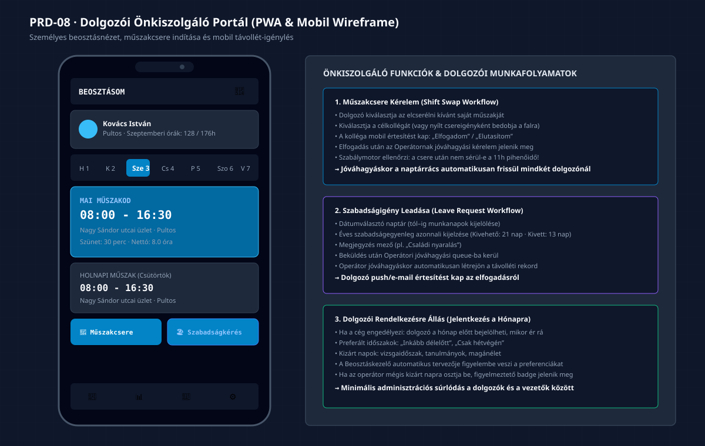

# PRD-08: Dolgozói Önkiszolgáló Portál és Mobil Nézet

[Előző: PRD-07 Törzsadat-kezelés](./PRD-07-torzsadat-es-munkavallalo-karton.md) · [Vissza a PRD Indexhez](./INDEX.md) · [Következő: PRD-09 Roadmap és Kiadás](./PRD-09-fejlesztesi-roadmap-es-mvp-kiadas.md)

---

## 1. Termék- és Funkciócélkitűzés

A **Dolgozói Önkiszolgáló Portál (Employee Self-Service - ESS)** egy reszponzív, mobil-optimalizált (PWA) felület, amely lehetővé teszi a munkavállalók számára, hogy saját okostelefonjukról vagy böngészőjükből megtekintsék a számukra kiírt beosztást, műszakcserét kezdeményezzenek kollégáikkal, szabadságigényt nyújtsanak be, és megadják havi rendelkezésre állásukat („mikor érnek rá”).

### 1.1 Kiemelt Felületi Értékajánlat
- **Mobil-első Dolgozói Élmény:** Letisztult kártyás megjelenítés az aktuális heti és havi műszakokról, indulási időpontokkal, telephely-címekkel és szünetekkel.
- **Kétlépcsős Műszakcsere Varázsló:** A dolgozók közvetlenül egymás között megállapodhatnak a műszakcseréről, amelyet a vezető egyetlen kattintással hagyhat jóvá.
- **Papírmentes Szabadságigénylés:** Mobilról leadható távolléti kérelmek azonnali keretegyenleg-ellenőrzéssel és értesítésekkel.

---

## 2. Dolgozói Mobil Képernyő és Wireframe


*(Vektoros formátum: [07_dolgozoi_mobil_onkiszolgalo_wireframe.svg](./diagramms/07_dolgozoi_mobil_onkiszolgalo_wireframe.svg) · Nagyfelbontású kép: [07_dolgozoi_mobil_onkiszolgalo_wireframe@2x.png](./diagramms/07_dolgozoi_mobil_onkiszolgalo_wireframe@2x.png))*

---

## 3. Mobil Felületi Zónák Specifikációja (`MobileRosterView`)

A felület keskeny képernyőméretre (&lt;480px) optimalizált felépítése:

### 3.1 Fejléc és Havi Munkaidő Keret Mutató
- **Dolgozó profilja:** Fénykép/avatar, munkakör és cég neve.
- **Havi óraszám számláló:** Körkörös vagy sávos folyamatjelző: `128 / 176 óra ledolgozva`.
- **Szabadságegyenleg kártya:** Kivehető és hátralévő fizetett szabadságnapok száma.

### 3.2 Heti Dátumválasztó Csík (Week Slider)
- Vízszintesen lapozható 7 napos sáv a napok számával és rövidítésével (H, K, Sze, Cs, P, Szo, V).
- Az aktuális nap kiemelt kék háttérrel jelenik meg.
- A hétvégék diszkrét háttérrel vannak megjelölve.

### 3.3 Műszakkártyák Listája (Shift Cards)
- **Kiemelt Mai Műszak Kártya:**
  - Idősáv: `08:00 – 16:30` (kiemelt nagy betűméret, 20px).
  - Telephely neve és címe kattintható térkép linkkel.
  - Szünet időtartama és nettó ledolgozandó idő (`8.0 óra`).
  - Munkakör és színkódos jelvény.
- **Következő Napok Műszakai:** Időrendi sorrendben lefelé görgethető kártyák.
- **Pihenőnapok:** Szürke szegélyes, diszkrét kártya: `🛌 Pihenőnap`.

---

## 4. Műszakcsere Munkafolyamat (`ShiftSwapWorkflow`)

A műszakcsere célja, hogy a dolgozók egymás között rugalmasan megoldhassák a váratlan programütközéseket anélkül, hogy a könyvelőt vagy vezetőt felesleges telefonálással terhelnék:

```
[ Dolgozó 1 kiválasztja a műszakját ] ──→ [ Kiválasztja a célkollégát ]
                                                         │
                                                         ▼
                                          [ Kolléga értesítést kap ]
                                                         │
                                                         ▼
                                        ┌──────────────────────────────┐
                                        │ Elfogadja a cserét a mobilon │
                                        └──────────────┬───────────────┘
                                                         │
                                                         ▼
                                        [ Szabálymotor ellenőrzi: Mt. ]
                                                         │
                                                         ▼
                                        [ Vezető / Operátor jóváhagyja ]
                                                         │
                                                         ▼
                                        [ Naptárrács azonnal frissül ]
```

### 4.1 Műszakcsere Lépései a Felületen
1. **Művelet indítása:** A dolgozó a műszakkártyáján a `🔄 Műszakcsere` gombra kattint.
2. **Kolléga kiválasztása:** A rendszer listázza az azonos munkakörben dolgozó kollégákat, akik aznap pihenőnapon vannak.
3. **Értesítés a partnernek:** A felkért kolléga push értesítést és felületi felugrót kap: *„Kovács István cserét kér a Szeptember 3-i műszakjára. Elfogadod?”*.
4. **Vezetői jóváhagyási queue:** Ha a partner elfogadta, az Operátor értesítési központjában megjelenik a jóváhagyási kérelem.
5. **Jóváhagyás & Frissülés:** Vezetői jóváhagyás után mindkét dolgozó beosztása automatikusan átrendeződik.

---

## 5. Szabadságigénylés és Rendelkezésre Állás

### 5.1 Szabadságigénylő Mobil Űrlap
- Dátumtartomány kiválasztása naptárból (tól–ig).
- Szabadság típusa: Fizetett szabadság, Fizetés nélküli szabadság, Gyermekápolási napok.
- Rövid indoklás / megjegyzés mező.
- `Kérelem beküldése` gomb → azonnali állapotjelző: `⏳ Vezetői jóváhagyásra vár`.

### 5.2 Havi Rendelkezésre Állás Megadása („Jelentkezés” `BK-05`)
- Ha a cég engedélyezi az opciót a beosztás létrehozásakor:
  - A dolgozó a hónap megtervezése előtt bejelölheti:
    - 🟢 *„Ezeken a napokon szívesen dolgozom”*
    - 🟡 *„Csak délután érek rá”*
    - 🔴 *„Ezeken a napokon nem tudok műszakot vállalni (pl. vizsga)”*
  - Az operátor naptárrácsában a beosztás tervezésekor ezek az igények automatikusan megjelennek a Munkavállalói Igények fülön (`BK-26`).

---

## 6. A 4 Kötelező UI Állapot

1. **Betöltési Állapot:** Mobil alkalmazás nyitásakor kártyás pulzáló szkeletonok töltődnek be az offline gyorsítótárból (&lt;150ms).
2. **Üres Állapot:** Ha a dolgozónak az adott hétre nincs kiírt műszaka: *„Erre a hétre nincs betervezett műszakod. Élvezd a pihenést!”*.
3. **Sikeres Állapot:** Csere- vagy szabadságkérelem beküldése után zöld kártya jelenik meg pipával: *„Kérelmedet sikeresen továbbítottuk a vezetődnek!”*.
4. **Hibaállapot (Szabálysértés miatti elutasítás):**
   - Ha a műszakcsere következtében a helyettesítő dolgozónak 11 óránál kevesebb pihenőideje maradna: a rendszer már a beküldés előtt figyelmeztet: *„A csere nem hajtható végre, mert megsérülne a kötelező napi 11 órás pihenőidő!”*.
