# Visibill — User Journeys

> A felhasználók fő útvonalai a rendszeren keresztül, a prod (visibill-709fffdf) kódbázis alapján.

---

## Journey 1: Új Felhasználó Onboarding

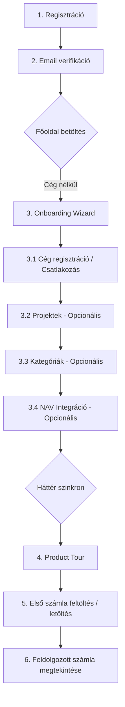

**Szereplő:** Új cégvezető vagy könyvelő (Owner vagy Member szerepkör)  
**Trigger:** Regisztrációs oldal megnyitása  

| Lépés | Oldal/Komponens | Leírás |
|-------|----------------|--------|
| 1 | Auth.tsx | Email + jelszó regisztráció (social login nélkül) |
| 2 | verify-email Edge Function | Email cím megerősítése (profiles.email_verified flag) |
| 3 | EmptyStateDashboard.tsx | Onboarding Wizard modal (mivel `companies.length === 0`): |
| 3.1 | EmptyStateDashboard | **Cég megadása:** Új cég létrehozása (Owner) vagy csatlakozás meglévőhöz share token alapján (Member) |
| 3.2 | EmptyStateDashboard | **Projektek:** Kezdeti projektek és partnerek felvétele |
| 3.3 | EmptyStateDashboard | **Kategóriák:** Költség kategóriák és kulcsszavak megadása |
| 3.4 | EmptyStateDashboard | **NAV Integráció:** Technikai felhasználó összekötése + validáció a `save-credentials` funkcióval |
| 3.5 | Edge Functions (NAV sync) | A háttérben elindul az elmúlt 90 nap számláinak lekérdezése 35 napos chunkokban |
| 4 | ProductTour.tsx | 13-lépéses interaktív bemutató a főoldalon (`react-joyride` segítségével) |
| 5 | ManualUpload.tsx vagy NAV szinkron | Első számla feltöltése manuálisan vagy szinkronizálása a NAV-ból |
| 6 | InvoicesPage.tsx | Feldolgozott/letöltött számla megtekintése és jóváhagyása |

**Sikerkritérium:** A felhasználó regisztrált, sikeresen elvégezte az onboarding konfigurációt, végigjárta a Product Tour-t, és látta az első feldolgozott számláját a rendszerben.

---

## Journey 2: Napi Számla Kezelés

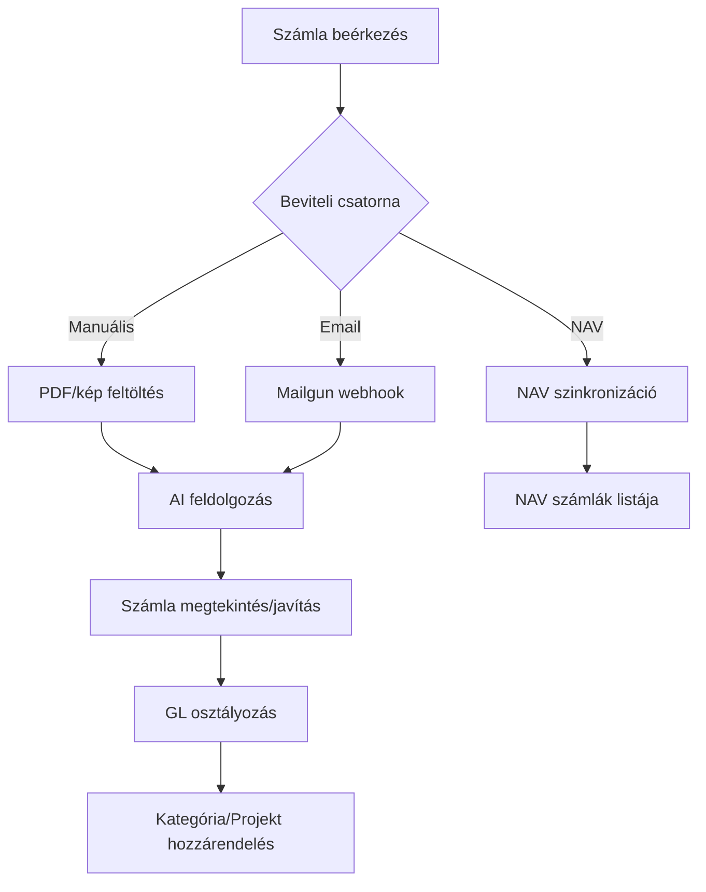

**Szereplő:** Cégvezető / könyvelő  
**Trigger:** Új számla érkezik (email, postán, NAV-on)  

| Lépés | Csatorna | Részletek |
|-------|---------|-----------|
| Feltöltés | ManualUpload.tsx | PDF/kép drag&drop, document_category választás |
| Email | process-mailgun-webhook | cegnev@inbox.visibill.hu → automatikus feldolgozás |
| NAV sync | nav-sync / nav-auto-sync | Bejövő + kimenő számlák lekérdezése |
| Feldolgozás | Worker (PGMQ) | OCR → LLM extraction → GL classification |
| Ellenőrzés | InvoicesPage.tsx | Részletek megtekintése, mezők javítása |
| Osztályozás | GL panel | AI-javasolt GL szám elfogadása/felülbírálása |

**Sikerkritérium:** A számla bekerült a rendszerbe, helyesen kategorizálva és GL-hez rendelve.

---

## Journey 3: Havi Pénzügyi Egyeztetés

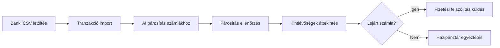

**Szereplő:** Cégvezető  
**Trigger:** Hónap vége / banki kivonat rendelkezésre áll  

| Lépés | Oldal | Leírás |
|-------|-------|--------|
| CSV import | TransactionsPage.tsx | Banki CSV feltöltés → AI parsing |
| AI matching | Worker (transaction_matcher) | Automatikus számla-tranzakció párosítás (confidence score) |
| Ellenőrzés | TransactionDetailsDialog.tsx | Párosítás jóváhagyása / felülbírálás (is_verified) |
| Kintlévőség | KintlevoPage.tsx | Lejárt számlák szűrése |
| Felszólítás | DunningDialog.tsx | Email küldés adósnak (send-dunning-email) |
| Házipénztár | PettyCashPage.tsx | Készpénzes tételek rögzítése |

**Sikerkritérium:** Minden tranzakció párosítva, kintlévőségek kezelve, házipénztár egyeztetve.

---

## Journey 4: NAV Integráció Beállítás & Használat

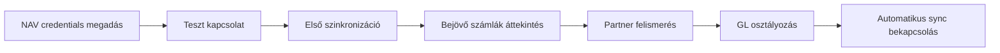

**Szereplő:** Cégvezető  
**Trigger:** NAV Online Számla használatának igénye  

| Lépés | Komponens | Leírás |
|-------|----------|--------|
| Beállítás | Integrations.tsx → NAV szekció | Technikai user, sign key, exchange key megadása |
| Mentés | save-credentials Edge Function | Credentials → Supabase Vault (secret_id-k) |
| Test/Prod | is_test_environment flag | Test vagy éles NAV környezet kiválasztása |
| Sync | nav-sync Edge Function | Bejövő + kimenő számlák lekérdezése |
| Partnerek | Automatikus | NAV számlákból partner rekordok létrehozása (adószám alapján) |
| Auto-sync | nav-auto-sync | Cron-alapú automatikus szinkronizáció bekapcsolása |

**Sikerkritérium:** NAV számlák szinkronizálva, partnerek felismerve, auto-sync aktív.

---

## Journey 5: Év Végi Beszámoló Készítés

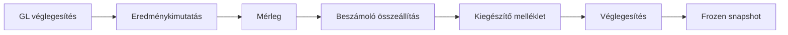

**Szereplő:** Cégvezető / könyvelő  
**Trigger:** Üzleti év lezárása  

| Lépés | Oldal | Leírás |
|-------|-------|--------|
| GL ellenőrzés | GeneralLedgerPage.tsx | Főkönyvi egyenlegek áttekintése, javítás |
| P&L | ProfitAndLoss.tsx | Eredménykimutatás generálás (pnl_structure + mapping) |
| Mérleg | BalanceSheet.tsx | Mérleg generálás (bs_structure + mapping) |
| Beszámoló | AnnualReportPage.tsx | Draft → validated → finalized workflow |
| Melléklet | Kiegészítő melléklet tab | 19 sablon kitöltése (general_info, valuation, stb.) |
| Véglegesítés | Finalize gomb | frozen_bs_data + frozen_pnl_data snapshot, status = finalized |
| Osztalék | Beszámoló tab | dividend_amount, retained_earnings rögzítése |

**Sikerkritérium:** Éves beszámoló véglegesítve és lezárva, frozen snapshot elmentve.

---

## Journey 6: Futárszolgálat Riport Feldolgozás

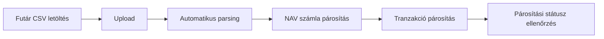

**Szereplő:** E-commerce cégvezető  
**Trigger:** Havi futárszolgálat elszámolás  

| Lépés | Részletek |
|-------|-----------|
| Upload | CourierReportTab.tsx — CSV feltöltés (GLS, MPL, DPD, FoxPost, Mixpack, Sprinter) |
| Parsing | Worker (report_extractor) — sorok kinyerése (item/total típus) |
| NAV match | Worker (report_matcher) — NAV számla párosítás |
| Trx match | Worker (transaction_matcher) — Banki tranzakció párosítás |
| Státusz | unmatched → partial_trx → partial_nav → full → total |

**Sikerkritérium:** Minden futár sor párosítva NAV számlához és tranzakcióhoz.

---

## Journey 7: Munkaidő & Szabadság (Employee)

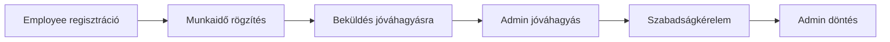

**Szereplő:** Alkalmazott (employee role)  
**Trigger:** Napi munkaidő rögzítése  

| Lépés | Oldal/Komponens | Leírás |
|-------|----------------|--------|
| Regisztráció | EmployeeRegister.tsx | registration_token alapú regisztráció |
| Munkaidő | WorkingTimePage.tsx | Napi órák, projekt, absence_type rögzítése |
| Beküldés | Submit gomb | draft → submitted státusz |
| Jóváhagyás | Admin nézet | submitted → approved (admin review) |
| Szabadság | LeavePanel.tsx | Szabadságkérelem: típus, dátum, indoklás |
| Döntés | Admin | pending → approved / rejected + megjegyzés |

**Sikerkritérium:** Munkaidő nyilvántartva és jóváhagyva, szabadság kezelve.

---

## Journey 8: Tárgyi Eszköz Életciklus

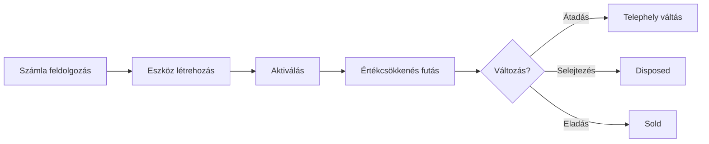

**Szereplő:** Cégvezető  
**Trigger:** Tárgyi eszköz beszerzése (számla alapján)  

| Lépés | Részletek |
|-------|-----------|
| Forrás | source_invoice_id + source_invoice_type (submitted/nav) |
| Létrehozás | FixedAssetsPage.tsx — név, bruttó érték, TAO sablon kiválasztás |
| Aktiválás | AssetActivationDialog.tsx → asset_events (activation) |
| Értékcsökkenés | useDepreciation.ts — lineáris módszer, TAO rate |
| Események | asset_events: transfer, disposal, inventory_check, value_change |
| Dokumentumok | documents JSONB — csatolmányok |
| Telephely | location_id → company_locations |

**Sikerkritérium:** Eszköz nyilvántartva, értékcsökkenés kalkulálva, események naplózva.

---

## Journey 9: Könyvelő Iroda Napi Munkafolyamata (Portfólió & Jóváhagyás)

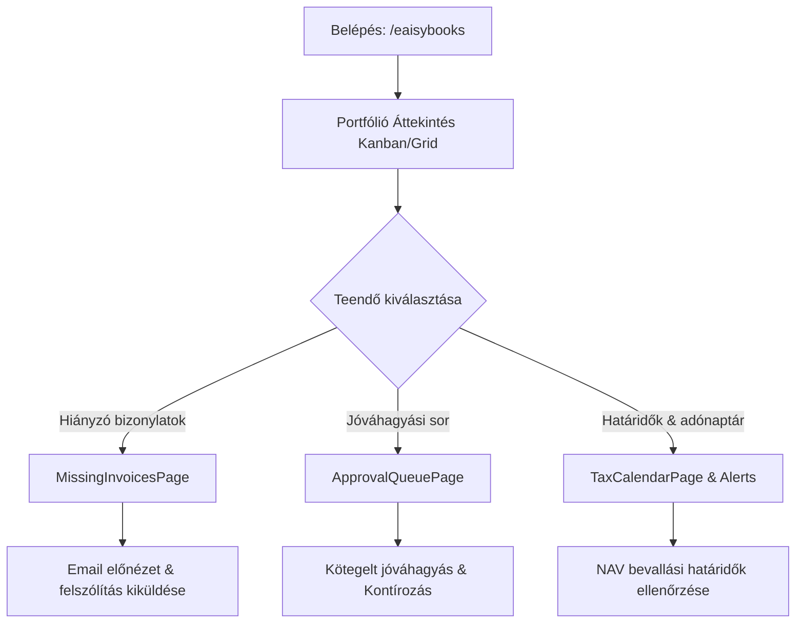

**Szereplő:** Könyvelő / Senior könyvelő  
**Trigger:** Napi operatív könyvelési munka indítása az irodában  

| Lépés | Oldal/Komponens | Leírás |
|-------|----------------|--------|
| Portfólió audit | `AccountyPortfolio` (`/eaisybooks`) | KPI-k áttekintése, Kanban oszlopok ellenőrzése (feldolgozás alatt, hiánypótlás, jóváhagyásra vár, kész). |
| Bizonylat hiánypótlás | `MissingInvoicesPage` (`/eaisybooks/missing-invoices`) | Kimenő/bejövő hiányzó számlák szűrése, `EmailPreviewModal` megnyitása és automatikus értesítő kiküldése az ügyfélnek. |
| Jóváhagyási sor | `ApprovalQueuePage` (`/eaisybooks/approval-queue`) | AI által előkontírozott tételek szakmai áttekintése, tömeges jóváhagyás (`approve_all`) vagy javítás. |
| Határidő menedzsment | `TaxCalendarPage` és `AlertsCenterPage` | Közelgő ÁFA, bér vagy helyi adó határidők ellenőrzése, feladatok szétosztása. |

**Sikerkritérium:** A portfólió naprakész, nincsenek elakadt jóváhagyások, az ügyfelek megkapták a bizonylatpótlási értesítőket.

---

## Journey 10: Havi Bérszámfejtési Ciklus & NAV 08 Bevallás

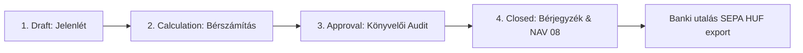

**Szereplő:** Bérszámfejtő / Könyvelő  
**Trigger:** Hónap végi / tárgyhó eleji kötelező bérszámfejtési időszak  

| Lépés | Fázis / Komponens | Leírás |
|-------|-------------------|--------|
| Cég és ciklus megnyitása | `PayrollDashboard` (`/eaisybooks/:companyId/:dateRange/payroll`) | Tárgyhavi ciklus inicializálása `draft` státuszban. |
| Jelenlét és kieső idők | `PayrollCycleAttendanceGrid` | Betegszabadság, táppénz, fizetett szabadság és túlóra rögzítése dolgozónként. |
| Bérszámítás futtatása | `PayrollCalculationView` | Bruttó bér, SZJA (kedvezmények: családi, 25 év alatti, stb.), TB és Szocho automatikus kalkulációja. |
| Szakmai jóváhagyás | `PayrollApprovalView` | Összesítők és eltérések ellenőrzése, státuszváltás `approved`-ra. |
| Lezárás & Bizonylatok | `PayrollClosingWizard` | Ciklus lezárása (`closed`), PDF bérjegyzékek generálása és kiküldése a munkavállalói portálra. |
| Hatósági export | `nav08XmlParser` / Export | NAV ÁNYK kompatibilis 08-as havi adó- és járulékbevallás XML generálása. |
| Banki utalás | Utalási csomag generátor | Dolgozói nettó bérek és NAV adószámlák SEPA HUF XML vagy CSV exportja. |

**Sikerkritérium:** A bérszámfejtés hibátlanul lezárva, a bérjegyzékek kiküldve, a 08-as XML benyújtásra kész, az utalási csomag letöltve.

---

## Journey 11: Új Ügyfél Onboarding & Bér/Könyvelés Rekonstrukció

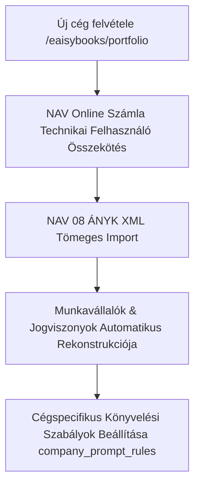

**Szereplő:** Senior Könyvelő / Iroda Admin  
**Trigger:** Új ügyfél szerződéskötése az irodával  

| Lépés | Komponens | Leírás |
|-------|-----------|--------|
| Cégregisztráció | `CompanyCreationDialog` | Cég alapadatai, adószám, könyvelési típus kiválasztása (Kettős / EV / Nonprofit). |
| NAV API összekapcsolás | Cégbeállítások / NAV integráció | Technikai felhasználó megadása, azonnali automatikus számlaszinkronizáció indítása. |
| Múltbéli béradatok importja | `Nav08XmlBulkImportModal` | Az előző könyvelőtől kapott 08-as havi XML bevallások feltöltése. |
| Törzsadat generálás | `nav08XmlParser` feldolgozó | Dolgozók, adóazonosítók, TAJ számok, munkaszerződések és korábbi járulékalapok automatikus beemelése. |
| AI szabályok finomhangolása | `CompanyPromptRulesLibrary` | Ügyfélspecifikus kontírozási elvek, költséghelyek és konfidencia küszöbök rögzítése. |

**Sikerkritérium:** Az új ügyfél teljes történeti és számlaadatai perceken belül rendelkezésre állnak manuális adatbevitel nélkül.

---

## Journey 12: Egyéni Vállalkozó Havi Könyvelése & Pénztárkönyv Zárás

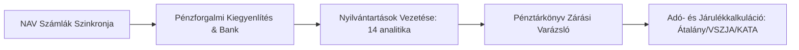

**Szereplő:** Könyvelő  
**Trigger:** EV ügyfél havi pénzforgalmának és adókötelezettségének megállapítása  

| Lépés | Oldal / Tab | Leírás |
|-------|-------------|--------|
| Bizonylatok beolvasása | `EvBookkeepingPage` / Számlák | NAV-ból érkező bejövő és kimenő számlák szinkronizálása és tételes ellenőrzése. |
| Bank és Készpénz tételek | Pénztárkönyv (`CashBookGrid`) | Pénzforgalmi kiegyenlítések párosítása, készpénzes kifizetések rögzítése. |
| Törvényes analitikák | Nyilvántartások tab | Gépjárműhasználat, tárgyi eszközök, selejtezések és vevő-szállító analitikák frissítése. |
| Pénztárkönyv Zárás | Zárási varázsló | Negatív pénztáregyenleg vizsgálata, nyitó-záró egyenlegek egyeztetése, pénztárkönyv hitelesítése. |
| Havi adókalkuláció | Kalkulátor & Járulékok tab | Átalányadó göngyölt jövedelemkeret figyelése, mentesített sávok számítása, fizetendő SZJA és TB megállapítása. |

**Sikerkritérium:** A pénztárkönyv egyeztetve és lezárva, a havi járulékfizetési értesítő elküldve az egyéni vállalkozónak.
