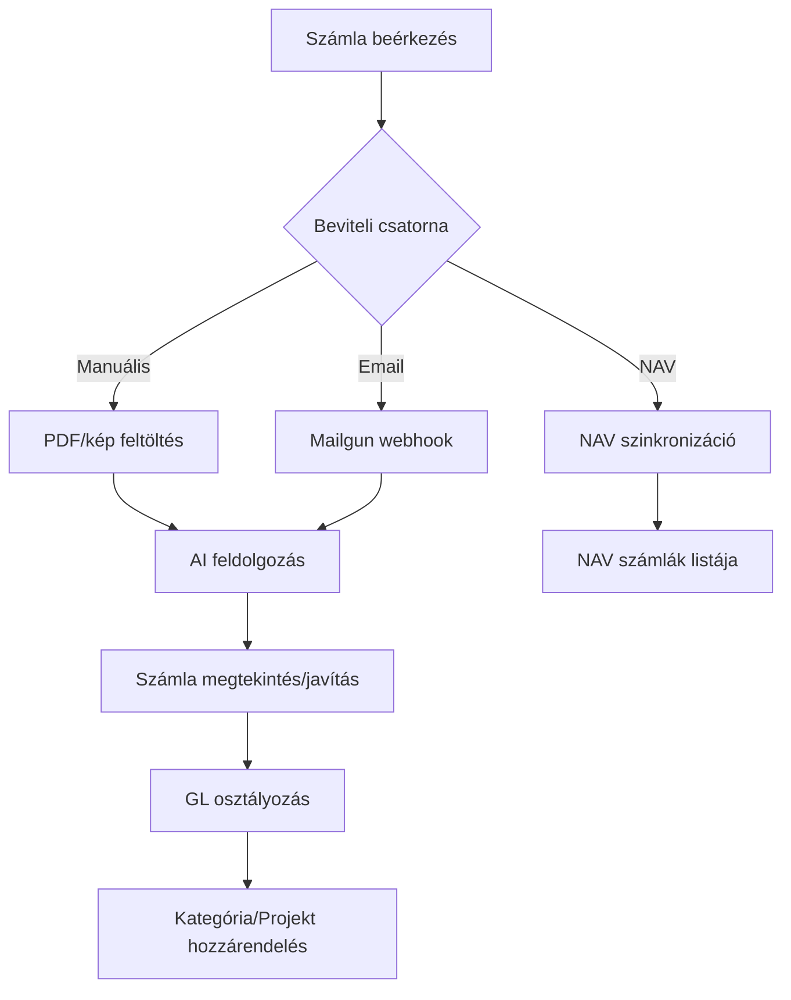
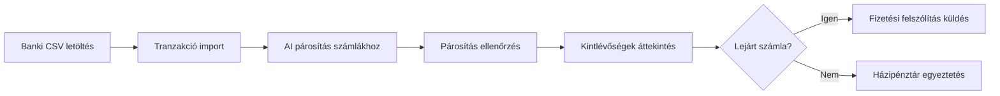
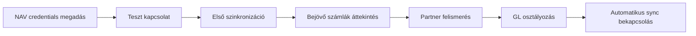
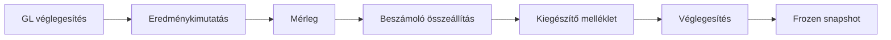
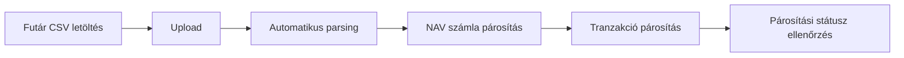
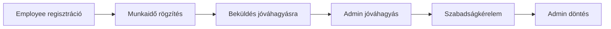
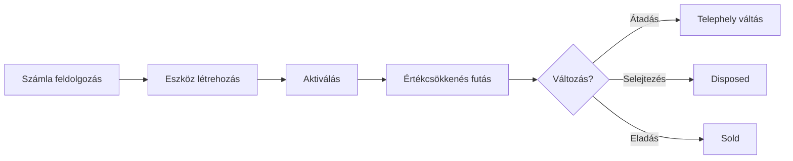

# Visibill — User Journeys

> A felhasználók fő útvonalai a rendszeren keresztül, a prod (visibill-709fffdf) kódbázis alapján.

---

## Journey 1: Új Felhasználó Onboarding

**Szereplő:** Új cégvezető  
**Trigger:** Regisztrációs oldal megnyitása  

| Lépés | Oldal/Komponens | Leírás |
|-------|----------------|--------|
| 1 | Auth.tsx | Email + jelszó regisztráció |
| 2 | verify-email Edge Function | Email cím megerősítése (email_verify_token) |
| 3 | CompanySelector → Új cég dialógus | Cégnév, adószám megadása |
| 4 | ProductTour.tsx | Interaktív bemutató (has_completed_tour flag) |
| 5 | ManualUpload.tsx | Első számla PDF/kép feltöltése |
| 6 | Worker pipeline | OCR → LLM → DB mentés (aszinkron) |
| 7 | InvoicesPage.tsx | Feldolgozott számla megtekintése |

**Sikerkritérium:** A felhasználó regisztrált, létrehozta a cégét, feltöltötte és látta az első feldolgozott számláját.

---

## Journey 2: Napi Számla Kezelés

**Szereplő:** Cégvezető / könyvelő  
**Trigger:** Új számla érkezik (email, postán, NAV-on)  

| Lépés | Csatorna | Részletek |
|-------|---------|-----------|
| Feltöltés | ManualUpload.tsx | PDF/kép drag&drop, document_category választás |
| Email | process-mailgun-webhook | cegnev@inbox.visibill.hu → automatikus feldolgozás |
| NAV sync | nav-sync / nav-auto-sync | Bejövő + kimenő számlák lekérdezése |
| Feldolgozás | Worker (PGMQ) | OCR → LLM extraction → GL classification |
| Ellenőrzés | InvoicesPage.tsx | Részletek megtekintése, mezők javítása |
| Osztályozás | GL panel | AI-javasolt GL szám elfogadása/felülbírálása |

**Sikerkritérium:** A számla bekerült a rendszerbe, helyesen kategorizálva és GL-hez rendelve.

---

## Journey 3: Havi Pénzügyi Egyeztetés

**Szereplő:** Cégvezető  
**Trigger:** Hónap vége / banki kivonat rendelkezésre áll  

| Lépés | Oldal | Leírás |
|-------|-------|--------|
| CSV import | TransactionsPage.tsx | Banki CSV feltöltés → AI parsing |
| AI matching | Worker (transaction_matcher) | Automatikus számla-tranzakció párosítás (confidence score) |
| Ellenőrzés | TransactionDetailsDialog.tsx | Párosítás jóváhagyása / felülbírálás (is_verified) |
| Kintlévőség | KintlevoPage.tsx | Lejárt számlák szűrése |
| Felszólítás | DunningDialog.tsx | Email küldés adósnak (send-dunning-email) |
| Házipénztár | PettyCashPage.tsx | Készpénzes tételek rögzítése |

**Sikerkritérium:** Minden tranzakció párosítva, kintlévőségek kezelve, házipénztár egyeztetve.

---

## Journey 4: NAV Integráció Beállítás & Használat

**Szereplő:** Cégvezető  
**Trigger:** NAV Online Számla használatának igénye  

| Lépés | Komponens | Leírás |
|-------|----------|--------|
| Beállítás | Integrations.tsx → NAV szekció | Technikai user, sign key, exchange key megadása |
| Mentés | save-credentials Edge Function | Credentials → Supabase Vault (secret_id-k) |
| Test/Prod | is_test_environment flag | Test vagy éles NAV környezet kiválasztása |
| Sync | nav-sync Edge Function | Bejövő + kimenő számlák lekérdezése |
| Partnerek | Automatikus | NAV számlákból partner rekordok létrehozása (adószám alapján) |
| Auto-sync | nav-auto-sync | Cron-alapú automatikus szinkronizáció bekapcsolása |

**Sikerkritérium:** NAV számlák szinkronizálva, partnerek felismerve, auto-sync aktív.

---

## Journey 5: Év Végi Beszámoló Készítés

**Szereplő:** Cégvezető / könyvelő  
**Trigger:** Üzleti év lezárása  

| Lépés | Oldal | Leírás |
|-------|-------|--------|
| GL ellenőrzés | GeneralLedgerPage.tsx | Főkönyvi egyenlegek áttekintése, javítás |
| P&L | ProfitAndLoss.tsx | Eredménykimutatás generálás (pnl_structure + mapping) |
| Mérleg | BalanceSheet.tsx | Mérleg generálás (bs_structure + mapping) |
| Beszámoló | AnnualReportPage.tsx | Draft → validated → finalized workflow |
| Melléklet | Kiegészítő melléklet tab | 19 sablon kitöltése (general_info, valuation, stb.) |
| Véglegesítés | Finalize gomb | frozen_bs_data + frozen_pnl_data snapshot, status = finalized |
| Osztalék | Beszámoló tab | dividend_amount, retained_earnings rögzítése |

**Sikerkritérium:** Éves beszámoló véglegesítve és lezárva, frozen snapshot elmentve.

---

## Journey 6: Futárszolgálat Riport Feldolgozás

**Szereplő:** E-commerce cégvezető  
**Trigger:** Havi futárszolgálat elszámolás  

| Lépés | Részletek |
|-------|-----------|
| Upload | CourierReportTab.tsx — CSV feltöltés (GLS, MPL, DPD, FoxPost, Mixpack, Sprinter) |
| Parsing | Worker (report_extractor) — sorok kinyerése (item/total típus) |
| NAV match | Worker (report_matcher) — NAV számla párosítás |
| Trx match | Worker (transaction_matcher) — Banki tranzakció párosítás |
| Státusz | unmatched → partial_trx → partial_nav → full → total |

**Sikerkritérium:** Minden futár sor párosítva NAV számlához és tranzakcióhoz.

---

## Journey 7: Munkaidő & Szabadság (Employee)

**Szereplő:** Alkalmazott (employee role)  
**Trigger:** Napi munkaidő rögzítése  

| Lépés | Oldal/Komponens | Leírás |
|-------|----------------|--------|
| Regisztráció | EmployeeRegister.tsx | registration_token alapú regisztráció |
| Munkaidő | WorkingTimePage.tsx | Napi órák, projekt, absence_type rögzítése |
| Beküldés | Submit gomb | draft → submitted státusz |
| Jóváhagyás | Admin nézet | submitted → approved (admin review) |
| Szabadság | LeavePanel.tsx | Szabadságkérelem: típus, dátum, indoklás |
| Döntés | Admin | pending → approved / rejected + megjegyzés |

**Sikerkritérium:** Munkaidő nyilvántartva és jóváhagyva, szabadság kezelve.

---

## Journey 8: Tárgyi Eszköz Életciklus

**Szereplő:** Cégvezető  
**Trigger:** Tárgyi eszköz beszerzése (számla alapján)  

| Lépés | Részletek |
|-------|-----------|
| Forrás | source_invoice_id + source_invoice_type (submitted/nav) |
| Létrehozás | FixedAssetsPage.tsx — név, bruttó érték, TAO sablon kiválasztás |
| Aktiválás | AssetActivationDialog.tsx → asset_events (activation) |
| Értékcsökkenés | useDepreciation.ts — lineáris módszer, TAO rate |
| Események | asset_events: transfer, disposal, inventory_check, value_change |
| Dokumentumok | documents JSONB — csatolmányok |
| Telephely | location_id → company_locations |

**Sikerkritérium:** Eszköz nyilvántartva, értékcsökkenés kalkulálva, események naplózva.
