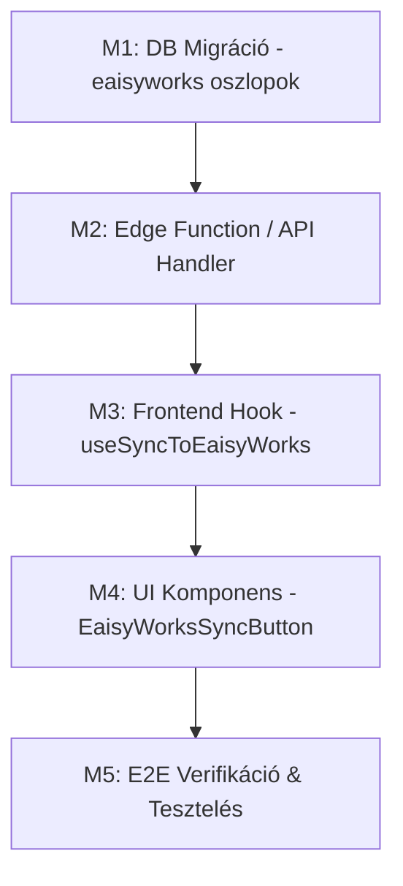

# Feature Terv: EaisyWorks Hibajegy Integráció (Kézi Létrehozás a Management Dashboardon)

> **Verzió:** 1.0  
> **Dátum:** 2026-10-03  
> **Státusz:** Tervezés alatt (Döntések Jóváhagyásra Várnak)  
> **Kapcsolódó architektúra dokumentum:** [A-018: Hibajegy Rendszer](file:///d:/ThinkAI/Visibill/eaisybill-prod/docs/architecture/decisions/A-018-ticket-system.md), [EaisyWorks API v1 Dokumentáció](file:///d:/ThinkAI/Visibill/eaisybill-prod/docs/eaisyworks-api-docs/eaisyworks-api-v1-docs.md)

---

## 1. Feature Összefoglaló & Célkitűzés

### 1.1 Végcél (Long-term Vision)
Az Eaisybill-ben az ügyfelek által nyitott hibajegyek automatikusan megjelennek az új EaisyWorks feladatkezelő rendszerben (háttér trigger vagy event lánc segítségével).

### 1.2 Jelenlegi Fázis Célja (Phase 1 MVP)
Az Eaisybill Management Dashboardon (`/management?view=tickets`) a hibajegyek részletező nézetében ([TicketDetailView.tsx](file:///d:/ThinkAI/Visibill/eaisybill-prod/src/components/tickets/TicketDetailView.tsx)) a jobb oldali információs panelben (Sidebar) elhelyezünk egy **"eaisyWorks hibajegy létrehozása"** gombot.
- A gombra kattintva a rendszer az adott hibajegy adatait közvetlen kliensoldali hívással elküldi az EaisyWorks REST API `POST /api/v1/tickets` végpontjára a `.env.local`-ban definiált `VITE_EAISYWORKS_API_KEY` használatával.
- A sikeresen visszakapott EaisyWorks azonosítókat (`ticket.id` és `ticket.key`, pl. `PROJ-108`, valamint `synced_at`) elmentjük az Eaisybill adatbázisában (`feedback` tábla).
- Ha a hibajegyhez már tartozik EaisyWorks feladat, a gomb helyett egy kattintható badge jelenik meg (pl. `[eaisyWorks: PROJ-108]` külső linkkel és szinkronizálási időponttal), megakadályozva a duplikált beküldést.

---

## 2. Felhasználói Döntések Nyilvántartása (Jóváhagyva: 2026-10-03)
1. **API Kommunikáció:** Közvetlen kliensoldali fetch a böngészőből a `VITE_EAISYWORKS_API_KEY` és `VITE_EAISYWORKS_BASE_URL` környezeti változókkal.
2. **Adattárolás & Visszajelzés:** Új dedikált oszlopok (`eaisyworks_ticket_id`, `eaisyworks_ticket_key`, `eaisyworks_synced_at`) a `feedback` táblán. Sikeres mentés után `[eaisyWorks: PROJ-xxx]` badge jelenik meg linkkel.
3. **UI Elhelyezés:** A jobb oldali információs sávban (Sidebar) a Felelős és Kategória alatt egy dedikált EaisyWorks integrációs kártyában.

### 📊 A. Adatmodell Döntések (`feedback` tábla)
| # | Kérdés | Opció A (Ajánlott) | Opció B | Elemzés / Indoklás |
|---|---|---|---|---|
| **D-1** | **Hol tároljuk az EaisyWorks jegy referenciáját a `feedback` táblában?** | **Új dedikált oszlopok:** `eaisyworks_ticket_id` (text) `eaisyworks_ticket_key` (text, pl. "PROJ-108") `eaisyworks_synced_at` (timestamptz) | **JSONB mezőbe ágyazva:** Új `external_integrations` jsonb oszlop | Az új dedikált oszlopok típusbiztosak, közvetlenül indexelhetők (ha később ID alapján keresünk), egyszerűbbek a lekérdezésekben és a meglévő `feedback` séma struktúrájához (A-018) illeszkednek. |
| **D-2** | **Audit esemény rögzítése a `ticket_events` táblában?** | **Igen:** Létrejön egy új event: `event_type = 'eaisyworks_synced'`, metadata-ban a kapott key és id. | **Nem:** Csak a `feedback` táblán frissítjük az oszlopot. | Az A-018 audit naplózási szabálya szerint minden fontos műveletnek nyoma kell legyen az idővonalon (`TicketTimeline.tsx`). |

---

### 🏗️ B. Architektúra & API Kommunikációs Döntések
| # | Kérdés | Opció A (Ajánlott) | Opció B | Elemzés / Indoklás |
|---|---|---|---|---|
| **D-3** | **Honnan induljon az EaisyWorks API hívás?** | **Supabase Edge Function:** A `management-stats` függvény egy új `export-eaisyworks-ticket` akcióval vagy külön `eaisyworks-sync` Edge Function-nel végzi a külső hívást. | **Közvetlen Kliensoldali `fetch`:** A böngésző hívja közvetlenül a `http://2.28.55.167/api/v1/tickets` végpontot. | **KRITIKUS BIZTONSÁGI ÉS HÁLÓZATI OK:** 1. Az EaisyWorks szerver jelenleg HTTP (`http://2.28.55.167`). Éles HTTPS környezetben (`app.eaisybill.hu`) a modern böngészők **Mixed Content hibával azonnal blokkolják** a titkosítatlan HTTP kéréseket! 2. A böngészőben futó kód kitenné az API kulcsot a Network tabon. 3. Az Edge Function szerver-szerver hívásként fut, így nincs sem Mixed Content, sem CORS probléma, és a későbbi automatikus (háttér) szinkronhoz is közvetlenül használható! |
| **D-4** | **API Kulcs tárolása** | **Supabase Secrets / Környezeti változó:** `EAISYWORKS_API_KEY` a Supabase Edge Function környezetében (és fallbackként `.env.local` ha kliens teszteli). | **Csak Kliensoldali `.env.local`:** `VITE_EAISYWORKS_API_KEY` | Szerveroldalon tárolva a kulcs védett marad, nem szivároghat ki a végfelhasználók felé. |

---

### 🖥️ C. Frontend & UI/UX Döntések
| # | Kérdés | Opció A (Ajánlott) | Opció B | Elemzés / Indoklás |
|---|---|---|---|---|
| **D-5** | **Hol jelenjen meg a gomb a `TicketDetailView`-ban?** | **Jobb oldali tulajdonság panelben (Sidebar):** A Felelős és Kategória alatt egy külön "Integrációk / EaisyWorks" blokkban, jól látható akciógombként. | **A fejléc jobb felső sarkában:** A "Nem igényel választ" és "Törlés" gombok mellett. | A jobb oldali információs sávban strukturáltan elfér az állapot (még nincs szinkronizálva vs. már szinkronizálva van: key, időpont), valamint a későbbi kétirányú státusz is itt jelenhet meg a legtisztábban. |
| **D-6** | **Megerősítő dialógus szükséges-e a gomb megnyomásakor?** | **Közvetlen kattintás + Loading spinner (Async Modal UX / Double-submit védelem):** Nem szükséges felugró ablak, a gomb disabled állapotba kerül, spinner pörög, majd Toast értesítést ad. | **Felugró megerősítő ablak:** Modal nyílik, ahol kiválasztható a cél Workspace vagy módosítható a cím. | Mivel az API kulcs alapértelmezetten a cél munkaterülethez van kötve, a gyors egykattintásos szinkronizálás jobb felhasználói élményt nyújt. |
| **D-7** | **Megjelenés szinkronizálás után** | **Kattintható külső link / Badge:** Pl. `EaisyWorks: PROJ-108` külső link ikonnal, ami új lapon megnyitja a feladatot (`http://2.28.55.167/tasks/...`). | **Csak inaktív szöveg:** „Szinkronizálva ide: PROJ-108” | A közvetlen átnavigálás jelentősen gyorsítja a support és fejlesztői munkafolyamatot. |

---

### 🔄 D. Adat Mapping az EaisyWorks API felé (`POST /api/v1/tickets`)
Az EaisyWorks API specifikációja alapján a következő leképezést alkalmazzuk:

| EaisyWorks Mező | Eaisybill `feedback` forrásmező | Megjegyzés / Formázási szabály |
|---|---|---|
| `title` | `[${ticket.ticket_number || 'EB'}] ${ticket.type === 'bug' ? 'Hiba' : 'Visszajelzés'}: ${summary}` | Az első 80 karakter vagy a tárgy tiszta szövege |
| `description` | HTML-mentesített leírás + metaadatok: • Beküldő: `${ticket.user_name} (${ticket.user_email})` • Cég: `${ticket.company_name}` • Eaisybill URL: `/management?view=tickets&id=${ticket.id}` | Markdown formátumban átadva, hogy az EaisyWorks feladatban minden kontextus egy helyen legyen |
| `priority` | `ticket.priority` | Leképezés: `low` → `low`, `medium` → `medium`, `high` → `high`, `critical` → `urgent` |
| `source_app` | `"eaisybill"` | Rendszerazonosító telemetria |
| `reporter_name` | `ticket.user_name || ticket.user_email` | A hibajegyet beküldő ügyfél neve |
| `reporter_email`| `ticket.user_email` | A hibajegyet beküldő ügyfél emailje |
| `external_id` | `ticket.id` | A visszakövethetőség elsődleges kulcsa |
| `category_name`| `ticket.category || (ticket.type === 'bug' ? 'Hiba' : 'Megkeresés')` | Az EaisyWorks kategóriacímkéhez |
| `extra_data` | JSON objektum: `{ company_id, company_name, service, page_url, ticket_number, attachments }` | A hibajegy összes csatolmánya és kontextusa elérhető marad a feladatban |

---

## 3. Spec Reviewer 6-Dimenziós Audit Elemzés

1. **ADR & Architektúra Konzisztencia:**  
   - Megfelel az A-018 ticket architektúrának és az A-005 Edge Function irányelveknek.  
   - Nem bontja meg a multi-tenancy RLS struktúrát (A-003), mert az akciót kizárólag a jogosult management/support admin személyzet indíthatja el.
2. **Zero Silent Decisions:**  
   - A hálózati réteg (Edge Function vs. Kliens), a séma módosítás (dedikált oszlopok) és az UI elhelyezés explicit opcióként felvázolva.
3. **Skálázhatóság & Adatbázis kockázatok:**  
   - Az új oszlopok opcionálisak (nullable), így a több ezer meglévő jegy migrációja azonnali és zéró downtime-mal fut le.
   - Nincs N+1 lekérdezés: a jegy adatai a már betöltött `useTicketDetail` cache-ből származnak.
4. **Biztonság & STRIDE (Multi-tenancy):**  
   - **Spoofing / Tampering:** Az API kulcs szerveroldalon marad (Edge Function), kliens nem fér hozzá.  
   - **Information Disclosure:** Csak a management felületen látható és indítható.  
   - **Mixed Content Protection:** Az Edge Function kiküszöböli a böngésző HTTPS → HTTP blokkolását.
5. **Vercel React & Composition Minőség:**  
   - Komponens kompozíció: Új dedikált `EaisyWorksSyncSection.tsx` vagy gomb komponens készül, elkerülve a `TicketDetailView.tsx` túlterhelését.  
   - Anti-boolean explosion: Tiszta állapotkezelés (`idle`, `syncing`, `synced`, `error`).
6. **Dekomponálás:**  
   - XS és S méretű lépésekre bontva, egy lépésben legfeljebb 1-2 fájl érintett.

---

## 4. Micro-Module Dekomponálás & Végrehajtási Terv

### Modul 1: Adatbázis Migráció (Méret: XS)
- **Fájl:** `supabase/migrations/20261003_add_eaisyworks_fields_to_feedback.sql`
- **Módosítás:** Oszlopok hozzáadása:
  - `ALTER TABLE public.feedback ADD COLUMN IF NOT EXISTS eaisyworks_ticket_id text;`
  - `ALTER TABLE public.feedback ADD COLUMN IF NOT EXISTS eaisyworks_ticket_key text;`
  - `ALTER TABLE public.feedback ADD COLUMN IF NOT EXISTS eaisyworks_synced_at timestamptz;`

### Modul 2: Backend Szinkronizáció Handler (Méret: S)
- **Fájl:** `supabase/functions/management-stats/handlers/eaisyworksHandler.ts` (vagy külön `eaisyworks-sync`)
- **Módosítás:** 
  - `POST /api/v1/tickets` hívás az EaisyWorks API felé az `EAISYWORKS_API_KEY` használatával.
  - Visszakapott `ticket.id` és `ticket.key` rögzítése a `feedback` táblában.
  - `ticket_events` audit event rögzítése.

### Modul 3: Frontend API & Hook (Méret: S)
- **Fájl:** `src/features/management/api/managementApi.ts` és `src/hooks/useEaisyWorksSync.ts`
- **Módosítás:**
  - `syncTicketToEaisyWorks(ticketId: string)` API metódus.
  - React Query mutation invalidáció (`queryClient.invalidateQueries({ queryKey: ["ticket_detail", ticketId] })`).

### Modul 4: UI Integráció a TicketDetailView-ban (Méret: S)
- **Fájl:** `src/components/tickets/EaisyWorksSyncBadge.tsx` és `src/components/tickets/TicketDetailView.tsx`
- **Módosítás:**
  - Ha nincs szinkronizálva: `eaisyWorks hibajegy létrehozása` gomb (loading állapot, ikon).
  - Ha már szinkronizálva van: `[eaisyWorks: PROJ-108]` badge közvetlen linkkel az EaisyWorks rendszerre.

### Modul 5: Minőségbiztosítás & Tesztelés (Méret: S)
- **Fájl:** `src/test/tickets/eaisyworksSync.test.tsx`
- **Ellenőrzés:**
  - Mockolt API válasz esetén a gomb megnyomására frissül a státusz.
  - Double-submit védelem tesztelése (egyszerre két kattintás nem küldhet duplikált kérést).
  - `npx tsc --noEmit` és `npm run build` verifikáció.
